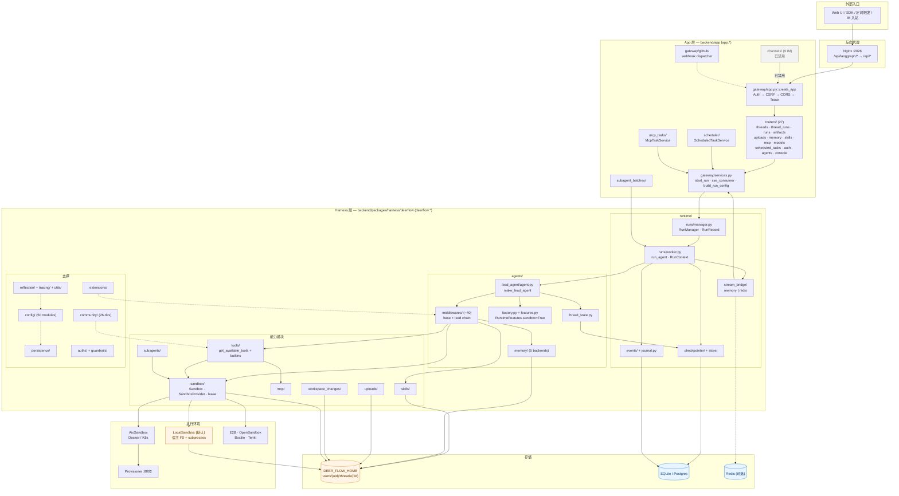
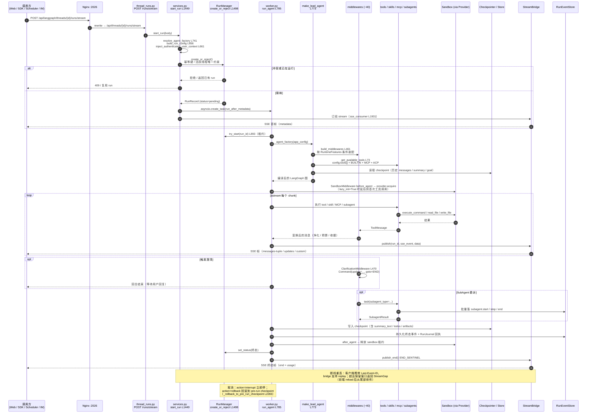
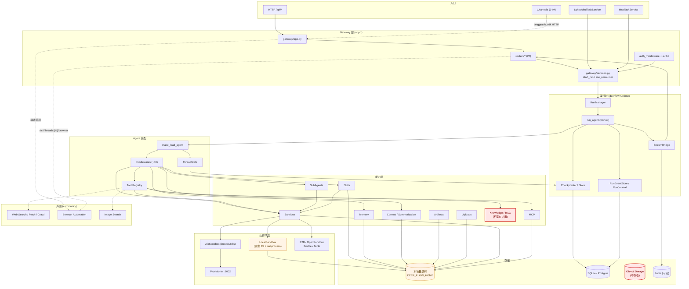
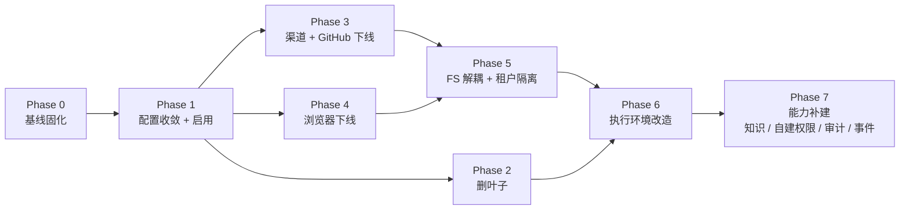
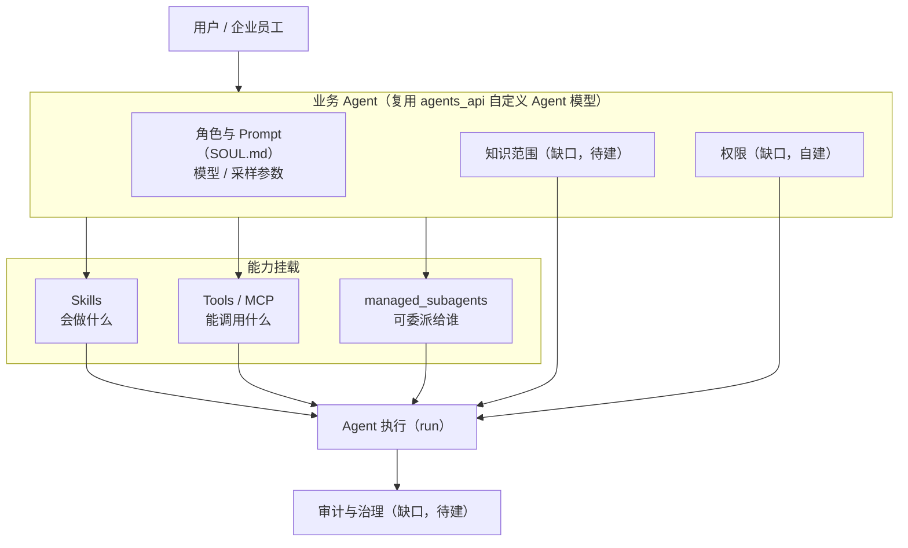
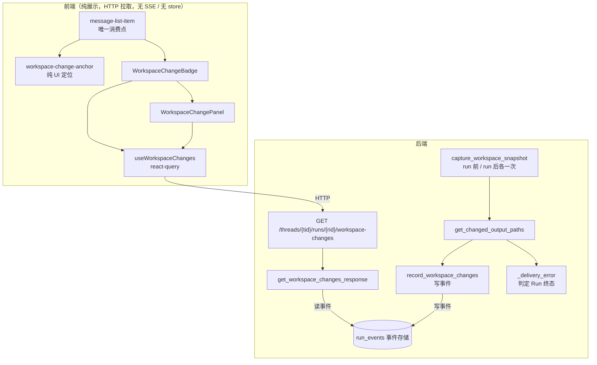

# DeerFlow 功能 / 架构 / 依赖盘点（裁剪前基线）

> **阶段**：分析阶段（Stage 0）。本文档只做盘点，不改代码、不删文件、不做重构、不新增功能与测试。
>
> **分析范围**：**仅后端**（`backend/`、仓库根配置、`skills/`、`docker/`、`deploy/`）。前端（`frontend/`）**不在本次分析范围内**，仅在评估"删除/改造影响面"时作为 API 消费方被引用，不做前端代码审计。
>
> **证据规则**：以实际代码为主要证据，README / docs / AGENTS.md 仅作辅助。所有结论均标注文件路径与关键符号。区分"代码存在"与"默认启用"。未取得足够代码证据的判断一律进入 **E. Unknown**，不强行下结论。
>
> **时间基线**：2026-09-16，仓库 HEAD 工作区状态。
>
> **修订记录**：Rev.1 首轮盘点（第 1–17 章）。**Rev.2** 第二轮取证：收敛原 §13 E 类 Unknown 项（10 项中 8 项取得充分证据并重新归类），据此修正 §5 若干行、§13、§15.2、§16 Phase 1、§17.2。详见 **13.6**。**Rev.3** 产品决策落地：§17.1 的 Q1–Q7 已由业务方决策，据此重算分类与裁剪顺序，新增 **§1.5**（决策总览）与 **§18**（业务 Agent 建模）。**Rev.3 改变了 4 项既有判断**（`agents_api` 升 A、`scheduler` 升 A、AuthZ 由 A 降 D、GitHub Webhook 明确删除）。**Rev.3.1** 收尾决策：§17.2 剩余 5 项（Q13/Q17/Q18/Q19/Q20）全部决策，新增 **§19**（`workspace_changes` 前端依赖审计，含一项**关键发现：后端该逻辑不是纯展示，参与 Run 终态判定**）。

---

## 1. Executive Summary

### 1.1 一句话结论

DeerFlow 后端是一个**已经具备生产级 Agent Runtime 骨架**的系统（run 生命周期、checkpoint、流式、多租户、租约、事件持久化、可扩展工具/技能/MCP/子代理均已实现），但其**默认配置与一半以上的代码量服务于"通用 Super Agent"场景**（Web Search、深度研究、浏览器自动化、多 IM 渠道、内容生成技能），并且**文件系统耦合是当前最硬的裁剪约束**——Sandbox、Skills、Memory、Artifacts、Uploads、Tool Output 全部落在同一个本地磁盘目录树上。


### 1.2 对四个核心问题的直接回答

**Q1：当前 DeerFlow 实际有哪些能力？**  
后端实际存在的能力可归为 12 个域：① 网关与 API（27 个路由模块）② 运行时与 Run 生命周期 ③ LangGraph 图与中间件链（约 40 个中间件）④ 工具注册与内置工具 ⑤ Skills ⑥ MCP（含长任务运行时）⑦ SubAgent（含批量运行时）⑧ Memory（5 个后端实现）⑨ Context 管理（摘要 + 预算 + 输出外置）⑩ Sandbox（6 个 provider 实现）⑪ 持久化与 Checkpoint ⑫ 定时任务 / 渠道 / 扩展。详见第 5 节 Feature Inventory。

**Q2：这些能力之间真实的依赖关系是什么？**  
三条主干依赖：**(a) `runtime → agents → middlewares → tools/skills/mcp/subagents`**（Agent 装配链）；**(b) `几乎一切 → config/paths（本地目录树）`**（文件系统耦合）；**(c) `tools/skills/sandbox/artifacts/uploads → sandbox 抽象`**（执行环境耦合）。反向依赖极少：`harness` 从不 import `app`（由 `tests/test_harness_boundary.py` 强制）；`harness` 对 `app.channels` **零引用**；Web Search / 浏览器 / 渠道均为**配置或路由级挂载**，不是硬编码编译期依赖。详见第 7 节。

**Q3：哪些属于 B 端 Agent 应保留的基础设施，哪些只是通用 Super Agent 的外围能力？**

- **应保留（基础设施）**：Run/Thread/Checkpoint/Stream/Event 生命周期、Agent 装配与中间件链骨架、Tool Registry + Tool Policy 挂钩、MCP 集成、Skills 加载与策略、Memory、Context 管理、Sandbox **抽象**与 provider 协议、持久化与多租户分桶、**Auth 认证（AuthZ 授权模型改为自建，见 D21）**、Scheduler、Extensions 插件机制、Config 系统、Tracing。
- **外围（可裁）**：Web Search / Fetch / Crawl 全部 provider、浏览器自动化、Research 系技能、内容生成系技能（PPT/图片/视频/音乐/播客/网页）、**8 个 IM 渠道**（GitHub 渠道已随 Q2 判删）、TUI、LangGraph Platform 兼容 stub、`assistants_compat`。
- **必须解耦后才能动（不是"该不该删"的问题）**：LocalSandbox 作为默认 provider、Agent 侧文件工具与 Sandbox 模块同源、Skills 的 sandbox 投影、Memory/Artifacts 的本地磁盘存储、`run_events` 与 `stream_bridge` 的 memory 后端默认值。

**Q4：后续应该按照什么顺序安全裁剪？**  
见第 16 节。核心原则：**先配置化关闭 → 再删除纯外围叶子 → 再解耦文件系统 → 最后才动执行环境**。顺序绝不能反过来。

### 1.3 最需要管理层知道的三个风险

| #  | 风险                                              | 说明                                                                                                                                                                                                                                                                                              |
| -- | ----------------------------------------------- | ----------------------------------------------------------------------------------------------------------------------------------------------------------------------------------------------------------------------------------------------------------------------------------------------- |
| R1 | **默认配置是"研究/通用 Agent"配置，不是"B 端运营"配置**            | 当前 `config.yaml` 的 `tools[]` 里启用了 `image_search`（Web 图片搜索），`tool_groups` 声明了 `web/browser/knowledge`，但**没有**任何企业知识库工具、没有业务工具、没有 MCP server（`extensions_config.example.json` 里全部 `enabled:false`）。裁剪不是"删"，首先是"换"。                                                                                |
| R2 | **"无本地磁盘依赖"目标与现状冲突最激烈**                         | 全部 7 类文件系统（详见第 8 节）都指向 `DEER_FLOW_HOME` 下的同一棵目录树；`run_events` 默认 `backend: memory`、`stream_bridge.type` 默认 `memory`、`agent_storage.backend` 默认 `file`——即**默认部署不是无状态的**。                                                                                                                         |
| R3 | **Sandbox 被 Runtime 硬依赖，但 LocalSandbox 不是安全边界** | `SandboxMiddleware` 在默认中间件链中（`agents/features.py: RuntimeFeatures.sandbox = True`），`runtime/runs/worker.py` 在 run 收尾时释放 sandbox 租约。而 `LocalSandbox.execute_command` 直接 `subprocess.Popen` 宿主 shell（`sandbox/local/local_sandbox.py:581/698`），仅靠 `allow_host_bash: false`（默认）与路径校验兜底，**不是隔离边界**。 |

### 1.4 Rev.2 取证修正（避免误删的三处）

第二轮只读取证把原 E 类 Unknown 从 10 项收敛到 2 项，其中**三处修正直接改变了裁剪建议**：

| 修正                             | 原判断              | 修正后                                                                                                        | 后果                                       |
| ------------------------------ | ---------------- | ---------------------------------------------------------------------------------------------------------- | ---------------------------------------- |
| `subagents/report_contract.py` | 疑似"研究类委派契约"，列入待删 | **通用交付质量契约**——`subagents/executor.py:1230` 表明它注入**每一个** subagent                                           | **撤销删除建议**，避免误伤所有委派的引用/可验证性契约            |
| `task_continuity`              | "未找到消费者与业务价值"    | 完整实现：`agents/task_continuity/*` + 3 个工具 + 摘要中间件归档接线 + `ThreadState.task_notes/task_history`                | 从"噪音配置"升为 **B 类，建议评估启用**（长会话 Context 管理） |
| `subagent_batches`             | "未见使用场景文档"       | 完整批量委派运行时（`batch_service` / `batch_runtime` / `batch_acceptance` / `persistence` / `batch_task` 工具），DB 硬约束 | 升为 **B 类待评估**，Phase 1 不应顺带关闭             |

同时确认了一条**正向架构线索**：`extensions_config.example.json` 的 `postgres` 示例带 `routing.keywords=["订单","用户"]`、`tools.query.routing.keywords=["查库","订单表","指标"]`，说明 **MCP 就是 Business Tools 的既定接入路径**，且工具路由机制已为业务语义设计。

### 1.5 Rev.3 产品决策落地（7 项）

§17.1 的 7 个待决问题已由业务方给出结论。**决策本身不改代码，但直接改变分类与裁剪顺序**，故在此集中列出，明细见 §18 与 §13。

| #  | 决策                                                                          | 对本文档的直接后果                                                                                     |
| -- | --------------------------------------------------------------------------- | -------------------------------------------------------------------------------------------- |
| Q1 | **业务 Agent 复用 `agents_api` 的自定义 Agent 模型**，不再新增 `BusinessAgent` / `SkillAgent` / `WorkflowAgent` 等平行类型 | `agents_api` 由 **D（概念重叠）→ A（业务主体）**；`D13` 解除；§15.2 中"保持关闭"改为 **Phase 1 必启** |
| Q2 | **保留定时任务 + 通用事件触发**；**不需要 GitHub Webhook**                                | `scheduler` 由 **B → A**；GitHub Webhook（`gateway/github/*` + `routers/github_webhooks.py`）**明确删除**；通用事件入口仍为净新增 |
| Q3 | **企业权限体系自建**，不沿用 DeerFlow 当前权限模型作为长期方案                                        | `AuthZ` 由 **A → D（需替换实现）**；`Guardrails`/`Authorization` 骨架**只保留 Provider 协议缝**             |
| Q4 | **多租户在存储层隔离**；具体形态（独立 Bucket / 独立 DB / 其他物理隔离）待存储架构设计阶段确定                      | `D7`/`D8` 增加"租户级物理隔离"约束；Phase 5 的设计前置条件明确                                                     |
| Q5 | **需要完整 Agent 执行审计与治理**（用户/租户/Agent/Run/Tool·Skill 调用/权限校验/人工确认/结果/异常），按租户+时间查询与导出；保留期待定 | 新增 **`D22`（企业 Audit 缺失）**；`run_events` 切 DB 由"生产建议"升为 **审计硬需求**                           |
| Q6 | **保留"通用对话"能力**（允许 Agent 在无业务工具时自由对话）                                          | 不引入"必须绑定业务工具"约束；中间件链与 prompt 设计**不做收紧**                                                      |
| Q7 | **不保留** `newsletter-generation` / `consulting-analysis` / `code-documentation` | 三者由 **B → C（删除）**；C 类 skill 由 **14 个增至 17 个**（Rev.1/2 正文写的"15 个"是计数错误，见 §5.5.1 数量校正） |

**Rev.3 推翻/调整了 Rev.2 的 4 项既有判断**（这是本轮的主要产出，避免按旧结论执行）：

| 项                 | Rev.2 判断             | Rev.3 修正                | 若不修正的后果                    |
| ----------------- | -------------------- | ----------------------- | -------------------------- |
| `agents_api`      | D13：概念重叠，保持关闭待建模     | **A：业务 Agent 主体**，Phase 1 启用 | 会误把业务 Agent 的载体当成待清理的未启用配置 |
| `scheduler`       | B6：B 端明确需要           | **A：明确需要保留**            | 优先级被低估，排期靠后                |
| `AuthZ`（A17/A23） | A：保留                | **D：保留 Auth，AuthZ 自建替换** | 会误以为现有权限模型可直接承载企业授权        |
| GitHub Webhook    | 随渠道一并处理（Phase 3.3）  | **明确删除，但仍在 Phase 3**     | 决策虽已明确，但它与渠道双向耦合，**不能提前删**  |

> ⚠️ Q2 有一个**执行陷阱**：`gateway/github/dispatcher.py:31` 硬引用 `app.channels.message_bus`，而 `app/channels/manager.py:42` 反向引用 `app.gateway.github.run_policy`——**两者双向耦合**。因此即便"不需要 GitHub Webhook"已确定，也**不能把它提到 Phase 2 单独删**，必须与渠道同阶段处理（见 §16 Phase 3）。
>
> 📌 **Q2 的一处精确化**：`GitHub` **本身就是 9 个 IM 渠道之一**（`app/channels/service.py::_CHANNEL_REGISTRY` L32：`"github": "app.channels.github:GitHubChannel"`）。所以"不需要 GitHub Webhook"同时意味着**渠道集合由 9 个降为 8 个**——GitHub 渠道与其 webhook 入口是同一个集成面。

### 1.6 Rev.3.1 补充决策（§17.2 剩余 5 项）

| #   | 问题                          | 决策                                                                       | 对本文档的后果                                                                                     |
| --- | --------------------------- | ------------------------------------------------------------------------ | ------------------------------------------------------------------------------------------ |
| Q13 | `DeerFlowClient` 是否保留        | **不需要**（实际业务不用）；**若便于调试可保留**                                             | B13 保留但**降级为"调试用途，非业务路径"**；仓库内唯一生产消费者是 TUI，而 TUI 已判删（C10），故业务侧零影响                                |
| Q17 | `image_search` 做什么用的        | **删除**。它是 DuckDuckGo **图搜**，工具 docstring 明示唯一用途是"**image generation 之前找参考图**" | C3 的删除依据由"需运行数据"改为"**用途明确**"：它服务的 `image-generation` 已判删（C9），工具随之失去存在理由。**连带收益：`ddgs` 可移出核心依赖**（全仓库仅 `image_search` 与 `ddg_search` 使用，二者同批删除） |
| Q18 | `workspace_changes` 前端依赖强度  | **需完整审计 → 见 §19**                                                       | 前端确为**纯展示**（HTTP 读、无 SSE、无 store）；**但后端不是**——该逻辑参与 **Run 终态判定**。**结论：不可只删后端生成逻辑**                      |
| Q19 | channels 是否有真实用户            | **不需要，没有**                                                               | C7 由"**先禁用 → 观察 → 再删除**"改为**直接删除**；Phase 3 的观察期可取消，渠道整块可下线                                        |
| Q20 | `skill_scan` / `skill_review` 治理要求 | **先保留**，后续按 Skill 规模扩展                                                   | A10 保留；不做裁剪，列入"随 Skill 规模演进"的观察项                                                            |

---

## 2. Repository Structure

### 2.1 顶层（与后端相关的部分）

```
deer-flow/
├── Makefile                          # 根编排：dev/start/stop/docker/setup/extension-*
├── config.yaml                       # ← 运行时主配置（gitignored，实际存在）
├── config.example.yaml               # 2977 行完整参考
├── extensions_config.json            # ← MCP servers + skills 启用态（gitignored，Gateway 可写）
├── extensions_config.example.json
├── contracts/                        # 跨组件 JSON 契约（7 个 json，含 subagent status / skill review）
├── skills/public/                    # 23 个已提交 skill
├── docker/                           # compose（redis/nginx/frontend/gateway/provisioner）+ nginx + provisioner + lark-cli-broker
├── deploy/helm/deer-flow/            # Helm chart（postgres/redis 默认 enabled，provisioner 默认 disabled）
├── scripts/                          # check/configure/doctor/support_bundle/serve/nginx/docker/deploy/setup_wizard
├── tests/skills/                     # 根级测试（public skill 测试）
└── docs/                             # 跨切面文档（本次新增 docs/architecture/）
```


### 2.2 后端（`backend/`，1785 个文件，1390 个 `.py`）

```
backend/
├── app/                              # 应用层，import 前缀 app.*（不可被 harness 引用）
│   ├── gateway/                      # FastAPI Gateway
│   │   ├── app.py                    # create_app() L586；lifespan L196
│   │   ├── services.py               # start_run L1449 / resolve_agent_factory L741 / build_run_config L856 / sse_consumer L1931
│   │   ├── auth_middleware.py / authz.py / internal_auth.py / auth_disabled.py / csrf_middleware.py / trace_middleware.py
│   │   ├── browser_capability.py / deps.py / path_utils.py / artifact_archive.py / conversation_reader.py / checkpoint_lineage.py
│   │   ├── github/                   # GitHub 渠道专用：dispatcher / registry / triggers / identity / app_auth / run_policy
│   │   └── routers/                  # 27 个路由模块（见 3.2）
│   ├── channels/                     # 9 个 IM 渠道 adapter + MessageBus + ChannelManager（25 个 py）
│   ├── scheduler/                    # ScheduledTaskService
│   ├── mcp_tasks/                    # McpTaskService（MCP 长任务运行时）
│   └── subagent_batches/             # SubAgent 批量运行时
├── packages/
│   ├── extension-api/                # deerflow-extension-api（公共扩展契约）
│   └── harness/deerflow/             # deerflow-harness，import 前缀 deerflow.*（28 个子系统）
│       ├── agents/                   # lead_agent / middlewares(约40) / memory / thread_state.py / factory.py / features.py
│       ├── runtime/                  # runs(manager/worker) / stream_bridge / events / checkpointer / store / checkpoint_cache / journal / goal / user_context
│       ├── sandbox/                  # Sandbox ABC / SandboxProvider ABC / tools.py(2671行) / middleware / lease / security / local/
│       ├── tools/                    # tools.py(get_available_tools) / builtins(14) / sync / mcp_metadata / conversation
│       ├── skills/                   # parser / frontmatter / storage / catalog / describe / projection / tool_policy / skillscan / review / installer
│       ├── mcp/                      # client / cache / session_pool / tools / oauth / headers / interceptors / tasks
│       ├── subagents/                # registry / executor / builtins / capacity / batch_* / report_contract / acceptance_checks
│       ├── persistence/              # thread_meta / run / models(run_event) / feedback / scheduled_tasks(_runs) / mcp_tasks / subagent_batches / projects / agents / personal_access_tokens / channel_connections / webhook_delivery / user / engine / migrations
│       ├── community/                # 26 个子目录：搜索/抓取/图搜/浏览器/沙箱 provider/知识
│       ├── config/                   # 50 个模块（app_config / paths / sandbox_config / tool_config / ...）
│       ├── authz/                    # principal / rbac / provider / enforcement / sandbox_authz / tool_filter / adapter
│       ├── guardrails/               # provider(Protocol) / builtin(AllowlistProvider) / middleware
│       ├── extensions/               # loader / registry / manager / gateway / injection / stack / ordering / policy / isolation
│       ├── uploads/                  # manager
│       ├── workspace_changes/        # recorder / scanner / diff / api（run 级 workspace 快照差分）
│       ├── integrations/             # lark_cli / lark_broker
│       ├── models/ / reflection/ / tracing/ / utils/ / scheduler/ / tui/
│       └── client.py                 # DeerFlowClient（嵌入式 in-process 客户端）
├── extensions/sources/               # 本地安装扩展的可部署快照
├── scripts/benchmark/                # 可复现基准（context_snapshot / deermem_eviction / concurrency）
├── tests/                            # 682 个条目
└── docs/                             # 40+ 篇后端文档
```

### 2.3 规模提示（用于判断裁剪收益）

| 区域                     | 规模                                                              | 与 B 端目标的关系                         |
| ---------------------- | --------------------------------------------------------------- | ---------------------------------- |
| `community/`（26 子目录）   | 搜索 13 家 + 抓取 6 家 + 图搜 + 浏览器 + 沙箱 provider 5 家                   | 大部分是**外围**，沙箱 provider 是**可选基础设施** |
| `app/channels/`（25 py） | feishu 1244 行 / wechat 1479 行 / dingtalk 1129 行 / buzz 1472 行 等 | 全部**外围**                           |
| `sandbox/tools.py`     | 2671 行                                                          | **同时**承载沙箱执行原语与 Agent 侧文件工具（强耦合点）  |
| `agents/middlewares/`  | 约 40 个中间件                                                       | **核心基础设施**，但其中约 1/3 服务于通用 Agent 场景 |
| `skills/public/`       | 23 个 skill（A×4 / B×1 / D×1 / **C×17**）                            | **17 个已明确裁剪**，**外围**              |

---

## 3. Current Architecture Overview

### 3.1 服务拓扑

| 服务          | 端口   | 职责                                                           | 是否必须       |
| ----------- | ---- | ------------------------------------------------------------ | ---------- |
| Nginx       | 2026 | 统一入口；`/api/langgraph/*` → Gateway 原生 `/api/*`；`/` → Frontend | 是（可换成任意反代） |
| Gateway API | 8001 | FastAPI REST + **内嵌 LangGraph 兼容 Agent Runtime**             | 是          |
| Frontend    | 3000 | Next.js UI                                                   | 本次不在范围     |
| Provisioner | 8002 | K8s Sandbox 编排（每 sandbox_id 建 Pod + Service）                 | 仅远程沙箱模式需要  |

发布地址默认 `127.0.0.1:2026`（`docker-compose` 的 `BIND_HOST`），由 `backend/tests/test_compose_default_bind_host.py` 逐服务钉住。


### 3.2 Gateway 路由清单（`app/gateway/routers/`，27 个模块）

| 模块                                       | 前缀                                                    | 职责                                                                | 与 B 端目标                                |
| ---------------------------------------- | ----------------------------------------------------- | ----------------------------------------------------------------- | -------------------------------------- |
| `threads.py`                             | `/api/threads`                                        | 线程 CRUD、state、history、goal、compact、branch、search                  | **Core**                               |
| `thread_runs.py`                         | `/api/threads`                                        | run 创建/流式/等待/取消/join、messages、events、token-usage、artifact archive | **Core**                               |
| `runs.py`                                | `/api/runs`                                           | 无预建 thread 的 stateless stream/wait                                | **Core**                               |
| `agents.py`                              | `/api`                                                | 自定义 agent CRUD（**= 业务 Agent 的唯一载体**）                               | **Core（业务 Agent 主体，A25）**               |
| `subagents.py` / `subagent_batches.py`   | `/api/subagents`、`/api/threads/{id}/subagent-batches` | 子代理目录/管理、批量任务进度                                                   | Optional                               |
| `artifacts.py`                           | `/api`                                                | 线程产物读写/下载（**读的是 thread outputs 目录下的真实文件**）                        | Core（需加存储抽象）                           |
| `uploads.py`                             | `/api/threads/{id}/uploads`                           | 文件上传（PDF/PPT/Excel/Word → markitdown）                             | **Core**（RAG 前置）                       |
| `memory.py`                              | `/api`                                                | 全局记忆读写                                                            | **Core**                               |
| `skills.py`                              | `/api`                                                | skill 查询/启用/安装                                                    | **Core**                               |
| `mcp.py` / `mcp_tasks.py`                | `/api`、`/api/threads/{id}/mcp-tasks`                  | MCP server 配置、长任务只读 API                                           | **Core** / Optional                    |
| `models.py`                              | `/api`                                                | 可用模型列表                                                            | Core                                   |
| `suggestions.py` / `input_polish.py`     | `/api`                                                | 追问建议、输入润色                                                         | Optional（体验增强）                         |
| `channels.py` / `channel_connections.py` | `/api/channels`                                       | IM 渠道管理与用户绑定                                                      | **Removable**                          |
| `scheduled_tasks.py`                     | `/api`                                                | 定时任务 CRUD/pause/resume/trigger/runs/preview-cron                  | **Core**（B 端定时任务）                      |
| `auth.py` / `user_preferences.py`        | `/api/v1/auth`                                        | 登录/JWT/会话、UI 偏好                                                   | **Core**                               |
| `feedback.py`                            | `/api/threads`                                        | 运行反馈                                                              | Optional                               |
| `projects.py`                            | `/api/projects`                                       | 项目（仅组织层；`instructions` 为项目级指令锚点）                                    | **Optional（业务项目组织层，B22）**              |
| `console.py`                             | `/api/console`                                        | 跨线程只读可观测                                                          | Optional（治理相关）                         |
| `features.py`                            | `/api`                                                | 前端特性开关                                                            | Optional                               |
| `integrations.py` / `browser.py`         | `/api`                                                | 集成凭据、浏览器会话                                                        | Removable（集成是 Lark 专用；browser 是浏览器自动化） |
| `github_webhooks.py`                     | `/api/webhooks`                                       | GitHub webhook（无 secret 则不挂载）                                     | Removable                              |
| `assistants_compat.py`                   | `/api/assistants`                                     | LangGraph Platform assistants 兼容 stub                             | Removable（占位）                          |

### 3.3 Harness / App 分层（唯一的强制架构边界）

- **Harness**（`packages/harness/deerflow/`，`deerflow.*`）：可发布的 Agent 框架包。
- **App**（`app/`，`app.*`）：未发布的 Gateway 与 IM 渠道。
- **规则**：`app` 可 import `deerflow`，**`deerflow` 永不 import `app`**，由 `tests/test_harness_boundary.py` 在 CI 强制。

> **裁剪含义**：这条边界是本次裁剪**最有价值的既有资产**。它意味着"渠道/网关层"与"Agent 运行时"在编译期已解耦，删除 `app/channels/` 不需要动 harness。


### 3.4 配置系统

| 层    | 文件/环境变量                                                      | 说明                                                                                               |
| ---- | ------------------------------------------------------------ | ------------------------------------------------------------------------------------------------ |
| 主配置  | `config.yaml`（`DEER_FLOW_CONFIG_PATH` 可覆盖）                   | `AppConfig`（`config/app_config.py`）；请求期 mtime 热重载；`config/reload_boundary.py` 标注 restart-only 字段 |
| 扩展配置 | `extensions_config.json`（`DEER_FLOW_EXTENSIONS_CONFIG_PATH`） | MCP servers / middlewares / interceptors / skills 启用态；**Gateway 运行时可写**                          |
| 插件   | `config.yaml -> plugins:`                                    | 会导致代码被 import，**刻意只放 operator 控制的位置**，不放 API 可写文件                                                |
| 环境变量 | `.env` + `$VAR` 递归解析                                         | 密钥、沙箱、DB 等                                                                                       |

**当前实际生效开关（`config.yaml` 实测）**：

| 状态                     | 配置项                                                                                                                                                                                              |
| ---------------------- | ------------------------------------------------------------------------------------------------------------------------------------------------------------------------------------------------ |
| **启用**                 | `token_usage`、`tool_output`、`suggestions`、`input_polish`、`loop_detection`、`read_before_write`、`safety_finish_reason`、`memory`、`summarization`、`title`、`skill_scan`、`verification.receipts`       |
| **关闭**                 | `tool_search`、`token_budget`、`agents_api`、`skill_evolution`、`task_continuity`、`subagent_batches`、`scheduler`、`mcp_tasks`、`channel_connections`、`authorization`、`run_ownership.heartbeat_enabled` |
| **默认值**                | `database.backend=sqlite`、`run_events.backend=memory`、`agent_storage.backend=file`、`sandbox.use=LocalSandboxProvider(allow_host_bash=false)`、`stream_bridge.type=memory`                         |
| **未出现在 `config.yaml`** | `channels`、`guardrails`、`mcp`（MCP 只在 `extensions_config.json`，示例中全部 `enabled:false`）                                                                                                             |


### 3.5 Current Architecture（Mermaid）



**读图要点**：

- **橙框 = 高风险耦合点**：`LocalSandbox` 与 `DEER_FLOW_HOME` 本地目录树。二者共同构成"无状态部署"的最大障碍。
- **灰框 = 已禁用**：`channels/` 虽存在于代码中，但配置层已关闭。
- **蓝框 = 生产必备持久化**：当前默认是 SQLite + memory bridge，生产需切 Postgres + Redis。
- `COMM → TLS` 是**唯一**的 community 静态引用方向，且全部来自浏览器自动化（见 7.2）。

---

## 4. End-to-End Runtime Flow


### 4.1 真实调用链（含文件与关键符号）

```
[HTTP]  POST /api/threads/{thread_id}/runs/stream
   └─ app/gateway/routers/thread_runs.py
        └─ app/gateway/services.py::start_run()                       L1449
             ├─ resolve_agent_factory()                                L741   ← 决定用哪个 agent factory
             ├─ build_run_config()                                     L856   ← trace_id / metadata / context 合并
             ├─ RunManager.create_or_reject()   runtime/runs/manager.py L1498  ← 幂等键 / 活跃线程唯一约束 / 冲突拒绝
             └─ asyncio.create_task(run_after_metadata)

[Background] runtime/runs/worker.py::run_agent()                        L785
   ├─ RunManager.try_start()                                                  ← 租约 / 状态机
   ├─ bridge.publish("metadata")                                              ← 首个 SSE 帧
   ├─ agent = agent_factory(...)  ← 装配（见 4.2）
   ├─ agent.astream(graph_input, config, stream_mode=[...])                   ← LangGraph 执行
   │     ├─ 每个 chunk → bridge.publish(run_id, sse_event, data)
   │     └─ 自定义事件 → deerflow.utils.custom_events.emit_custom_event / aemit_custom_event
   ├─ subagent 事件 → _SubagentEventBuffer → RunEventStore.put_batch
   └─ bridge.publish_end()                                                    ← 终结帧

[HTTP]  app/gateway/services.py::sse_consumer()                         L1931
        └─ bridge.subscribe() → format_sse()  L150 → text/event-stream
```

**其它入口（复用同一 runtime）**：

| 入口              | 绑定 trace 的位置                                                                                |
| --------------- | ------------------------------------------------------------------------------------------- |
| Gateway HTTP    | `app/gateway/trace_middleware.py::TraceMiddleware`                                          |
| 定时任务            | `ScheduledTaskService._attempt_queued_run` → `services.launch_scheduled_thread_run()` L1776 |
| MCP 长任务通知       | `services.launch_mcp_task_notification_run()` L1855                                         |
| IM 入站           | `app/channels/manager.py::ChannelManager._worker_loop`                                      |
| 嵌入式 / TUI / CLI | `deerflow/client.py::DeerFlowClient.stream()`                                               |


### 4.2 Agent 装配链

```
make_lead_agent()                         agents/lead_agent/agent.py:773
 └─ assemble_lead_agent()                 agent.py:778
      └─ _assemble_lead_agent()           agent.py:893
           ├─ build_middlewares()         agent.py:461   ← 约 40 个中间件的组装顺序（列表首个 = 最外层）
           ├─ get_available_tools()       tools/tools.py:73
           │    ├─ config.yaml -> tools[] 经 resolve_variable(cfg.use, BaseTool) 动态加载
           │    ├─ BUILTIN_TOOLS（tools.py:31）= present_files / ask_clarification / review_skill_package
           │    ├─ SUBAGENT_TOOLS（tools.py:37）= task（仅 subagent_enabled）
           │    ├─ MCP 缓存工具（mcp/cache.py::get_cached_mcp_tools）
           │    └─ ACP 工具（配了 acp_agents 才有）
           └─ langchain.agents.create_agent(...) → 编译成 LangGraph 图
```

`agents/factory.py::create_deerflow_agent()` L66 是**可配置装配入口**，用 `agents/features.py::RuntimeFeatures` 声明式开关：

```python
sandbox: bool | AgentMiddleware = True      # ← 默认开启
memory: bool | AgentMiddleware = False
summarization: Literal[False] | AgentMiddleware = False
subagent / vision / auto_title / guardrail / token_budget = False
loop_detection: bool | AgentMiddleware = True
```

### 4.3 ThreadState（图状态）

`agents/thread_state.py::ThreadState` L280 字段：  
`sandbox, thread_data, title, artifacts, todos, goal, uploaded_files, viewed_images, promoted, delegations, skill_context, task_notes, task_history, summary_text, background_tasks`。  
`DeltaThreadState` L396 用 `DeltaChannel` 做增量 checkpoint（`database.checkpoint_channel_mode=delta`）。

### 4.4 中间件链（组装顺序 = 执行顺序，首个最外层）

**共享基座**（`agents/middlewares/tool_error_handling_middleware.py::_build_runtime_middlewares()` L161）：

```
InputSanitization → ToolOutputBudget → ToolResultSanitization
→ ThreadData → (Uploads) → Sandbox
→ (DanglingToolCall) → LLMErrorHandling → (ToolReceipt) → (Guardrail×1~2)
→ SandboxAudit → (ReadBeforeWrite) → (ToolProgress) → ToolErrorHandling
```

**lead 专属追加**（`agents/lead_agent/agent.py::build_middlewares()` L461→L528-717）：

```
DynamicContext → SkillActivation → (DeferredToolPromotionAudit) → SkillToolPolicy → DurableContext
→ (Summarization) → (Todo) → (TokenUsage) → Title → (Memory) → (ViewImage) → (McpRouting)
→ (DeferredToolFilter) → SystemMessageCoalescing → (SubagentLimit) → (LoopDetection) → (TokenBudget)
→ custom_middlewares → configured extension middlewares → TerminalResponse
→ ModelLengthFinishReason → (SafetyFinishReason) → Clarification（恒为最后）
```

> **裁剪含义**：中间件链是**单一装配点**。裁剪单个能力（如 ViewImage、SubagentLimit）只需改 `build_middlewares()` 的条件分支，不需要跨模块手术。


### 4.5 关键实现位置速查

| 关注点              | 位置                                                                                                                                                                                                                              |
| ---------------- | ------------------------------------------------------------------------------------------------------------------------------------------------------------------------------------------------------------------------------- |
| State            | `agents/thread_state.py::ThreadState` L280                                                                                                                                                                                      |
| Graph 构建         | `agents/lead_agent/agent.py::_assemble_lead_agent` L893 → `langchain.create_agent` L1086/L1214                                                                                                                                  |
| Agent 创建         | `agents/lead_agent/agent.py::make_lead_agent` L773；`agents/factory.py::create_deerflow_agent` L66                                                                                                                               |
| Tool 注册          | `tools/tools.py::get_available_tools` L73（**无装饰器注册表，纯 config 驱动 + 动态解析**）                                                                                                                                                       |
| Middleware 注入    | `agents/middlewares/tool_error_handling_middleware.py::build_lead_runtime_middlewares` L320；扩展中间件在 `agent.py` L528-717 尾部插入                                                                                                     |
| Streaming        | `runtime/stream_bridge/base.py::StreamBridge` L57；`memory.py` / `redis.py` 两个实现；`runtime/stream_modes.py`                                                                                                                       |
| Persistence      | `runtime/runs/manager.py::RunManager` L248；`persistence/run`；`persistence/thread_meta`；`persistence/models/run_event.py::RunEventRow`                                                                                           |
| Checkpoint       | `runtime/checkpointer/async_provider.py::make_checkpointer` L216 → InMemorySaver / AsyncSqliteSaver / AsyncPostgresSaver；`cached_saver.py::CachedHistorySaver`                                                                  |
| Interrupt / HITL | `middlewares/clarification_middleware.py::ClarificationMiddleware._handle_clarification` L470 → `Command(update=..., goto=END)`；resume 走 `start_run` 的 `command.resume` → `Command(resume=...)`；取消 `action=interrupt\|rollback` |
| Scheduler        | `packages/harness/deerflow/scheduler/schedules.py`（cron 计算）+ `app/scheduler/service.py::ScheduledTaskService`                                                                                                                   |
| 扩展加载             | `app/gateway/app.py` L758-791 → `extensions/loader.py::load_extensions` → `registry.py::ExtensionRegistry`                                                                                                                      |


### 4.6 Runtime Flow（Mermaid 时序图 — 一次 Agent 请求的真实执行路径）



**其它入口复用同一 runtime**：定时任务（`launch_scheduled_thread_run` L1776）、MCP 长任务通知（`launch_mcp_task_notification_run` L1855）、IM 入站（`ChannelManager._worker_loop` L1743）、嵌入式（`DeerFlowClient.stream()`）。四者的差异**仅在于 trace 绑定位置**，run 执行路径完全一致。

---

## 5. Feature Inventory

> 说明：
>
> - **Runtime Critical**：删除后是否会导致 Agent 主链路无法运行（Yes/No）。
> - **Classification**：A=Core / B=Optional / C=Removable / D=Coupled-NeedsRefactor / E=Unknown（详见第 13 节）。
> - **Risk**：Low / Medium / High。
> - "默认"列指当前仓库 `config.yaml` 的实际生效状态。


### 5.1 入口与网关层

| Feature                   | Purpose                                                            | Main Location                                                                                    | Key Dependencies                            | Used By                             | Runtime Critical | Classification   | Risk   |
| ------------------------- | ------------------------------------------------------------------ | ------------------------------------------------------------------------------------------------ | ------------------------------------------- | ----------------------------------- | ---------------- | ---------------- | ------ |
| Gateway FastAPI 应用        | HTTP 入口、中间件栈、路由挂载、lifespan 启动各服务                                   | `app/gateway/app.py::create_app` L586                                                            | config, auth, runtime, scheduler, mcp_tasks | 全部 HTTP 调用方                         | Yes              | A                | Low    |
| Auth 中间件                  | 会话/JWT/PAT/内部 token → `request.state.user`                         | `app/gateway/auth_middleware.py` L67；`auth/`；`internal_auth.py`；`auth_disabled.py`               | config, persistence/user                    | 所有受保护路由                             | Yes              | A                | Low    |
| CSRF 中间件                  | 双提交 cookie 校验                                                      | `app/gateway/csrf_middleware.py`                                                                 | auth                                        | 写操作路由                               | Yes              | A                | Low    |
| Trace 中间件                 | `X-Trace-Id` 绑定与回传                                                 | `app/gateway/trace_middleware.py`；`deerflow/trace_context.py`                                    | 无                                           | 全链路日志/审计                            | No               | A                | Low    |
| 权限 scope                  | `threads:read/write/delete`、`runs:create/read/cancel`、`projects:*` | `app/gateway/authz.py::Permissions` L59；`require_permission` L595                                | auth                                        | 各路由                                 | Yes              | A                | Low    |
| 资源级 RBAC                  | Principal + 资源授权                                                   | `deerflow/authz/`（`rbac.py`/`principal.py`/`enforcement.py`/`sandbox_authz.py`/`tool_filter.py`） | `authorization.enabled`（默认 false）           | Guardrail 适配器                       | No               | B（企业权限目标能力，当前关闭） | Medium |
| 匿名/单用户模式                  | `DEER_FLOW_AUTH_DISABLED=1` → 默认用户 `default`                       | `app/gateway/auth_disabled.py`                                                                   | 无                                           | 本地开发                                | No               | B                | Low    |
| 多租户分桶                     | `{base}/users/{user_id}/...`                                       | `config/paths.py::user_dir`；`runtime/user_context.py::get_effective_user_id` L101                | filesystem                                  | memory / agents / sandbox / uploads | Yes              | A                | Low    |
| `/health`、`/health/ready` | 探活（含 ORM engine + checkpointer + store 探测）                         | `app/gateway/app.py` L888/L897；`gateway/health.py`                                               | DB / checkpointer                           | 部署编排                                | No               | A                | Low    |
| LangGraph Platform 兼容     | `/api/assistants` stub                                             | `app/gateway/routers/assistants_compat.py`                                                       | 无                                           | 兼容旧 SDK                             | No               | C                | Low    |


### 5.2 运行时与生命周期

| Feature           | Purpose                                                                    | Main Location                                                                                                                                                                    | Key Dependencies                                                | Used By                                                | Runtime Critical | Classification                     | Risk   |
| ----------------- | -------------------------------------------------------------------------- | -------------------------------------------------------------------------------------------------------------------------------------------------------------------------------- | --------------------------------------------------------------- | ------------------------------------------------------ | ---------------- | ---------------------------------- | ------ |
| RunManager        | run 状态机、幂等键、活跃线程唯一约束、租约、心跳、孤儿回收                                            | `runtime/runs/manager.py::RunManager` L248 / `RunRecord` L185 / `create_or_reject` L1498 / `try_start` L893 / `start_heartbeat` L2044 / `reconcile_orphaned_inflight_runs` L1861 | persistence/run, config/run_ownership                           | Gateway, scheduler, MCP tasks                          | Yes              | A                                  | Low    |
| run_agent worker  | 后台执行 agent、发事件、checkpoint、收尾                                               | `runtime/runs/worker.py::run_agent` L785 / `RunContext` L585                                                                                                                     | agent factory, StreamBridge, checkpointer, event store, sandbox | 所有执行入口                                                 | Yes              | A                                  | Low    |
| RunContext        | 基础设施依赖打包                                                                   | `runtime/runs/worker.py` L585                                                                                                                                                    | checkpointer/store/event_store/thread_store/extensions          | run_agent                                              | Yes              | A                                  | Low    |
| StreamBridge      | 生产者/消费者解耦（Queue + StreamManager 语义）                                        | `runtime/stream_bridge/{base,memory,redis,async_provider}.py`                                                                                                                    | `stream_bridge.type`（默认 memory）                                 | Gateway SSE, 渠道                                        | Yes              | **D**（默认 memory 后端不适配多实例）          | Medium |
| SSE 消费            | `Last-Event-ID` 重连、gap 检测、心跳                                               | `runtime/stream_bridge/base.py`（StreamGap / HEARTBEAT_SENTINEL）；`services.py::format_sse` L150 / `sse_consumer` L1931                                                            | StreamBridge                                                    | 前端、SDK                                                 | Yes              | A                                  | Low    |
| stream_modes      | `values / messages-tuple / updates / debug / tasks / checkpoints / custom` | `runtime/stream_modes.py`                                                                                                                                                        | LangGraph                                                       | 流式消费方                                                  | Yes              | A                                  | Low    |
| Run 事件持久化         | `run_events` 表（thread/run/user/type/category/seq）                          | `persistence/models/run_event.py::RunEventRow`；`runtime/events/store/`                                                                                                           | DB（默认 `run_events.backend=memory`）                              | 回放、审计、subagent 事件                                      | No               | **D**（默认非持久）                       | Medium |
| RunJournal        | 终态回执                                                                       | `runtime/journal.py::RunJournal`                                                                                                                                                 | run store                                                       | 审计                                                     | No               | A                                  | Low    |
| Checkpointer      | LangGraph checkpoint（内存/SQLite/Postgres）+ delta 模式                         | `runtime/checkpointer/{async_provider,cached_saver,provider}.py`                                                                                                                 | DB                                                              | resume / rollback / 状态访问                               | Yes              | A                                  | Low    |
| Checkpoint cache  | 状态访问图缓存                                                                    | `runtime/checkpoint_cache/`；`database.checkpoint_graph_cache`                                                                                                                    | config                                                          | Gateway 状态读取                                           | No               | B                                  | Low    |
| Resume / Retry    | `command.resume → Command(resume=...)`；regenerate / edit-regenerate        | `app/gateway/services.py::start_run`；`routers/thread_runs.py`                                                                                                                    | checkpointer                                                    | 前端重试                                                   | Yes              | A                                  | Low    |
| Cancel / Rollback | `action=interrupt\|rollback`；回滚到 pre-run checkpoint                        | `routers/thread_runs.py`；`worker.py::_rollback_to_pre_run_checkpoint` L2283                                                                                                      | checkpointer                                                    | 用户取消                                                   | Yes              | A                                  | Low    |
| Interrupt / HITL  | `ask_clarification` → `Command(goto=END)`（**不是 LangGraph `interrupt()`**）  | `middlewares/clarification_middleware.py` L470；`tools/builtins/clarification_tool.py`                                                                                            | 无                                                               | 澄清交互                                                   | Yes              | A                                  | Low    |
| Goal / 自主续跑       | 目标状态与评估续跑                                                                  | `runtime/goal.py`；`agents/goal_state.py`；`worker.py::_prepare_goal_continuation_input` L1884                                                                                     | checkpointer                                                    | 长任务                                                    | No               | B                                  | Medium |
| Workspace 快照差分    | run 前后 workspace/outputs 快照与 diff，产出 `workspace_changes` 事件                | `workspace_changes/{recorder,scanner,diff,api}.py`；`runtime/runs/worker.py` L91/L1396/L1478/L1505；`constants.py` L71 `WORKSPACE_CHANGES_EVENT_TYPE`                              | filesystem                                                      | run worker（**运行时装配**）+ events API                      | No               | **B**（删除需改 run worker）             | Medium |
| 嵌入式客户端            | in-process `chat/stream` + Gateway 等价方法                                    | `deerflow/client.py::DeerFlowClient`                                                                                                                                             | 全 harness                                                       | 仓库内唯一生产消费者是 TUI（`tui/session.py` L92-96）；Gateway 路径不经它 | No               | **E**（harness 公开 API，是否保留嵌入式定位待决策） | Medium |


### 5.3 Agent 装配与中间件

| Feature                                             | Purpose                                      | Main Location                                                                                          | Key Dependencies                            | Used By         | Runtime Critical | Classification           | Risk   |
| --------------------------------------------------- | -------------------------------------------- | ------------------------------------------------------------------------------------------------------ | ------------------------------------------- | --------------- | ---------------- | ------------------------ | ------ |
| lead agent 工厂                                       | 装配主 Agent 图                                  | `agents/lead_agent/agent.py::make_lead_agent` L773                                                     | middlewares, tools, skills, memory, sandbox | 所有 run          | Yes              | A                        | Low    |
| 可配置 agent 工厂                                        | 声明式 feature flag 装配                          | `agents/factory.py::create_deerflow_agent` L66；`agents/features.py`                                    | 同上                                          | 自定义 agent       | Yes              | A                        | Low    |
| 中间件基座（14 个）                                         | 输入净化、输出预算、结果净化、thread data、沙箱、LLM/Tool 错误、审计 | `middlewares/tool_error_handling_middleware.py` L161/L320                                              | sandbox, config                             | 所有 agent        | Yes              | A                        | Low    |
| UploadsMiddleware                                   | 上传文件注入对话                                     | `middlewares/uploads_middleware.py` L47                                                                | uploads, filesystem                         | lead agent      | Yes              | A                        | Low    |
| SandboxMiddleware                                   | 沙箱 acquire/release、skill 投影                  | `sandbox/middleware.py` L51（before_agent L227 / after_agent L423 / wrap_tool_call L539）                | sandbox provider, skills                    | lead + subagent | Yes              | **D**（强耦合）               | High   |
| SummarizationMiddleware                             | 上下文压缩                                        | `middlewares/summarization_middleware.py::DeerFlowSummarizationMiddleware`                             | 模型, checkpointer                            | lead + subagent | No               | A                        | Low    |
| DynamicContextMiddleware                            | 日期 / 记忆注入                                    | `middlewares/dynamic_context_middleware.py`                                                            | memory                                      | lead            | No               | A                        | Low    |
| DurableContextMiddleware                            | delegation/skill 上下文投影                       | `middlewares/durable_context_middleware.py`                                                            | ThreadState                                 | lead            | Yes              | A                        | Low    |
| SkillActivation / SkillToolPolicy                   | `/slash` 激活 + `allowed-tools` 运行时白名单         | `middlewares/skill_activation_middleware.py`、`skill_tool_policy_middleware.py`；`skills/tool_policy.py` | skills                                      | lead            | No               | **A**（Tool Policy 的既有挂钩） | Low    |
| MemoryMiddleware                                    | 被动记忆入队                                       | `middlewares/memory_middleware.py`                                                                     | memory backend                              | lead            | No               | A                        | Low    |
| TodoList（Plan Mode）                                 | `write_todos` 任务追踪                           | `middlewares/todo_middleware.py`；`config.configurable.is_plan_mode`                                    | 无                                           | 复杂任务            | No               | B                        | Low    |
| ViewImage                                           | 图片 base64 注入                                 | `middlewares/view_image_middleware.py`；`tools/builtins/view_image_tool.py`                             | `supports_vision`                           | 多模态模型           | No               | B                        | Low    |
| McpRouting / DeferredToolFilter                     | MCP 工具路由、延迟工具过滤                              | `middlewares/mcp_routing_middleware.py`、`deferred_tool_filter_middleware.py`                           | mcp, tool_search                            | lead            | No               | B                        | Low    |
| SubagentLimit                                       | 并发/总量截断                                      | `middlewares/subagent_limit_middleware.py`                                                             | `subagent_enabled`                          | lead            | No               | B                        | Low    |
| LoopDetection                                       | 循环检测（警告 + 硬限）                                | `middlewares/loop_detection_middleware.py`                                                             | config                                      | lead            | No               | A                        | Low    |
| TokenBudget / TokenUsage                            | 预算与用量统计                                      | `middlewares/token_budget_middleware.py`、`token_usage_middleware.py`                                   | config                                      | lead            | No               | B / A                    | Low    |
| ReadBeforeWrite                                     | 写前读校验                                        | `middlewares/read_before_write_middleware.py` L56-69                                                   | filesystem 工具                               | lead            | No               | A                        | Low    |
| ToolOutputBudget                                    | 超长输出外置到 `.tool-results`                      | `middlewares/tool_output_budget_middleware.py`                                                         | **filesystem**                              | lead            | No               | **D**                    | Medium |
| Guardrail                                           | 工具调用授权决策                                     | `guardrails/{provider,middleware,builtin}.py`                                                          | `guardrails.enabled`（默认关）                   | lead            | No               | B（治理目标能力）                | Medium |
| TerminalResponse / ModelLength / SafetyFinishReason | 终态归一化                                        | `middlewares/{terminal_response,model_length_finish_reason,safety_finish_reason}_middleware.py`        | 无                                           | lead            | Yes              | A                        | Low    |
| Title / Suggestions / InputPolish                   | 标题生成、追问建议、输入润色                               | `middlewares/title_middleware.py`；`routers/suggestions.py`、`input_polish.py`                           | 模型                                          | 前端体验            | No               | B                        | Low    |


### 5.4 工具体系

| Feature                                            | Purpose                                                          | Main Location                                                                                                                                   | Key Dependencies                           | Used By                 | Runtime Critical | Classification                                                     | Risk   |
| -------------------------------------------------- | ---------------------------------------------------------------- | ----------------------------------------------------------------------------------------------------------------------------------------------- | ------------------------------------------ | ----------------------- | ---------------- | ------------------------------------------------------------------ | ------ |
| Tool Registry（配置驱动）                                | 从 `config.yaml:tools[]` 动态解析为 `BaseTool`，按名去重                    | `tools/tools.py::get_available_tools` L73；`config/tool_config.py`                                                                               | config, reflection                         | 所有 agent                | Yes              | A                                                                  | Low    |
| Tool Groups                                        | `web / file:read / file:write / bash / browser / knowledge` 分组过滤 | `config/tool_config.py`；`config.yaml:42-48`                                                                                                     | config                                     | 装配期过滤                   | Yes              | A                                                                  | Low    |
| `present_files`                                    | 声明产出物（仅 `/mnt/user-data/outputs`）                                | `tools/builtins/present_file_tool.py`                                                                                                           | filesystem, artifacts                      | lead                    | Yes              | A                                                                  | Low    |
| `ask_clarification`                                | 澄清提问（`non_interactive` 时移除）                                      | `tools/builtins/clarification_tool.py`                                                                                                          | clarification middleware                   | lead                    | Yes              | A                                                                  | Low    |
| `review_skill_package`                             | skill 质量只读审查                                                     | `tools/builtins/review_skill_package_tool.py`；`skills/review/`；`contracts/skill_review/`                                                        | skills                                     | skill-reviewer          | No               | B                                                                  | Low    |
| `ls` / `read_file` / `glob` / `grep`               | 只读文件工具                                                           | `sandbox/tools.py` L2121 / L2402 / L2189 / L2269                                                                                                | **sandbox**                                | lead（当前 config 启用）      | No               | **D**                                                              | High   |
| `write_file` / `str_replace`                       | 写文件工具                                                            | `sandbox/tools.py` L2497 / L2596                                                                                                                | **sandbox**, read_before_write             | lead（当前 config **未**启用） | No               | **D**                                                              | High   |
| `bash`                                             | 受控 shell 执行                                                      | `sandbox/tools.py::bash_tool` L2014                                                                                                             | **sandbox**, `is_host_bash_allowed`        | lead（当前 config **未**启用） | No               | **B/D**                                                            | High   |
| `list_uploaded_files`                              | 历史上传文件发现                                                         | `tools/builtins/list_uploaded_files_tool.py` L246                                                                                               | uploads                                    | lead                    | No               | A                                                                  | Low    |
| `task`                                             | 委派 SubAgent                                                      | `tools/builtins/task_tool.py`（`@tool("task")`，参数 `subagent_type`）                                                                               | subagents                                  | lead                    | No               | A                                                                  | Low    |
| `batch_task` / `batch_status` / `cancel_batch`     | SubAgent 批量                                                      | `tools/builtins/batch_task_tool.py`                                                                                                             | `subagent_batches.enabled`（默认关）            | lead                    | No               | B                                                                  | Medium |
| `list_background_tasks` / `cancel_background_task` | MCP 长任务管理                                                        | `tools/builtins/background_tasks_tool.py`                                                                                                       | `mcp_tasks.enabled`（默认关）                   | lead                    | No               | B                                                                  | Medium |
| `tool_search`                                      | 延迟工具发现                                                           | `tools/builtins/tool_search.py`                                                                                                                 | `tool_search.enabled`（默认关）                 | lead                    | No               | B                                                                  | Low    |
| `skill_manage_tool`                                | 技能自演进                                                            | `tools/skill_manage_tool.py`                                                                                                                    | `skill_evolution.enabled`（默认关）             | lead                    | No               | B                                                                  | Medium |
| `setup_agent` / `update_agent`                     | 自定义 agent 引导                                                     | `tools/builtins/setup_agent_tool.py`、`update_agent_tool.py`                                                                                     | `agents_api.enabled`（默认关）                  | lead                    | No               | B                                                                  | Medium |
| `invoke_acp_agent`                                 | 调用外部 ACP agent                                                   | `tools/builtins/invoke_acp_agent_tool.py`                                                                                                       | `acp_agents` 配置                            | lead                    | No               | B                                                                  | Medium |
| `read_conversation`                                | 跨线程只读会话检索（**host 双重授权**：config 声明 + 注入 `__conversation_reader`）  | `tools/conversation.py`；`gateway/conversation_access.py::prepare_conversation_reader` L129；`gateway/conversation_reader.py`；`services.py` L1597 | `CONVERSATION_TOOL_USE`（`constants.py` L8） | 特定 host                 | No               | **B**（默认不加载，见 `test_conversation_reader_is_not_loaded_by_default`） | Low    |
| Tool 权限模型                                          | 现状 = 全局 config + skill `allowed-tools` + guardrails allowlist    | `tools/tools.py` L105-111；`skills/tool_policy.py`；`guardrails/builtin.py`                                                                       | 三者                                         | —                       | —                | **D**（无法按 Agent 粒度授权）                                              | High   |


### 5.5 Skills

| Feature                     | Purpose                                                                                                                                              | Main Location                                                                                                   | Key Dependencies         | Used By                   | Runtime Critical | Classification | Risk |
| --------------------------- | ---------------------------------------------------------------------------------------------------------------------------------------------------- | --------------------------------------------------------------------------------------------------------------- | ------------------------ | ------------------------- | ---------------- | -------------- | ---- |
| Skill 发现                    | 扫描 4 类根目录                                                                                                                                            | `skills/storage/user_scoped_skill_storage.py::_iter_skill_files`；`skills/storage/local_skill_storage.py`        | **filesystem**           | 装配期                       | No               | **D**          | High |
| 4 类 skill 根                 | PUBLIC `skills/public/**`、CUSTOM `{home}/users/{uid}/skills/custom/`、INTEGRATION `{home}/integrations/skills/{provider}/`、LEGACY 全局 `skills/custom/` | `config/skills_config.py::get_skills_path`；`skills/storage/skill_storage.py` L163                               | filesystem               | 装配期                       | No               | A              | Low  |
| SKILL.md 解析                 | frontmatter 字段解析与校验                                                                                                                                  | `skills/parser.py::parse_skill_file`；`skills/frontmatter.py::ALLOWED_FRONTMATTER_PROPERTIES`                    | filesystem               | 装配期                       | No               | A              | Low  |
| allowed-tools 策略            | 便携别名映射（Bash→bash、Read→read_file…）                                                                                                                    | `skills/tool_policy.py::filter_tools_by_skill_allowed_tools`                                                    | tools                    | SkillToolPolicyMiddleware | No               | **A**          | Low  |
| Skill 启用态                   | PUBLIC 存 `extensions_config.json:skills`；其它存 `{user}/skills/_skill_states.json`                                                                      | `config/extensions_config.py::is_skill_enabled`；`skills/storage/user_scoped_skill_storage.py`                   | filesystem               | Gateway API               | No               | A              | Low  |
| Skill prompt 注入             | `<available_skills>` 全量 或 `skills.deferred_discovery` 下 `<skill_index>` + `describe_skill`                                                           | `agents/lead_agent/prompt.py::get_skills_prompt_section`；`skills/describe.py`；`skills/catalog.py::SkillCatalog` | filesystem               | lead agent                | No               | A              | Low  |
| Skill 投影到沙箱                 | 物化到 `{base}/skills_view/...` 并挂载到容器 `/mnt/skills`                                                                                                    | `skills/projection.py`；`config/paths.py` L298；`constants.DEFAULT_SKILLS_CONTAINER_PATH`                         | **sandbox + filesystem** | SandboxMiddleware         | No               | **D**          | High |
| Skill 安全扫描                  | SkillScan 静态扫描                                                                                                                                       | `skills/skillscan/{models,orchestrator}.py`；`config/skill_scan_config.py`                                       | 无                        | CI / 安装                   | No               | A              | Low  |
| Skill 安装 / 导出               | 归档安装、导出                                                                                                                                              | `skills/installer.py`、`skills/export.py`、`skills/package_files.py`、`gateway/skill_export.py`                    | filesystem               | Gateway API               | No               | A              | Low  |
| `skills/public/` 23 个 skill | 见 5.5.1                                                                                                                                              | `skills/public/`                                                                                                | 各自                       | lead                      | No               | 混合 A/B/C/D（Rev.3.1 校正：原写 C/B）         | Low  |

#### 5.5.1 `skills/public/` 逐个分类

| Skill                          | 用途                                   | 与 B 端目标             | 分类    |
| ------------------------------ | ------------------------------------ | ------------------- | ----- |
| `data-analysis`                | duckdb 数据分析脚本                        | ✅ Excel/CSV 分析是目标能力 | **A** |
| `chart-visualization`          | AntV GPT-Vis 图表生成（26 类）              | ✅ 报表可视化             | **A** |
| `skill-creator`                | 创建 skill                             | ✅ 业务 Skill 生产       | **A** |
| `skill-reviewer`               | skill 质量审查（内置只读）                     | ✅ 治理                | **A** |
| `bootstrap`                    | agent 创建引导（`_BOOTSTRAP_SKILL_NAMES`） | ⚠️ 与 agents_api 绑定  | **D** |
| `code-documentation`           | 代码文档生成                               | ❌ **Rev.3 决策：不保留**    | **C** |
| `consulting-analysis`          | 咨询分析框架（prompt 型）                     | ❌ **Rev.3 决策：不保留**    | **C** |
| `find-skills`                  | 从市场找 skill                           | ⚠️ 依赖外部市场           | **B** |
| `newsletter-generation`        | 邮件简报生成                               | ❌ **Rev.3 决策：不保留**    | **C** |
| `deep-research`                | 深度研究（纯 prompt 方法论）                   | ❌ 研究强绑定             | **C** |
| `github-deep-research`         | GitHub 仓库深研（`scripts/github_api.py`） | ❌ 研究强绑定             | **C** |
| `systematic-literature-review` | 文献综述（`scripts/arxiv_search.py`）      | ❌ 研究强绑定             | **C** |
| `academic-paper-review`        | 论文评审                                 | ❌ 研究强绑定             | **C** |
| `ppt-generation`               | python-pptx + PIL 逐页拼图               | ❌ 通用内容生成            | **C** |
| `image-generation`             | MiniMax/OpenAI/Gemini 出图             | ❌ 通用内容生成            | **C** |
| `video-generation`             | 视频生成                                 | ❌ 通用内容生成            | **C** |
| `music-generation`             | 音乐生成                                 | ❌ 通用内容生成            | **C** |
| `podcast-generation`           | 播客生成                                 | ❌ 通用内容生成            | **C** |
| `frontend-design`              | 前端设计（产出 index.html/React）            | ❌ 通用内容生成            | **C** |
| `web-design-guidelines`        | Web 设计规范                             | ❌ 通用内容生成            | **C** |
| `vercel-deploy-claimable`      | Vercel claimable 部署                  | ❌ 通用内容生成            | **C** |
| `surprise-me`                  | 随机惊喜                                 | ❌ 演示用               | **C** |
| `claude-to-deerflow`           | 迁移助手                                 | ❌ 迁移用               | **C** |

> ⚠️ `ppt-generation` 依赖 `image-generation`（其 `scripts/generate.py` 调用出图）。删除时需按依赖序处理。
>
> **Rev.3 数量校正**：`skills/public/` 实测 **23** 个 skill 目录，按 §5.5.1 逐行分类应为 **A×4**（`data-analysis` / `chart-visualization` / `skill-creator` / `skill-reviewer`）+ **B×1**（`find-skills`）+ **D×1**（`bootstrap`）+ **C×17**（14 个研究/内容生成类 + Rev.3 新增不保留的 `newsletter-generation` / `consulting-analysis` / `code-documentation`）= 23。
> **注意**：Rev.1/Rev.2 正文中"15 个研究/内容生成 skill"是**计数错误**（§15.2 第 6 项实际只列了 14 个名字）；Rev.3 起统一为 **17 个 C 类**。此校正不影响任何裁剪决策方向，仅影响工作量估算。


### 5.6 MCP

| Feature                     | Purpose                                                                                          | Main Location                                                                                                                | Key Dependencies             | Used By             | Runtime Critical | Classification                          | Risk   |
| --------------------------- | ------------------------------------------------------------------------------------------------ | ---------------------------------------------------------------------------------------------------------------------------- | ---------------------------- | ------------------- | ---------------- | --------------------------------------- | ------ |
| MCP client                  | 多 server 连接（stdio / sse / http）                                                                  | `mcp/client.py::build_server_params`；`langchain_mcp_adapters.MultiServerMCPClient`                                           | 无沙箱依赖                        | 装配期                 | No               | **A**                                   | Low    |
| MCP 工具发现与注册                 | 前缀命名、per-server 超时、interceptor                                                                   | `mcp/tools.py::get_mcp_tools`；`mcp/interceptors.py`；`tools/mcp_metadata.py::tag_mcp_tool`                                    | tools                        | get_available_tools | No               | **A**                                   | Low    |
| MCP 工具路由（Business Tools 锚点） | server 级 / tool 级 `routing.mode=prefer` + `priority` + `keywords`，由 `McpRoutingMiddleware` 按语义筛选 | `extensions_config.example.json`（`postgres` 示例 keywords 含 `订单`/`用户`/`查库`/`订单表`/`指标`）；`middlewares/mcp_routing_middleware.py` | 无                            | lead                | No               | **A**（**MCP 即 Business Tools 的既定接入路径**） | Low    |
| MCP 工具缓存                    | 启动期预热 + 失效                                                                                       | `mcp/cache.py::get_cached_mcp_tools` / `initialize_mcp_tools`                                                                | extensions_config            | 装配期                 | No               | A                                       | Low    |
| stdio session pool          | LRU 复用 stdio 会话                                                                                  | `mcp/session_pool.py::MCPSessionPool`                                                                                        | 无                            | stdio server        | No               | A                                       | Low    |
| MCP OAuth / 用户级鉴权           | OAuth 与 per-user 授权                                                                              | `mcp/oauth.py`、`user_scoped_auth.py`                                                                                         | persistence                  | 企业 MCP              | No               | **A**                                   | Low    |
| MCP 长任务运行时                  | 独立持久化任务运行时（submit/poll/cancel/notify、租约恢复、死信）                                                    | `mcp/tasks/{driver,models,ordinary,runtime}.py`；`app/mcp_tasks/service.py::McpTaskService`；`persistence/mcp_tasks`           | `mcp_tasks.enabled`（默认关）+ DB | lead                | No               | B                                       | Medium |
| MCP 配置 API                  | server 增删改查、缓存重置                                                                                 | `routers/mcp.py`                                                                                                             | extensions_config            | 前端                  | No               | A                                       | Low    |
| MCP task API                | 长任务只读列表/取消                                                                                       | `routers/mcp_tasks.py`                                                                                                       | 同上                           | 前端                  | No               | B                                       | Low    |
| MCP 工作目录                    | stdio server 的 workspace cwd                                                                     | `mcp/tools.py::_prepare_stdio_workspace` L157/L209                                                                           | **filesystem**               | stdio server        | No               | **D**                                   | Medium |

> **结论**：MCP **可以独立于 Sandbox 存在**（`mcp/*.py` 无 `deerflow.sandbox` import），但它依赖 `config/paths.py` 提供 stdio 工作目录与产出物落盘位置。


### 5.7 SubAgent

| Feature               | Purpose                                                                         | Main Location                                                                                           | Key Dependencies                | Used By   | Runtime Critical | Classification  | Risk   |
| --------------------- | ------------------------------------------------------------------------------- | ------------------------------------------------------------------------------------------------------- | ------------------------------- | --------- | ---------------- | --------------- | ------ |
| SubAgent registry     | 解析 builtin → custom_agents → managed → agents 覆盖                                | `subagents/registry.py`                                                                                 | config, persistence/agents      | 装配期       | No               | A               | Low    |
| SubAgentExecutor      | 同步/异步执行、状态、结果                                                                   | `subagents/executor.py::SubagentExecutor` / `SubagentStatus` / `SubagentResult`（L770+）                  | 独立隔离事件循环、sandbox 租约             | `task` 工具 | No               | A               | Low    |
| 后台异步执行                | 常驻隔离事件循环 + FIFO 准入（`max_running=3`、`max_queued=64`）                             | `subagents/capacity.py`；`subagents/runtime.py`；`config/subagent_runtime_config.py`                      | 无                               | lead      | No               | A               | Low    |
| builtin subagents     | `general-purpose`（全工具除 task）、`bash`（仅 bash/ls/read_file/write_file/str_replace） | `subagents/builtins/general_purpose.py`、`bash_agent.py`                                                 | sandbox, `is_host_bash_allowed` | lead      | No               | A / **B**       | Medium |
| SubAgent 事件与持久化       | `task_*` SSE + `RunEventStore`（`category="subagent"`）                           | `subagents/step_events.py`；`runtime/runs/worker.py::_SubagentEventBuffer`；`contracts/`（status contract） | event store                     | 前端卡片      | No               | A               | Low    |
| SubAgent 与 checkpoint | 子图 `checkpointer=False`，继承父 namespace                                           | `subagents/executor.py`                                                                                 | checkpointer                    | —         | No               | A               | Low    |
| SubAgent 批量运行时        | 批量任务、进度、重试                                                                      | `app/subagent_batches/`；`subagents/batch_service.py` / `batch_runtime.py` / `batch_acceptance.py`       | `subagent_batches.enabled`（默认关） | lead      | No               | B               | Medium |
| 报告契约                  | 引用与可验证句柄契约，**由 executor 注入每一个 subagent**（非研究专用）                                 | `subagents/report_contract.py::build_report_contract_section`（`executor.py:1230`）                       | 无                               | 所有委派      | No               | **A**（通用交付质量机制） | Low    |
| 验收检查                  | 委派结果验收（消费 `normalize_acceptance_criteria`）                                      | `subagents/acceptance_checks.py`；`batch_acceptance.py`                                                  | report_contract                 | lead      | No               | A               | Low    |
| 子代理 token 归属          | 终态用量经 `ToolMessage.additional_kwargs`                                           | `subagents/token_collector.py`；`worker.py`                                                              | 无                               | 计费/统计     | No               | A               | Low    |


### 5.8 Memory / Context

| Feature                              | Purpose                                                            | Main Location                                                                                                                                                                                                                            | Key Dependencies                                             | Used By                           | Runtime Critical | Classification               | Risk   |
| ------------------------------------ | ------------------------------------------------------------------ | ---------------------------------------------------------------------------------------------------------------------------------------------------------------------------------------------------------------------------------------- | ------------------------------------------------------------ | --------------------------------- | ---------------- | ---------------------------- | ------ |
| MemoryManager                        | 记忆读写门面                                                             | `agents/memory/manager.py::MemoryManager` / `get_memory_manager`                                                                                                                                                                         | backend                                                      | middleware / tools                | No               | **A**                        | Low    |
| deermem 后端（默认）                       | 事实提取、门控、容量淘汰、FTS5 检索                                               | `agents/memory/backends/deermem/`（`core/updater.py`、`core/retrieval.py::FTS5Retrieval`、`core/eviction.py::select_facts_for_capacity`）                                                                                                    | **filesystem（memory.json + facts/*.md + .retrieval SQLite）** | lead                              | No               | **D**                        | High   |
| mem0 / openviking / honcho / noop 后端 | 可替换记忆后端                                                            | `agents/memory/backends/{mem0,openviking,honcho,noop}/`                                                                                                                                                                                  | 各自外部服务                                                       | lead                              | No               | B                            | Low    |
| Memory 注入                            | 摘要 + facts 注入 prompt                                               | `middlewares/dynamic_context_middleware.py`；`memory.injection_enabled`                                                                                                                                                                   | filesystem                                                   | lead                              | No               | **D**                        | Medium |
| Memory tools                         | `memory_search/add/update/delete`                                  | `agents/memory/tools.py`                                                                                                                                                                                                                 | `memory.mode=tool`                                           | lead                              | No               | B                            | Low    |
| Memory 摘要钩子                          | 摘要时冲刷记忆                                                            | `agents/memory/summarization_hook.py`                                                                                                                                                                                                    | summarization                                                | lead                              | No               | A                            | Low    |
| 摘要压缩                                 | token/message/fraction 触发                                          | `middlewares/summarization_middleware.py`；`config/summarization_config.py`                                                                                                                                                               | 模型, checkpointer                                             | lead + subagent                   | No               | A                            | Low    |
| 手动压缩                                 | `POST /api/threads/{id}/compact`                                   | `routers/threads.py`；`services.py::reserve_checkpoint_write` L96                                                                                                                                                                         | checkpointer                                                 | 前端                                | No               | A                            | Low    |
| 输出预算与预算门                             | 超长工具输出外置、token 预算                                                  | `middlewares/tool_output_budget_middleware.py`、`token_budget_middleware.py`；`config/tool_output_config.py`                                                                                                                               | **filesystem（`.tool-results`）**                              | lead                              | No               | **D**                        | Medium |
| Task continuity                      | 线程本地笔记（`task_note`）+ 被压缩历史归档与回溯（`history_search` / `history_read`） | `agents/task_continuity/{archive,state,tools}.py`；`append_task_continuity_tools`（`lead_agent/agent.py` L1043/L1169）；`summarization_middleware.py` L679-728；`ThreadState.task_notes/task_history`；`config/task_continuity_config.py`（默认关） | filesystem（归档）                                               | lead + `DurableContextMiddleware` | No               | **B**（长会话 Context 管理，建议评估启用） | Medium |


### 5.9 Sandbox / Bash / 代码执行

| Feature                             | Purpose                                                                              | Main Location                                                                                                                                     | Key Dependencies           | Used By                  | Runtime Critical | Classification | Risk     |
| ----------------------------------- | ------------------------------------------------------------------------------------ | ------------------------------------------------------------------------------------------------------------------------------------------------- | -------------------------- | ------------------------ | ---------------- | -------------- | -------- |
| `Sandbox` ABC                       | 统一执行接口（execute_command / read / write / list / glob / grep / download / update_file） | `sandbox/sandbox.py::Sandbox` L44                                                                                                                 | 无                          | 全部 provider              | Yes              | **A**          | Low      |
| `SandboxProvider` ABC               | acquire / get / release + 网络策略 + 能力标志                                                | `sandbox/sandbox_provider.py::SandboxProvider` L15                                                                                                | 无                          | 全部 provider              | Yes              | **A**          | Low      |
| Provider 工厂                         | 按 `config.sandbox.use` 动态解析                                                          | `sandbox/sandbox_provider.py::get_sandbox_provider` L159 / `reset` L198 / `shutdown` L228                                                         | reflection, config         | 装配期                      | Yes              | **A**          | Low      |
| Sandbox 租约                          | 进程内执行租约                                                                              | `sandbox/lease.py::SandboxLeaseManager` L143 / `acquire_sandbox_client_lease` L99                                                                 | 无                          | worker 收尾、subagent       | Yes              | **A**          | Low      |
| Warm pool                           | 沙箱预热池（idle 600s、LRU 驱逐）                                                              | `community/warm_pool_lifecycle.py::WarmPoolLifecycleMixin` L17                                                                                    | provider                   | AIO                      | No               | B              | Low      |
| LocalSandboxProvider（默认）            | 宿主文件系统 + 宿主 subprocess                                                               | `sandbox/local/local_sandbox.py::LocalSandbox` L95（`execute_command` L499、`subprocess.Popen` L581/L698）；`local_sandbox_provider.py` L36           | 宿主 OS                      | 默认部署                     | Yes              | **D**（不是安全边界）  | **High** |
| AioSandboxProvider                  | Docker 容器（本地）/ provisioner+K8s（远端）；支持 skill 隔离                                       | `community/aio_sandbox/aio_sandbox.py` L47、`aio_sandbox_provider.py` L132、`local_backend.py::LocalContainerBackend` L489、`remote_backend.py` L130 | Docker / K8s / provisioner | 远程沙箱目标                   | No               | **B（远程沙箱首选）**  | Medium   |
| E2B / OpenSandbox / Boxlite / Tenki | 其它云/microVM 沙箱 provider                                                              | `community/{e2b_sandbox,opensandbox,boxlite,tenki}/`                                                                                              | 各自 SDK（均为 optional extra）  | 备选                       | No               | **C**（可整目录删）   | Low      |
| 沙箱网络策略                              | 受限 AIO 的 egress 控制、审批、sidecar                                                        | `sandbox/sandbox_provider.py` L100-132；`docker/sandbox-network-proxy/`                                                                            | AIO                        | 合规                       | No               | B              | Medium   |
| `bash` 工具                           | 受控 shell 执行                                                                          | `sandbox/tools.py::bash_tool` L2014 → `_execute_bash_command` L1690 → `sandbox.execute_command_in_scope/execute_command`                          | sandbox, security          | lead（默认**未**在 config 启用） | No               | **B**（保留但按需授权） | High     |
| Bash 主机门控                           | LocalSandbox 下默认禁止 host bash                                                         | `sandbox/security.py::is_host_bash_allowed` L35 / `uses_local_sandbox_provider`；`tools/tools.py` L110-111                                         | config                     | 装配期                      | No               | **A**          | Low      |
| Bash 路径校验                           | 本地 bash 的绝对路径白名单校验                                                                   | `sandbox/tools.py::validate_local_bash_command_paths` L1252 / `_validate_local_bash_shell_tokens` L1139                                           | thread_data                | LocalSandbox             | No               | A              | Low      |
| Bash 输出脱敏                           | 密钥脱敏、路径遮蔽                                                                            | `sandbox/tools.py::mask_secret_values` / `mask_local_paths_in_output` L1763/L1780                                                                 | 无                          | bash                     | No               | A              | Low      |
| 代码执行（Python/REPL/Notebook）          | **不存在专用工具**；Python 只能经 bash 执行                                                       | —                                                                                                                                                 | —                          | —                        | No               | —              | —        |
| ACP agent 调用                        | 外部 agent 子进程                                                                         | `tools/builtins/invoke_acp_agent_tool.py`                                                                                                         | `acp_agents` 配置            | lead                     | No               | B              | Medium   |


### 5.10 Filesystem / Artifact / Storage

| Feature                     | Purpose                                                                                                                  | Main Location                                                                                                                                        | Key Dependencies    | Used By | Runtime Critical | Classification        | Risk     |
| --------------------------- | ------------------------------------------------------------------------------------------------------------------------ | ---------------------------------------------------------------------------------------------------------------------------------------------------- | ------------------- | ------- | ---------------- | --------------------- | -------- |
| 路径系统                        | 统一目录树与虚拟路径前缀                                                                                                             | `config/paths.py`（`user_dir`、L102-126 布局、L330/338/346、L298）；`config/runtime_paths.py` L19-23；`VIRTUAL_PATH_PREFIX` L12                               | 无                   | 几乎全部模块  | Yes              | **A**                 | Low      |
| Agent Server 本地 FS          | `DEER_FLOW_HOME`（默认 `backend/.deer-flow`）下 `users/{uid}/threads/{tid}/user-data/{workspace,uploads,outputs}`             | 同上                                                                                                                                                   | 宿主磁盘                | 全部      | Yes              | **D**（无状态部署阻塞点）       | **High** |
| Agent Workspace abstraction | **不存在**。`workspace_changes/` 只是 run 级快照差分（`types.py::WorkspaceRoot` L30、`recorder.py::build_thread_workspace_roots` L32） | `workspace_changes/`                                                                                                                                 | filesystem          | 前端展示    | No               | **D**（需新建抽象）          | High     |
| Sandbox Filesystem          | `PathMapping`（`local_sandbox.py::PathMapping` L82）、`sandbox.mounts`、`thread_data_mounts`、虚拟前缀 `/mnt/user-data`           | `sandbox/local/local_sandbox.py`；`config/sandbox_config.py` L229/L233；`config/paths.py` L12                                                          | provider            | 沙箱内工具   | Yes              | A                     | Low      |
| Artifact 存储                 | **无独立存储**。artifact = thread `outputs/` 目录下的真实文件                                                                          | `routers/artifacts.py`（`@router.get` L365、`get_artifact` L371、`resolve_outputs_confined_path`）；`gateway/path_utils.py`；`gateway/artifact_archive.py` | filesystem          | 前端预览/下载 | No               | **D**（需加 abstraction） | High     |
| Object Storage / S3         | **不存在**。全仓无 boto3 / minio / oss2 / S3 抽象                                                                                 | —                                                                                                                                                    | —                   | —       | No               | **D（缺失）**             | High     |
| Uploads                     | 上传、转换（markitdown）、落盘、同步进沙箱                                                                                               | `uploads/manager.py`；`routers/uploads.py` L42；`utils/file_conversion.py`                                                                             | filesystem, sandbox | lead    | No               | **D**                 | Medium   |
| Agent 侧文件工具                 | `ls/read_file/glob/grep/write_file/str_replace`                                                                          | `sandbox/tools.py` L2121/2402/2189/2269/2497/2596                                                                                                    | **sandbox 模块**      | lead    | No               | **D**                 | High     |
| 文件操作锁 / 覆盖保护                | 并发写保护、原子覆盖                                                                                                               | `sandbox/{file_operation_lock,overwrite}.py`                                                                                                         | filesystem          | 文件工具    | No               | A                     | Low      |


### 5.11 搜索 / 抓取 / 浏览器 / 研究 / 内容生成

| Feature                    | Purpose                                                                                                               | Main Location                                                                                                                                   | 外部依赖                             | 默认                               | Classification | Risk   |
| -------------------------- | --------------------------------------------------------------------------------------------------------------------- | ----------------------------------------------------------------------------------------------------------------------------------------------- | -------------------------------- | -------------------------------- | -------------- | ------ |
| DDG 搜索                     | `web_search`（无 key）                                                                                                   | `community/ddg_search/tools.py::web_search_tool`                                                                                                | ddgs                             | 未在 config 启用                     | **C**          | Low    |
| 其它搜索 provider              | Brave / Tavily / SearXNG / Serper / Serply / Exa / Firecrawl / FastCRW / GroundRoute / Sofya / InfoQuest / TencentWSA | `community/{brave,tavily,searxng,serper,serply,exa,firecrawl,fastcrw,groundroute,sofya,infoquest,tencent_wsa}/tools.py`                         | 各自 API key                       | 未启用                              | **C**          | Low    |
| Jina 抓取                    | `web_fetch`                                                                                                           | `community/jina_ai/tools.py::web_fetch_tool`                                                                                                    | JINA_API_KEY（可选）                 | 未启用                              | **C**          | Low    |
| 其它抓取                       | Browserless（含截图）/ Crawl4AI                                                                                            | `community/{browserless,crawl4ai}/`                                                                                                             | token / self-host                | 未启用                              | **C**          | Low    |
| 图片搜索                       | `image_search`                                                                                                        | `community/image_search/tools.py::image_search_tool`                                                                                            | DDG                              | **✅ 当前 config 已启用**              | **C**          | Low    |
| 浏览器自动化                     | navigate/snapshot/click/type/get_text/back/screenshot/close                                                           | `community/browser_automation/{session,tools}.py`；`routers/browser.py`；`gateway/browser_capability.py`                                          | `browser` extra（playwright）      | 未启用                              | **C（但见耦合）**    | Medium |
| URL 安全 / 时间范围              | 公共地址校验、`time_range` 映射                                                                                                | `community/{url_safety,search_time_range}.py`                                                                                                   | 无                                | —                                | **C**（随搜索一起）   | Low    |
| Research                   | **无独立 research agent / subgraph / 模块**。由 `deep-research` skill（纯 prompt）+ `general-purpose` subagent + 搜索工具组合         | `skills/public/deep-research/`                                                                                                                  | 搜索工具                             | skill 默认启用                       | **C**          | Low    |
| 通用内容生成（PPT/图片/视频/音乐/播客/网页） | 全部落在 skills（沙箱内跑脚本调外部 API），**仓库无内置生成工具**                                                                              | `skills/public/{ppt-generation,image-generation,video-generation,music-generation,podcast-generation,frontend-design,vercel-deploy-claimable}/` | MiniMax / Gemini / OpenAI / Node | skill 默认启用                       | **C**          | Low    |
| `utils/readability`        | HTML → Markdown（Readability.js）                                                                                       | `deerflow/utils/readability.py`                                                                                                                 | readabilipy                      | 仅被 jina/browserless/infoquest 引用 | **C**（可随抓取一起删） | Low    |


### 5.12 渠道 / 定时任务 / 后台任务 / 扩展

| Feature                     | Purpose                                                                                | Main Location                                                                                                                                | Key Dependencies                                                                                                                  | 默认                                                               | Classification | Risk   |
| --------------------------- | -------------------------------------------------------------------------------------- | -------------------------------------------------------------------------------------------------------------------------------------------- | --------------------------------------------------------------------------------------------------------------------------------- | ---------------------------------------------------------------- | -------------- | ------ |
| IM 渠道（9 个）                  | Feishu / Slack / Telegram / Discord / DingTalk / WeChat / WeCom / Buzz(Nostr) / GitHub | `app/channels/*.py`；`app/channels/service.py::_CHANNEL_REGISTRY` L27                                                                         | `lark-oapi` / `slack-sdk` / `python-telegram-bot` / `dingtalk-stream` / `wecom-aibot-python-sdk` / `discord` extra / `buzz` extra | `channel_connections.enabled=false`，`config.yaml` 无 `channels` 键 | **C**          | Medium |
| MessageBus / ChannelManager | 有界队列、背压、去重、worker loop                                                                 | `app/channels/message_bus.py`；`manager.py::ChannelManager._worker_loop` L1743                                                                | langgraph_sdk HTTP                                                                                                                | 同上                                                               | **C**          | Medium |
| Channel 运行策略                | 按渠道的 run 策略                                                                            | `app/channels/run_policy.py`；`feishu_run_policy.py`；`buzz_run_policy.py`                                                                     | 无                                                                                                                                 | 同上                                                               | **C**          | Low    |
| GitHub webhook              | 唯一 webhook 入口（GitHub 专用）                                                              | `routers/github_webhooks.py`；`gateway/github/{dispatcher,registry,triggers,identity,prompts,app_auth,run_policy}.py`                          | 无 secret 则不挂载；**但 `dispatcher.py:31` 硬引用 `app.channels.message_bus`**                                                           | **C（Rev.3 决策：不需要，删除）**                                            | Medium         |        |
| 定时任务                        | cron 计算 + 租约认领 + 队列 + 触发                                                               | `scheduler/schedules.py`；`app/scheduler/service.py::ScheduledTaskService`；`persistence/scheduled_tasks{,_runs}`；`routers/scheduled_tasks.py` | `scheduler.enabled`（默认 false）                                                                                                     | **A（Rev.3 决策：明确保留）**                                              | Medium         |        |
| 通用事件 / Webhook 触发           | **除 GitHub 外不存在通用事件触发**；Rev.3 决策为**需要建设**                                                 | —                                                                                                                                            | —                                                                                                                                 | **D（缺失，Phase 7 净新增）**                                            | Medium         |        |
| MCP 长任务运行时                  | 见 5.6                                                                                  | `app/mcp_tasks/`                                                                                                                             | `mcp_tasks.enabled`（默认 false）                                                                                                     | B                                                                | Medium         |        |
| 扩展系统                        | 插件贡献 middleware / task lifecycle / observer / service / router                         | `extensions/{loader,registry,gateway,injection,stack,ordering,policy,isolation,manager,cli}.py`；`config.yaml:plugins`                        | operator 控制                                                                                                                       | **A**                                                            | Low            |        |
| 基准测试                        | 可复现 benchmark                                                                          | `backend/scripts/benchmark/{context_snapshot,deermem_eviction,concurrency}/`                                                                 | 无                                                                                                                                 | B                                                                | Low            |        |
| TUI                         | 终端工作台（`deerflow` 控制台脚本）                                                                | `deerflow/tui/`；`pyproject.toml:[project.scripts]`                                                                                           | `tui` extra                                                                                                                       | **C**                                                            | Low            |        |

---

## 6. Infrastructure vs Agent-facing Capabilities

这是本次分析最重要的拆分。**同一个模块名往往同时承载基础设施与 Agent 能力，必须按"对谁可见"来切分。**

### 6.1 Filesystem

| 层                                    | 具体内容                                                             | 类型                          | 归属判断                       |
| ------------------------------------ | ---------------------------------------------------------------- | --------------------------- | -------------------------- |
| 路径系统 / 目录树布局                         | `config/paths.py`、`runtime_paths.py`、`VIRTUAL_PATH_PREFIX`       | **Infrastructure**          | 保留（但需可重定向到对象存储/远端）         |
| Workspace abstraction                | **当前不存在**，只有 `workspace_changes` 快照                              | **Infrastructure（缺失）**      | **需要新建**                   |
| Remote Sandbox filesystem            | `Sandbox.write_file/read_file/list_dir` + `PathMapping` + mounts | **Infrastructure**          | 保留                         |
| Local filesystem dependency          | `DEER_FLOW_HOME` 下的 memory/artifacts/uploads/agent_storage       | **Implementation**          | **需替换为 abstraction**       |
| `read_file` / `ls` / `glob` / `grep` | `sandbox/tools.py` L2402/2121/2189/2269                          | **Agent-facing capability** | **不默认暴露**，按 Skill/Agent 授权 |
| `write_file` / `str_replace`         | `sandbox/tools.py` L2497/2596                                    | **Agent-facing capability** | **不默认暴露**                  |
| `present_files`                      | `tools/builtins/present_file_tool.py`                            | **Agent-facing capability** | 保留（受限于 outputs 前缀）         |

### 6.2 Execution

| 层                                      | 具体内容                                             | 类型                              | 归属判断                           |
| -------------------------------------- | ------------------------------------------------ | ------------------------------- | ------------------------------ |
| Sandbox ABC + Provider ABC + 租约 + 生命周期 | `sandbox/{sandbox,sandbox_provider,lease}.py`    | **Infrastructure**              | **保留**                         |
| Sandbox provider 实现（AIO 远程）            | `community/aio_sandbox/` + `docker/provisioner/` | **Infrastructure**              | 保留（远程沙箱基础）                     |
| Sandbox provider 实现（Local）             | `sandbox/local/`                                 | **Implementation**              | 保留为开发/单机模式，但**不得作为生产默认**       |
| SandboxMiddleware                      | `sandbox/middleware.py`                          | **Infrastructure**              | 保留（需解耦为可选）                     |
| `bash` Tool                            | `sandbox/tools.py::bash_tool` L2014              | **Agent-facing capability**     | 保留但**默认关闭 + 按 Skill/Agent 授权** |
| Python / Code execution                | 无专用工具，经 bash                                     | **Agent-facing capability（隐式）** | 同上                             |
| ACP agent 调用                           | `tools/builtins/invoke_acp_agent_tool.py`        | **Agent-facing capability**     | 可选                             |

### 6.3 Context / Knowledge

| 层                                      | 具体内容                                            | 类型                                | 归属判断                   |
| -------------------------------------- | ----------------------------------------------- | --------------------------------- | ---------------------- |
| Checkpointer / Store                   | `runtime/checkpointer/`、`runtime/store/`        | **Infrastructure**                | 保留                     |
| Summarization 机制                       | `summarization_middleware.py`                   | **Infrastructure**                | 保留                     |
| Memory 存储与提取机制                         | `agents/memory/`（backend 协议 + 门控 + 淘汰）          | **Infrastructure**                | 保留，**替换存储后端**          |
| Memory 注入内容                            | `dynamic_context_middleware.py`                 | **Agent-facing（间接）**              | 保留                     |
| `memory_search/add/update/delete`      | `agents/memory/tools.py`                        | **Agent-facing capability**       | 可选（`memory.mode=tool`） |
| Knowledge / RAG 检索                     | **不存在内置实现**                                     | **Infrastructure（缺失）**            | **需新建**                |
| `knowledge_search`（RAGFlow / LightRAG） | `community/{ragflow,lightrag}/tools.py`         | **Agent-facing capability（外部适配）** | 可选保留作过渡                |
| 文件上传 → Markdown                        | `uploads/manager.py`、`utils/file_conversion.py` | **Infrastructure**                | 保留（RAG 入库前置）           |

### 6.4 Skills / Tools / MCP

| 层                                         | 具体内容                                                    | 类型                          | 归属判断                          |
| ----------------------------------------- | ------------------------------------------------------- | --------------------------- | ----------------------------- |
| Skill 发现/解析/存储协议                          | `skills/{parser,frontmatter,storage,types}.py`          | **Infrastructure**          | 保留                            |
| Skill 启用态与策略                              | `extensions_config.json:skills`、`skills/tool_policy.py` | **Infrastructure**          | 保留（**这就是 Tool Policy 的锚点**）   |
| Skill → prompt 注入                         | `prompt.py::get_skills_prompt_section`                  | **Infrastructure**          | 保留                            |
| Skill → sandbox 投影                        | `skills/projection.py`、`skills_view` 挂载                 | **Implementation**          | **需解耦**（Skills 不应强依赖 sandbox） |
| Skill 内容本身                                | `skills/public/*`                                       | **Agent-facing capability** | 按业务裁剪                         |
| Tool Registry / 分组 / 去重                   | `tools/tools.py`                                        | **Infrastructure**          | 保留                            |
| 单个工具（present_files / ask_clarification 等） | `tools/builtins/*`                                      | **Agent-facing capability** | 按业务裁剪                         |
| MCP client / 缓存 / 鉴权 / 长任务运行时             | `mcp/**`、`app/mcp_tasks/`                               | **Infrastructure**          | **保留**                        |
| MCP server 提供的具体工具                        | 运行时由外部 server 决定                                        | **Agent-facing capability** | 按业务配置                         |

### 6.5 Storage

| 层                    | 具体内容                                     | 类型                     | 归属判断               |
| -------------------- | ---------------------------------------- | ---------------------- | ------------------ |
| Thread/Run/Event 元数据 | `persistence/**`（SQLAlchemy）             | **Infrastructure**     | 保留                 |
| Checkpoint 存储        | LangGraph checkpointer（SQLite/Postgres）  | **Infrastructure**     | 保留（生产切 Postgres）   |
| Artifact 二进制         | thread `outputs/` 下的真实文件                 | **Implementation**     | **需加 abstraction** |
| Object Storage       | **不存在**                                  | **Infrastructure（缺失）** | **需新建**            |
| Stream bridge        | `runtime/stream_bridge/`（memory / redis） | **Infrastructure**     | 保留（生产切 redis）      |

---

## 7. Module Dependency Map


### 7.1 依赖类型清单（真实存在的耦合方式）

| 类型                           | 表现                       | 例子                                                                                                                                                                            |
| ---------------------------- | ------------------------ | ----------------------------------------------------------------------------------------------------------------------------------------------------------------------------- |
| **Direct import**            | 编译期 import               | `runtime/runs/worker.py` → `deerflow.sandbox`；`agents/factory.py:242` → SandboxMiddleware                                                                                     |
| **Transitive**               | 经中间层                     | `routers/artifacts.py` → `path_utils` → `config/paths.py`                                                                                                                     |
| **Runtime dependency**       | 进程内单例/全局状态               | `get_sandbox_provider()` 单例；`get_loaded_extensions()`；`get_memory_manager()`                                                                                                  |
| **Configuration dependency** | 配置键决定装配                  | `config.yaml:tools[]`、`sandbox.use`、`memory.mode`、`authorization.enabled`                                                                                                     |
| **Optional dependency**      | extra / 懒加载              | `browser`(playwright)、`boxlite`、`tenki`、`opensandbox`、`postgres`、`redis`、`tui`、`memory-zh`                                                                                    |
| **Dynamic registration**     | `resolve_variable` 字符串解析 | `reflection/resolvers.py::resolve_variable/resolve_class`，被约 15 个模块使用                                                                                                         |
| **Middleware injection**     | 链式装配                     | `build_middlewares()`；扩展中间件在 `agent.py` L528-717                                                                                                                              |
| **Plugin / Registry**        | 贡献点注册                    | `extensions/registry.py::ExtensionRegistry`（middlewares / task_lifecycle / system_model_observer / agent_assembly_observer / context_compaction_observer / service / routers） |
| **反向依赖（禁止）**                 | harness → app            | 由 `tests/test_harness_boundary.py` 强制                                                                                                                                         |


### 7.2 关键反向依赖检查结果

| 问题                                     | 结论                        | 证据                                                                                                                                                                                                                               |
| -------------------------------------- | ------------------------- | -------------------------------------------------------------------------------------------------------------------------------------------------------------------------------------------------------------------------------- |
| `harness` 是否 import `app`？             | **否**                     | `tests/test_harness_boundary.py`                                                                                                                                                                                                 |
| `harness` 是否 import `app.channels`？    | **否（零引用）**                | 全仓 grep 未命中 `packages/harness/**`                                                                                                                                                                                                |
| 谁 import `app.channels`？               | 仅 6 个 app 层文件             | `gateway/app.py`(L340/L448)、`routers/channels.py`(L32/L46)、`routers/channel_connections.py`(L14/244/275/486/499)、`routers/github_webhooks.py`(L279)、`gateway/github/dispatcher.py`(L31)、`gateway/github/run_policy.py`(L20/L101) |
| 谁 import `deerflow.community`？         | app 层 4 处 + 若干 harness 内部 | `gateway/deps.py`(L30)、`browser_capability.py`(L9)、`routers/threads.py`(L768)、`routers/browser.py`(L91/245)、`gateway/app.py`(L494) —— **全部是浏览器自动化**                                                                              |
| 谁 import `deerflow.utils.readability`？ | 仅 3 个抓取 provider          | `community/{jina_ai,browserless,infoquest}/tools.py`                                                                                                                                                                             |
| `mcp` 是否 import `sandbox`？             | **否**                     | 仅用 `config/paths.py` 取工作目录                                                                                                                                                                                                       |

> **⚠️ 重要发现**：`community/browser_automation` 是**唯一一个被 Gateway 启动路径静态引用的 community 模块**（`gateway/deps.py` L30、`gateway/app.py` L494、`browser_capability.py` L9）。删除浏览器自动化**不是删目录那么简单**，需同时处理 Gateway 启动、`threads.py:768` 与 `routers/browser.py`。

### 7.3 依赖图（Mermaid）

见 7.4。核心事实：

- `runtime` 是**扇入最大**的模块（被 Gateway、scheduler、MCP tasks、channels 同时使用）。
- `config/paths.py` 是**隐式的全局枢纽**——几乎所有子系统都要它。
- `sandbox` 是**双向耦合最严重**的模块：既被 runtime/agents 依赖，又承载 Agent 侧文件工具。
- `community` 除浏览器自动化外**全部是叶子节点**（无被依赖方）。


### 7.4 Dependency Map（Mermaid）



**图例**：红色 = 目标架构中应存在但当前缺失；橙色 = 高风险耦合点。

> **Mermaid 语法约束（维护提示）**：边标签内若出现 `{`，必须给整个标签加双引号，例如  
> `ROUTERS -.->|"/api/threads/{id}/browser"| BRW`。不加引号时 Mermaid 的词法器会把 `{`  
> 识别为菱形节点起始符 `DIAMOND_START`，导致**整张图**解析失败（报错指向含 `{` 的那一行）。  
> 节点标签（`X["..."]`）内的 `{` 无此问题，因为已被引号包裹。

---

## 8. Filesystem / Workspace Dependency Analysis


### 8.1 七类文件系统，逐一确认存在性

| # | 类别                                | 是否存在                           | 位置 / 证据                                                                                                                                                                                                                 | 说明                                                                  |      |           |           |                |                                                                |      |
| - | --------------------------------- | ------------------------------ | ----------------------------------------------------------------------------------------------------------------------------------------------------------------------------------------------------------------------- | ------------------------------------------------------------------- | ---- | --------- | --------- | -------------- | -------------------------------------------------------------- | ---- |
| 1 | **Agent Server Local Filesystem** | ✅ 存在                           | `config/paths.py`（L102-126 布局）；`config/runtime_paths.py` L19-23；根 = `DEER_FLOW_HOME` → 否则 `project_root()/.deer-flow`；`backend/.deer-flow/` 实际存在                                                                        | 所有子系统的落盘根                                                           |      |           |           |                |                                                                |      |
| 2 | **Agent Workspace abstraction**   | ❌ **不存在**                      | `workspace_changes/` 只是 run 级快照/差分（`types.py::WorkspaceRoot` L30、`recorder.py::build_thread_workspace_roots` L32、`scanner.py`、`diff.py`、`api.py`），供 UI 展示改动，**不是抽象层**                                                   | 需要新建                                                                |      |           |           |                |                                                                |      |
| 3 | **Sandbox Filesystem**            | ✅ 存在                           | `local_sandbox.py::PathMapping` L82 / `_find_path_mapping` L295；`config/sandbox_config.py` L229 `mounts` / L233 `thread_data_mounts`；虚拟前缀 `/mnt/user-data`（`config/paths.py` L12）                                       | 容器内虚拟路径 → 宿主真实路径的映射                                                 |      |           |           |                |                                                                |      |
| 4 | **Remote Sandbox Workspace**      | ✅ 存在（AIO remote / provisioner） | `community/aio_sandbox/remote_backend.py` L130；`docker/provisioner/app.py`（每 sandbox_id 建 Pod + Service）；`sandbox_provider.py::uses_thread_data_mounts` L18                                                             | 目标架构中的"执行期临时文件"落点                                                   |      |           |           |                |                                                                |      |
| 5 | **Artifact Storage**              | ⚠️ **存在但无抽象**                  | `routers/artifacts.py`（`@router.get` L365 / `get_artifact` L371 / `reserve_artifact_write` L63 / `_sync_artifact_to_sandbox` L159）；`gateway/path_utils.py::resolve_outputs_confined_path`；`gateway/artifact_archive.py` | artifact **就是** `users/{uid}/threads/{tid}/user-data/outputs/` 下的文件 |      |           |           |                |                                                                |      |
| 6 | **Object Storage / S3**           | ❌ **不存在**                      | 全仓 grep \`boto3                                                                                                                                                                                                         | minio                                                               | oss2 | s3_client | S3Storage | object_storage | ObjectStore`→ **零命中**（仅`tests/test_skills_reload.py\` 因字符串误命中） | 需要新建 |
| 7 | **Agent-facing Filesystem Tools** | ✅ 存在                           | `sandbox/tools.py`：`ls_tool` L2121、`glob_tool` L2189、`grep_tool` L2269、`read_file_tool` L2402、`write_file_tool` L2497、`str_replace_tool` L2596（**无 `edit_file`**）                                                       | 由 `config.yaml:tools[]` 决定是否暴露                                      |      |           |           |                |                                                                |      |


### 8.2 目录树（`config/paths.py` 实测布局）

```
DEER_FLOW_HOME  (默认 backend/.deer-flow)
├── users/{user_id}/
│   ├── memory.json                          # Memory 清单
│   ├── agents/{agent}/facts/{sha256前N位}/{fact-id}.md
│   ├── .retrieval/                          # Memory FTS5 SQLite 索引
│   ├── skills/custom/ + skills/_skill_states.json
│   ├── integrations/lark-cli/{config,data}
│   └── threads/{thread_id}/
│       ├── user-data/
│       │   ├── workspace/                   # Agent 工作目录（含 .venv）
│       │   ├── uploads/                     # 上传原件 + .upload-*.part 暂存
│       │   └── outputs/                     # ← Artifact 实际存储位置
│       ├── skills_view/{public,custom,legacy,integrations}/   # Skill 投影
│       └── .tool-results/                   # 超长工具输出外置
├── integrations/skills/{provider}/          # 全局只读集成 skill（如 lark-cli）
└── skills_view/                             # 公共 skill 投影
```

另：legacy 路径 `{base}/threads/{thread_id}`（`config/paths.py` L310）仍被兼容。

### 8.3 各能力对 Filesystem 的依赖判定（逐项回答）

| 能力                     | 依赖 Filesystem？  | 依赖形式                                                                                               | 是否可解耦                                                              |
| ---------------------- | --------------- | -------------------------------------------------------------------------------------------------- | ------------------------------------------------------------------ |
| **Skills**             | ✅ **强依赖**       | 扫描 4 类根目录读 `SKILL.md`；写 `_skill_states.json`；**投影**到 `skills_view/` 并挂载进沙箱 `/mnt/skills`           | 可：发现/解析可抽象为 storage 接口（已有 `skill_storage.py` 协议骨架），投影需与 sandbox 解绑 |
| **Memory**             | ✅ **强依赖**       | `memory.json` 清单 + `facts/*.md` 事实文件 + `.retrieval/` SQLite FTS5 索引                                | 可：`backends/` 已是可插拔设计，新增 S3/DB 后端即可                                |
| **Context Management** | ✅ **依赖**        | `ToolOutputBudgetMiddleware` 把 >12000 字符输出写入 `.tool-results`；摘要本身不落盘（写 `ThreadState.summary_text`） | 可：外置存储改为对象存储或直接截断                                                  |
| **SubAgent**           | ⚠️ **间接依赖**     | 复用父线程的 sandbox 租约与 provider client；子图不落 checkpoint                                                 | 可：随 sandbox 解耦而解耦                                                  |
| **Sandbox**            | ✅ **强依赖**       | `LocalSandbox` 即宿主 FS；`PathMapping` 做虚拟路径映射                                                        | 是（这正是要保留的基础设施）                                                     |
| **Artifacts**          | ✅ **强依赖**       | 直接读写 thread `outputs/` 目录，无抽象层                                                                     | 需新建 abstraction（**高风险项**）                                          |
| **Knowledge / RAG**    | ⚠️ **不存在**，若建则需 | 当前仅上传文件转 Markdown 落盘                                                                               | 需新建                                                                |
| **Agent Loop**         | ⚠️ **间接依赖**     | 经中间件（ThreadData / Sandbox / ToolOutputBudget / ReadBeforeWrite）间接依赖                                | 可：中间件可选化                                                           |
| **Uploads**            | ✅ **强依赖**       | 落 `uploads/`，再 `sandbox.update_file()` 同步                                                          | 可：改为对象存储 + 沙箱拉取                                                    |
| **MCP（stdio）**         | ✅ **依赖**        | `_prepare_stdio_workspace` 用 `paths.sandbox_work_dir()`                                            | 可：工作目录可注入                                                          |
| **Extensions**         | ✅ **依赖**        | `extensions/manager.py` 用 subprocess 执行 pip/包管理，落 `extensions/sources/`                            | 可：与部署方式绑定                                                          |

### 8.4 关键结论

1. **文件系统不是"一个功能"，而是 7 个不同层次的东西**——把它当成一个整体来"保留/删除"是错误的。正确做法是：保留**抽象与协议**，替换**实现**，控制**暴露面**。
2. **最硬的约束不是 LocalSandbox，而是 `config/paths.py` 这个隐式全局枢纽**——它被几乎所有子系统 import。无状态部署的第一个动作应该是把 `paths.py` 的调用面收敛到一个可替换的 storage 接口后面。
3. **Artifact 与 Object Storage 是当前最大的架构缺口**：artifact 无 abstraction、无对象存储，意味着"Agent Runtime 无本地磁盘依赖"目标在当前代码结构下**无法通过配置达成**。

---

## 9. Sandbox / Bash / Code Execution Analysis

### 9.1 Sandbox 抽象能力矩阵

| 方法 / 能力                                    | `Sandbox` ABC                | LocalSandbox                   | AioSandbox                                    | E2B          | OpenSandbox / Boxlite / Tenki |
| ------------------------------------------ | ---------------------------- | ------------------------------ | --------------------------------------------- | ------------ | ----------------------------- |
| `execute_command`                          | 抽象 L74                       | ✅ `subprocess.Popen` L581/L698 | ✅ 容器内 exec                                    | ✅            | ✅                             |
| `execute_command_in_scope`                 | 具体 L110                      | ✅                              | ✅                                             | —            | —                             |
| `release_command_scope`                    | 具体 L127                      | ✅                              | ✅                                             | —            | —                             |
| `persistent_shell_sessions`                | 三态 L64                       | `False` L98                    | `True`                                        | `False`      | `False`                       |
| `read_file` / `write_file` / `update_file` | 抽象 L132/L191/L230            | ✅                              | ✅                                             | ✅            | ✅                             |
| `list_dir` / `glob` / `grep`               | 抽象 L170/L202/L212            | ✅                              | ✅                                             | ✅            | ✅                             |
| `download_file`                            | 抽象 L151                      | ✅                              | ✅                                             | ✅            | ✅                             |
| `SandboxProvider.acquire/get/release`      | 抽象 L26/L76/L85               | ✅                              | ✅                                             | ✅            | ✅                             |
| `acquire_async`                            | 默认实现 L34                     | ✅                              | ✅                                             | ✅            | ✅                             |
| `sync_agent_skills`                        | 默认 L44/L58                   | —                              | ✅（`supports_agent_skill_isolation=True` L157） | —            | —                             |
| `uses_thread_data_mounts`                  | 标志 L18                       | —                              | 可配                                            | `False` L286 | —                             |
| Warm pool                                  | `WarmPoolLifecycleMixin` L17 | —                              | ✅                                             | —            | —                             |
| 网络策略 / 审批                                  | 协议 L100-132                  | —                              | ✅（受限模式 + sidecar）                             | —            | —                             |
| 执行租约                                       | `SandboxLeaseManager` L143   | 通用                             | 通用                                            | 通用           | 通用                            |
| 隔离强度                                       | —                            | **无（宿主）**                      | 容器/microVM                                    | 云 VM         | microVM / 远端                  |

### 9.2 Bash / Shell 执行路径（用户重点问题的直接回答）

**Q：Bash 是否通过 Sandbox abstraction 执行？**  
**A：是，但 LocalSandbox 的实现本身就是宿主 subprocess。**

真实调用链（含证据）：

```
bash_tool (sandbox/tools.py:2014, @tool("bash"))
 └─ ensure_sandbox_initialized(runtime)            tools.py:1504  → provider.acquire
 └─ 本地沙箱分支: is_local_sandbox(runtime)         tools.py:2051
      ├─ if not is_host_bash_allowed(): return Error  tools.py:2052（security.py:35）
      ├─ validate_local_bash_command_paths()       tools.py:2056
      ├─ replace_virtual_paths_in_command()        tools.py:2057
      └─ _execute_bash_command()                   tools.py:1690
           └─ sandbox.execute_command_in_scope / execute_command   tools.py:1711
                └─ LocalSandbox.execute_command    local/local_sandbox.py:499
                     └─ subprocess.Popen([shell, "-c", cmd])  L581 (Windows) / L698 (POSIX)
                        shell = /bin/zsh | bash | sh   (L476)
```

**Q：是否存在本地直接执行（旁路 sandbox）？**  
**A：Agent 工具路径上不存在 `os.system` 旁路。** 全仓 `subprocess` 使用点仅以下 5 类，均非 Agent 工具执行路径：

1. `sandbox/local/local_sandbox.py` —— **LocalSandbox 本体**（这是 sandbox 的合法实现，但等价于宿主执行）。
2. `community/aio_sandbox/local_backend.py` —— Docker CLI 管理（创建/销毁容器）。
3. `extensions/manager.py` L939/L1056/L1065/L1084 —— 扩展安装时的包管理。
4. `tools/builtins/invoke_acp_agent_tool.py` L256 —— ACP 外部 agent 子进程。
5. `utils/readability.py` L158 —— `readabilipy` 内部调 Node（异常捕获），随抓取工具移除。

**Q：是否默认暴露给所有 Agent？**  
**A：当前仓库 `config.yaml` 的 `tools[]` 里没有 `bash`（L49-67 只列了 `image_search/ls/read_file/glob/grep`），所以默认不暴露。** 但存在三重控制，行为需要明确：

1. **装配期过滤**：`tools/tools.py` L110-111 —— 当 `is_host_bash_allowed(config)` 为假时，把所有 `group=="bash"` 或 `use=="deerflow.sandbox.tools:bash_tool"` 的工具从配置里剔除。
2. **调用期拦截**：`sandbox/tools.py` L2052 —— 即使装配进来了，LocalSandbox 下也返回错误（`security.py::LOCAL_HOST_BASH_DISABLED_MESSAGE`）。
3. **子代理拦截**：`subagents/builtins/bash_agent.py` 的工具集 = `["bash","ls","read_file","write_file","str_replace"]`；`registry.py` 同样检查 `is_host_bash_allowed`（对应 `security.py::LOCAL_BASH_SUBAGENT_DISABLED_MESSAGE`）。

`is_host_bash_allowed()` 语义（`sandbox/security.py` L35）：非 LocalSandbox → `True`；LocalSandbox → 取决于 `sandbox.allow_host_bash`（**默认 `false`**，`config/sandbox_config.py:178`）。

**Q：与 Sandbox / Filesystem / Skills / SubAgent 的关系？**

- **Sandbox**：bash 是 Sandbox 的**唯一命令执行消费者**，本身不直接持有 subprocess（除 LocalSandbox 实现）。
- **Filesystem**：本地 bash 会经 `validate_local_bash_command_paths` + `replace_virtual_paths_in_command` 把 `/mnt/user-data/*` 虚拟路径映射为宿主路径，并做绝对路径白名单校验。
- **Skills**：bash 是 skill 脚本的执行载体（skill 正文由 agent 用 `read_file` 读取，脚本经 bash 执行）；`_lark_cli_env_from_runtime` 会把 skill 请求级密钥以**per-call env** 注入子进程（`tools.py` L2039-2050），并有 `mask_secret_values` 对输出脱敏。
- **SubAgent**：`bash` subagent 存在但受 `is_host_bash_allowed` 门控；子代理 bash 走**隔离的 shell-session scope**（`_execute_bash_command` L1698）。

**Q：是否能够未来改成按 Skill / Agent 授权？**  
**A：可以，且已有三个现成锚点**：

1. `config.yaml:tools[]` 的 `group` 字段（`bash` 已是独立 group）—— 装配期过滤，已有代码路径（`tools.py` L105/L110）。
2. `skills` 的 `allowed-tools` frontmatter + `SkillToolPolicyMiddleware`（`skills/tool_policy.py::filter_tools_by_skill_allowed_tools`）—— **运行时**白名单，已有实现。
3. `guardrails/` 的 `GuardrailProvider` Protocol + `GuardrailMiddleware`（含 `fail_closed` 默认 True）—— 通用工具授权决策点，已有骨架但默认关闭。  
   缺的是：**"按 Agent 身份"的工具授权**（当前没有 agent 粒度的 tool policy）。这是第 10 节的问题之一。

### 9.3 目标模型对照

| 目标模型                                                                          | 当前状态                                                                                                  | 差距                                                       |
| ----------------------------------------------------------------------------- | ----------------------------------------------------------------------------------------------------- | -------------------------------------------------------- |
| `Agent → Tool Policy → Bash/Code Tool → Sandbox abstraction → Remote Sandbox` | **已有**：Tool Registry → (SkillToolPolicy / Guardrails) → `bash_tool` → `SandboxProvider` → provider 实现 | 缺"按 Agent 的 Tool Policy"；缺 Remote Sandbox 为默认            |
| ❌ 反模式 `Agent → subprocess/os.system → Agent Server`                           | **Agent 工具路径上不存在**（subprocess 只在 provider 内部）                                                         | — 但 **LocalSandbox 等价于该反模式**（provider 内部就是宿主 subprocess） |

> **结论**：Bash **不应删除**。它的架构位置是正确的（经 abstraction），问题在于**默认 provider 的隔离强度**与**授权粒度**。

---

## 10. Skills / Memory / Context Dependency Analysis

### 10.1 Skills

**如何发现**（`skills/storage/user_scoped_skill_storage.py::_iter_skill_files`；`config/skills_config.py::get_skills_path`）：  
4 类根目录，目录含 `SKILL.md` 即为包边界：

| 类别          | 路径                                                 | 可写      | 启用态存哪                              |
| ----------- | -------------------------------------------------- | ------- | ---------------------------------- |
| PUBLIC      | `<skills_root>/public/**/SKILL.md`                 | 否       | `extensions_config.json:skills`    |
| CUSTOM      | `{DEER_FLOW_HOME}/users/{user_id}/skills/custom/`  | 是       | `{user}/skills/_skill_states.json` |
| INTEGRATION | `{DEER_FLOW_HOME}/integrations/skills/{provider}/` | 否（全局只读） | 同上                                 |
| LEGACY      | 全局 `skills/custom/`（用户无 custom 时降级只读）              | 视情况     | 同上                                 |

**如何加载**：`skills/parser.py::parse_skill_file` 强制 `name` + `description`；frontmatter 允许字段见 `skills/frontmatter.py::ALLOWED_FRONTMATTER_PROPERTIES`（`name, description, license, allowed-tools, argument-hint, required-secrets, secrets-autonomous, metadata, compatibility, version, author`）。

**是否依赖 SKILL.md**：是，`SKILL.md` 是唯一的包标识与元数据来源。

**是否依赖 filesystem**：**强依赖**（扫描目录、读文件、写 `_skill_states.json`）。

**如何绑定 Tools**：

- 静态：frontmatter `allowed-tools`（含便携别名映射：`Bash→bash`、`Read→read_file`…）。
- 动态：`SkillActivationMiddleware`（`/slash` 激活 + 密钥绑定）+ `SkillToolPolicyMiddleware`（`skills/tool_policy.py::filter_tools_by_skill_allowed_tools`）。**仅在 slash / in-context 激活时生效**。
- 常驻工具白名单：`ALWAYS_AVAILABLE_BUILTIN_TOOL_NAMES = {describe_skill, read_file, review_skill_package, tool_search}`。

**是否支持动态 Tool selection**：**支持**，但入口是"skill 激活"而非"agent 身份"。

**是否与 SubAgent / Sandbox 耦合**：

- SubAgent：复用同一对 middleware（activation + policy），`skills` 字段限制发现范围。
- Sandbox：**耦合**——`skills/projection.py` 把启用 skill 物化到 `{base}/skills_view/{public,custom,legacy,integrations}` 与线程级 `users/{uid}/threads/{tid}/skills_view/`，再挂载到容器 `/mnt/skills`（`constants.DEFAULT_SKILLS_CONTAINER_PATH`）。E2B 的 mount upload 还有专门的 skill 投影预算（512 MiB / 2000 文件共享预算）。

### 10.2 Memory

**存储**（`agents/memory/backends/deermem/`）：

- 清单：`{base_dir}/users/{user_id}/memory.json`
- 事实：`{base_dir}/users/{user_id}/agents/{agent}/facts/{sha256前缀}/{fact-id}.md`
- 检索索引：`.retrieval/` 下的 SQLite FTS5（`deermem/core/retrieval.py::FTS5Retrieval`，BM25）

**提取**：`backends/deermem/deermem/core/updater.py`，带 scope / durability / authority 门控。

**注入**：`middlewares/dynamic_context_middleware.py` —— middleware 模式注入"摘要 + facts"；tool 模式仅注入摘要。

**容量控制**：`backends/deermem/deermem/core/eviction.py::select_facts_for_capacity()`，`max_facts=100`，策略 `confidence`（默认）/ `hybrid-v1`。

**是否依赖 filesystem**：**强依赖**（见上）。**但 `backends/` 已是可插拔设计**（`deermem` / `mem0` / `openviking` / `honcho` / `noop`），新增一个"对象存储 / DB 后端"不需要改 Manager。

**B 端关注点**：当前默认 backend `deermem` + `storage_class: file`（`config.yaml:179-180`）。对无状态多实例部署，这是必须替换的实现细节，**不是要删除的能力**。

### 10.3 Context Management

| 机制          | 位置                                                                                                                                                              | 是否依赖 FS                         |
| ----------- | --------------------------------------------------------------------------------------------------------------------------------------------------------------- | ------------------------------- |
| 自动摘要        | `middlewares/summarization_middleware.py::DeerFlowSummarizationMiddleware`（继承 LangChain `SummarizationMiddleware`）；触发 `trigger.tokens=32000`、`keep.messages=10` | 否（写 `ThreadState.summary_text`） |
| 手动压缩        | `POST /api/threads/{id}/compact`；`services.py::reserve_checkpoint_write` L96                                                                                    | 否                               |
| 输出外置        | `middlewares/tool_output_budget_middleware.py`；`tool_output.externalize_min_chars=12000`；`storage_subdir=.tool-results`                                         | **是**                           |
| Token 预算    | `middlewares/token_budget_middleware.py`（默认关）                                                                                                                   | 否                               |
| SubAgent 限制 | `middlewares/subagent_limit_middleware.py`                                                                                                                      | 否                               |
| 上下文快照（供子代理） | `subagents/context_snapshot.py`                                                                                                                                 | 否                               |

**结论**：Context 管理的**机制**与 FS 解耦良好，唯一耦合点是"超长输出外置"这一实现选择（可改为对象存储或直接中间截断）。

---

## 11. Knowledge / RAG Analysis

### 11.1 直接回答

| 问题                | 答案                                  | 证据                                                                                                                                                                            |       |          |        |               |                       |                 |             |                                                                                                              |
| ----------------- | ----------------------------------- | ----------------------------------------------------------------------------------------------------------------------------------------------------------------------------- | ----- | -------- | ------ | ------------- | --------------------- | --------------- | ----------- | ------------------------------------------------------------------------------------------------------------ |
| 是否存在内置向量检索 / RAG？ | **不存在**                             | 全仓 grep \`chromadb                                                                                                                                                            | faiss | pgvector | milvus | elasticsearch | sentence_transformers | embedding_model | VectorStore | Retriever`→ 仅命中`community/ragflow/tools.py`、`agents/memory/backends/openviking/openviking_manager.py\` 及对应测试 |
| 是否独立？             | 不适用（无实现）。**最接近的是两个外部服务适配器**         | `community/ragflow/tools.py::knowledge_search`、`community/lightrag/tools.py::knowledge_search`，group = `knowledge`，需 `RAGFLOW_API_KEY` / `LIGHTRAG_API_KEY`，**当前 config 未启用** |       |          |        |               |                       |                 |             |                                                                                                              |
| 是否依赖 Search？      | 不依赖                                 | `ragflow`/`lightrag` 只依赖各自 HTTP 服务                                                                                                                                            |       |          |        |               |                       |                 |             |                                                                                                              |
| 是否依赖 Research？    | 不依赖                                 | 无代码引用                                                                                                                                                                         |       |          |        |               |                       |                 |             |                                                                                                              |
| 是否依赖 Filesystem？  | 适配器本身不依赖；**但 RAG 的前置"文档入库"链路依赖 FS** | `uploads/manager.py` + `utils/file_conversion.py`（markitdown / pymupdf4llm）把上传文档转 Markdown 落盘                                                                                 |       |          |        |               |                       |                 |             |                                                                                                              |
| 是否可作为独立 Tool 使用？  | 可以                                  | `knowledge_search` 是标准 `BaseTool`，通过 `config.yaml:tools[]` + `group: knowledge` 装配                                                                                            |       |          |        |               |                       |                 |             |                                                                                                              |

### 11.2 现状与目标的差距

| 目标能力         | 当前状态                                                                                                                               |
| ------------ | ---------------------------------------------------------------------------------------------------------------------------------- |
| 企业知识问答 / RAG | **完全缺失**（无 embedding / 无向量库 / 无索引 / 无 chunking）                                                                                    |
| 可用的过渡路径      | ① `knowledge_search` 对接外部 RAGFlow / LightRAG；② 经 MCP 接入外部检索服务；③ 上传文档转 Markdown + 全量读入上下文（仅小文档可行）；④ Memory 的 FTS5 是**关键词检索**，不是语义检索 |
| 是否可独立建设      | **可以**——Knowledge 与 Research/Search 无耦合，可作为独立 Tool + 独立存储落地，不需要先动其它模块                                                              |

> **重要**：这意味着 Knowledge 是**净新增**，不是"裁剪后的残留"。裁剪决策不应以"为 Knowledge 让路"为由扩大范围。

---

## 12. Channels Analysis

### 12.1 渠道清单与接入方式

| 渠道                 | 文件                               | 行数    | 接入方式                                                                       | SDK 依赖                         |
| ------------------ | -------------------------------- | ----- | -------------------------------------------------------------------------- | ------------------------------ |
| Feishu / Lark      | `feishu.py`                      | 1244  | WebSocket 长连接                                                              | `lark-oapi`（核心依赖）              |
| Slack              | `slack.py`                       | 475   | Socket Mode                                                                | `slack-sdk`（核心依赖）              |
| Telegram           | `telegram.py`                    | 992   | long-poll                                                                  | `python-telegram-bot`（核心依赖）    |
| DingTalk           | `dingtalk.py`                    | 1129  | Stream                                                                     | `dingtalk-stream`（核心依赖）        |
| WeCom（企微）          | `wecom.py`                       | 619   | SDK                                                                        | `wecom-aibot-python-sdk`（核心依赖） |
| WeChat（个人微信/iLink） | `wechat.py`                      | 1479  | 轮询                                                                         | 无额外                            |
| Buzz（Nostr）        | `buzz.py` + `buzz_nostr.py`      | 1472  | NIP-42 WebSocket                                                           | `coincurve`（extra）             |
| Discord            | `discord.py`                     | 858   | Gateway                                                                    | `discord.py`（extra）            |
| GitHub             | `github.py` + `gateway/github/*` | 115 + | **唯一 webhook**：`POST /api/webhooks/github` → `dispatcher.py::fanout_event` | 无                              |

支撑模块：`base.py`（`Channel` 抽象）、`message_bus.py`（`MessageBus` / `InboundMessage` / `OutboundMessage` / `ResolvedAttachment`，有界队列 + reservation 背压）、`manager.py`（`ChannelManager` 2786 行）、`service.py`（`ChannelService` + `_CHANNEL_REGISTRY` L27）、`store.py`（JSON `channel:chat[:topic]` → thread_id）、`run_policy.py`（+ `feishu_run_policy.py` / `buzz_run_policy.py`）、`dedupe_store.py`、`commands.py`（`/new /status /models /memory /goal /agent /help`）、`connection_identity.py`、`runtime_config_store.py`、`sandbox_files.py`。

> **Rev.3 / Rev.3.1：全部 9 个渠道均已明确不要。**
> - **Q2** 裁决 GitHub 渠道 —— 它是 9 个中唯一走 webhook 的（`POST /api/webhooks/github` → `dispatcher.py::fanout_event`）；
> - **Q19** 裁决其余 8 个（Feishu / Slack / Telegram / Discord / DingTalk / WeCom / WeChat / Buzz）—— **无真实用户**。
>
> **结论：无需业务观察期，直接进入删除**；但**删除前必须先完成技术解耦**——GitHub 与渠道经 `message_bus` **双向耦合**（`dispatcher.py:31` ↔ `channels/manager.py:42`，见 D24）。因此 §16 Phase 3 的内部顺序 `3.2 → 3.2b → 3.3 → 3.4` **不可调整**，也不能提前到 Phase 2。

### 12.2 耦合分析（逐项回答用户问题）

| 问题                           | 结论                    | 证据                                                                                                                                                                                                                                                                                             |
| ---------------------------- | --------------------- | ---------------------------------------------------------------------------------------------------------------------------------------------------------------------------------------------------------------------------------------------------------------------------------------------- |
| 是否只是外围 Adapter？              | **基本是**，但不是"纯"Adapter | `harness` 对 `app.channels` **零引用**；反向依赖仅 6 个 app 层文件                                                                                                                                                                                                                                           |
| 是否与 Thread / Run 耦合？         | **是，但通过 HTTP 而非进程内**  | `manager.py` 用 `langgraph_sdk.get_client()` L1611 调 Gateway 的 LangGraph API（`threads.create` L2087、`runs.wait` L2351、`runs.stream` L2436、`runs.create` L1397/L2331）；**不 import `RunManager`**                                                                                                  |
| 是否与 Message 共用模型？            | **否**                 | 渠道自有 `InboundMessage`/`OutboundMessage`，不共用 Gateway 的 message schema                                                                                                                                                                                                                           |
| 是否与 Streaming 耦合？            | **部分耦合**              | 用 SDK 流而非 SSE；但 **GitHub follow-up watcher 依赖 `StreamBridge`**（`manager.py` L1153；service `get_stream_bridge`）                                                                                                                                                                                 |
| 是否与 Filesystem / Uploads 耦合？ | **是，正向依赖共享模块**        | `deerflow.uploads.manager`（`ensure_uploads_dir` / `write_upload_file_no_symlink` / `claim_unique_filename`）、`deerflow.config.paths`（`get_paths` / `make_safe_user_id`）、`app.gateway.path_utils.resolve_outputs_confined_path`（`manager.py` L858）、`deerflow.sandbox.lease` + `sandbox_provider` |
| 是否与 AuthZ 耦合？                | **是**                 | 走内部身份（`app.gateway.internal_auth` + `csrf_middleware`）；`owner_user_id` → run `user_id`；`channel_user_id` 由 `gateway/services.py` L707 写入 runtime_context；绑定关系存 `persistence/channel_connections`（SQL）                                                                                          |
| **删除后是否影响 Web/API Chat？**    | **不影响**               | Web/API Chat 走 `/api/langgraph/*` → `routers/threads.py` + `runs.py`，**不经 channels**                                                                                                                                                                                                           |

### 12.3 删除渠道的连带清单（供后续执行参考，本阶段不执行）

必须同时处理：

1. `gateway/app.py` L340 / L448 两处 lifespan import + `include_router(channels.router)`
2. `routers/channels.py`、`routers/channel_connections.py`、`routers/github_webhooks.py`
3. `gateway/github/`（`dispatcher.py` / `registry.py` / `triggers.py` / `identity.py` / `app_auth.py` / `run_policy.py`）
4. `app/channels/` 整目录
5. `persistence/channel_connections`、`persistence/webhook_delivery`（若 webhook 不保留）
6. `config/channel_connections_config.py`、`config.yaml:channel_connections`
7. pyproject 依赖：`lark-oapi`、`slack-sdk`、`python-telegram-bot`、`dingtalk-stream`、`wecom-aibot-python-sdk`、`discord` extra、`buzz` extra
8. 测试：`test_*channel*.py`、`test_channels.py`、`test_github_*.py`、`test_telegram_*` 等（数量较大）
9. **`integrations/lark_cli` 与 `lark_broker`**：为 Lark 渠道服务的托管 skill pack 安装器 —— 需一并决策

> **注意**：`github_token` 是**被 runtime 感知的配置键**（`AGENTS.md` 记载：`non_interactive`、`disable_clarification`、`github_token` 仅对内部鉴权调用方生效）。删除 GitHub 渠道时需确认 runtime 的 run-context 白名单是否需要同步收敛。

---

## 13. Core / Optional / Removable / Coupled / Unknown Classification

### A. Core —— B 端 Agent Runtime 明确需要保留

| #   | 能力                                                                        | 关键位置                                                                                           |
| --- | ------------------------------------------------------------------------- | ---------------------------------------------------------------------------------------------- |
| A1  | **Gateway 应用骨架 + Core 路由集合**（27 仅为当前库存路由数，其中含 `assistants_compat` / `suggestions` / `input_polish` 等 C 类，**不作为 A 类整体**） | `app/gateway/`                                                                                 |
| A2  | Run 生命周期（RunManager / run_agent / RunRecord / 租约 / 幂等）                    | `runtime/runs/`                                                                                |
| A3  | StreamBridge + SSE + stream_modes + custom events                         | `runtime/stream_bridge/`、`runtime/stream_modes.py`                                             |
| A4  | Checkpointer + Store + 状态访问                                               | `runtime/checkpointer/`、`runtime/store/`                                                       |
| A5  | ThreadState / DeltaThreadState                                            | `agents/thread_state.py`                                                                       |
| A6  | Agent 装配（make_lead_agent / create_deerflow_agent / RuntimeFeatures）       | `agents/lead_agent/agent.py`、`agents/factory.py`、`agents/features.py`                          |
| A7  | 中间件基座 + 核心中间件（约 20 个）                                                     | `agents/middlewares/`                                                                          |
| A8  | Clarification / HITL + resume / cancel / rollback                         | `middlewares/clarification_middleware.py`、`routers/thread_runs.py`                             |
| A9  | Tool Registry + Tool Groups + 去重                                          | `tools/tools.py`、`config/tool_config.py`                                                       |
| A10 | Skills 发现 / 解析 / 存储协议 / 策略 / 启用态                                          | `skills/`（除 projection 的 sandbox 挂载部分）                                                         |
| A11 | MCP client / 缓存 / 鉴权 / interceptors                                       | `mcp/`（除 stdio workspace 的 FS 依赖）                                                              |
| A12 | SubAgent（registry / executor / capacity / 事件 / 验收 / **report_contract**）  | `subagents/`（batch 见 B5；`report_contract` 经取证确认是**通用**契约，非研究专用）                                |
| A13 | Memory 机制与 backend 协议                                                     | `agents/memory/`                                                                               |
| A14 | Context 管理（摘要 / 预算 / 压缩 API）                                              | `middlewares/summarization_middleware.py`、`routers/threads.py`                                 |
| A15 | Sandbox ABC + Provider ABC + 租约 + Middleware                              | `sandbox/{sandbox,sandbox_provider,lease,middleware}.py`                                       |
| A16 | 持久化与多租户（thread_meta / run / run_event / feedback / user / PAT / projects） | `persistence/`                                                                                 |
| A17 | Auth（认证）+ 多租户分桶（**AuthZ 授权模型见 D21，Rev.3 改为自建**）                                | `app/gateway/{auth_middleware,internal_auth,auth_disabled}.py`、`runtime/user_context.py`        |
| A18 | 配置系统（AppConfig / ExtensionsConfig / paths / reload boundary）              | `config/`                                                                                      |
| A19 | 扩展插件机制                                                                    | `extensions/`                                                                                  |
| A20 | Trace / 日志                                                                | `trace_context.py`、`logging_config.py`、`tracing/`                                              |
| A21 | Uploads（含文档转换）                                                            | `uploads/`、`utils/file_conversion.py`                                                          |
| A22 | Artifacts API（存储实现待重构）                                                    | `routers/artifacts.py`、`gateway/artifact_archive.py`                                           |
| A23 | Guardrails **Provider 协议缝**（实现自建，见 D22）                                      | `guardrails/`（Protocol 部分）、`authz/`                                                             |
| A24 | reflection 动态解析                                                           | `reflection/resolvers.py`                                                                      |
| A25 | **`agents_api` / 自定义 Agent CRUD（Rev.3：业务 Agent 的唯一载体）**                     | `routers/agents.py`、`persistence/agents/{base,file,sql}`、`config/agents_config.py::AgentConfig`（L206）、`load_agent_soul`（L344）；委派对象 `persistence/managed_subagents/` + `routers/subagents.py` + `subagents/registry.py` |
| A26 | **定时任务 `scheduler`（Rev.3：明确保留）**                                          | `scheduler/`、`app/scheduler/`、`persistence/scheduled_tasks{,_runs}`、`routers/scheduled_tasks.py` |

### B. Optional —— 当前 MVP 不一定使用，但未来价值高且保留成本合理

| #   | 能力                                            | 理由                                                            |
| --- | --------------------------------------------- | ------------------------------------------------------------- |
| B1  | **AioSandboxProvider + provisioner（远程沙箱）**    | 目标架构明确需要 Remote Sandbox；是唯一同时支持 Docker 与 K8s 且带网络策略的 provider |
| B2  | Sandbox warm pool / 网络策略 / ownership          | 远程沙箱规模化所需                                                     |
| B3  | **bash 工具 + bash subagent**（保持默认关闭 + 按需授权）    | 目标模型明确保留受控 Bash                                               |
| B4  | MCP 长任务运行时（`mcp_tasks`）                       | 企业业务工具常见长任务形态                                                 |
| B5  | SubAgent 批量运行时（`subagent_batches`）            | 批量业务处理场景                                                      |
| B6  | ~~定时任务（`scheduler`）~~ **Rev.3 已升为 A26**          | 决策明确"保留定时任务"，不再是"可选"                                          |
| B7  | `data-analysis` / `chart-visualization` skill | Excel/CSV 分析是明确目标能力                                           |
| B8  | `knowledge_search`（RAGFlow / LightRAG 适配器）    | Knowledge 的过渡路径                                               |
| B9  | 其它 Memory backend（mem0 / openviking / honcho） | 存储后端可替换性的验证                                                   |
| B10 | Guardrails / Authorization（当前关闭）              | **Rev.3 降为 D22**：只保留 Provider 协议缝，企业权限实现自建（不沿用现有模型）                      |
| B11 | `console.py` 跨线程只读可观测                         | Audit / Governance                                            |
| B12 | `workspace_changes`（**Rev.3.1 已完整审计，见 §19**）     | **必须拆三层**：前端 UI **可删**、事件/路由 **可删**、**快照与差分机制不可删**（参与 Run 终态判定） |
| B13 | DeerFlowClient（嵌入式）—— **Rev.3.1 / Q13：不需要，降级为"调试用途"** | 业务侧零影响（唯一生产消费者 TUI 已判删）；保留成本低，仅作调试入口            |
| B14 | `tool_search` / deferred tools                | 工具规模扩大后需要                                                     |
| B15 | Goal / 自主续跑                                   | 长任务场景                                                         |
| B16 | `verification` receipts                       | 交付可信度                                                         |
| B17 | Plan Mode（todo）                               | 复杂业务流程                                                        |
| B18 | ViewImage                                     | 若接入多模态模型                                                      |
| B19 | ACP agent 调用                                  | 若需对接外部 agent                                                  |
| B20 | E2B / OpenSandbox / Boxlite / Tenki           | 备选沙箱 provider（成本低，可留可删）                                       |
| B21 | **task_continuity**（线程本地笔记 + 被压缩历史回溯）         | 长会话 Context 管理，B 端多轮业务流程受益；默认关，**建议评估启用**（E2 收敛结论）            |
| B22 | **projects API**（业务项目分组 + 项目级 `instructions`） | Phase 1 组织层，可作为"业务项目"容器（E1 收敛结论）                              |
| B23 | **read_conversation**（跨线程只读检索）                | host 双重授权，默认不加载（E4 收敛结论）                                      |
| B24 | **subagent_batches**（批量委派运行时）                 | 完整实现，需 DB；默认关（E5 收敛结论）                                        |

### C. Removable —— 与目标明显无关且依赖边界清晰

| #   | 能力                                                                                                                                                                 | 边界清晰度                                              |
| --- | ------------------------------------------------------------------------------------------------------------------------------------------------------------------ | -------------------------------------------------- |
| C1  | 全部 Web Search provider（13 家：`ddg_search`/`brave`/`tavily`/`searxng`/`serper`/`serply`/`exa`/`firecrawl`/`fastcrw`/`groundroute`/`sofya`/`infoquest`/`tencent_wsa`） | 高：仅经 `config.yaml:tools[]` + `resolve_variable` 装配 |
| C2  | 全部 Fetch / Crawl provider（`jina_ai`/`browserless`/`crawl4ai`）                                                                                                      | 高：同上                                               |
| C3  | `image_search`（**Rev.3.1 澄清用途**：DuckDuckGo **图搜**，docstring 明示唯一用途 = "image generation 之前找参考图"）                                                                        | 高：同上。**删除依据由"需运行数据"改为"用途明确"**——它服务的 `image-generation` 已判删；**连带 `ddgs` 可移出核心依赖**（全仓库仅它与此表 C1 的 `ddg_search` 使用） |
| C4  | `utils/readability.py`                                                                                                                                             | 高：仅被 C2 引用                                         |
| C5  | `community/url_safety.py` / `search_time_range.py`                                                                                                                 | 高：仅被 C1/C2/C6 引用                                   |
| C6  | `community/browser_automation/` + `routers/browser.py`                                                                                                             | **中：见 D 类**                                        |
| C7  | **8 个** IM 渠道 + 支撑模块（Rev.3.1/Q19：**无真实用户，直接删除**；GitHub 渠道另见 C14）                                                                                                  | 高：harness 零引用。连带清单虽长，但**无业务依赖 → Phase 3 可取消观察期，直接进入删除** |
| C8  | `integrations/lark_cli.py` / `lark_broker.py` + `routers/integrations.py`                                                                                          | 中：与渠道/技能包相关                                        |
| C9  | **17 个**研究/内容生成/半通用 skill（见 5.5.1 标 C 项；Rev.3 加入 `newsletter-generation` / `consulting-analysis` / `code-documentation`）                                                                                                  | 高：纯 `skills/public/` 目录                            |
| C10 | `deerflow/tui/` + `[project.scripts]`                                                                                                                              | 高：独立包                                              |
| C11 | `routers/assistants_compat.py`                                                                                                                                     | 高：兼容 stub                                          |
| C12 | `routers/suggestions.py` / `input_polish.py`                                                                                                                       | 高：体验增强，独立路由                                        |
| C14 | **GitHub Webhook 全套**（Rev.3 决策：不需要）—— `routers/github_webhooks.py` + `gateway/github/{dispatcher,registry,triggers,identity,prompts,app_auth,run_policy}.py` + `config` 中 GitHub 触发段 | **中：与渠道双向耦合**（`dispatcher.py:31` → `app.channels.message_bus`；`channels/manager.py:42` → `gateway.github.run_policy`），**必须与渠道同阶段删除** |

### D. Coupled / Needs Refactor —— 目标上需改变实现方式，当前与核心能力耦合

| #   | 能力                                                    | 耦合对象                                                                                             | 必须先做什么                                    |
| --- | ----------------------------------------------------- | ------------------------------------------------------------------------------------------------ | ----------------------------------------- |
| D1  | **LocalSandboxProvider 作为默认**                         | `SandboxMiddleware` 在默认中间件链；`worker.py` 收尾释放租约                                                   | 先支持"无沙箱模式"或远程沙箱默认，再谈降级 Local              |
| D2  | **Agent 侧文件工具与 Sandbox 模块同源**                         | `sandbox/tools.py` 同时是执行原语与工具定义                                                                  | 拆出独立的 filesystem tools 模块（可独立授权/移除）       |
| D3  | **Skills → Sandbox 投影**                               | `skills/projection.py`、`skills_view` 挂载                                                          | 让 Skills 在"无沙箱"模式下也能工作（仅 prompt 注入）       |
| D4  | **Memory → 本地磁盘**                                     | `memory.json` + `facts/*.md` + `.retrieval` SQLite                                               | 新增对象存储/DB backend                         |
| D5  | **Artifact → 本地 outputs 目录，无 abstraction**            | `routers/artifacts.py`、`path_utils`                                                              | 新建 ArtifactStore 抽象                       |
| D6  | **Uploads → 本地磁盘 + 沙箱同步**                             | `uploads/manager.py`、`routers/uploads.py`                                                        | 同上                                        |
| D7  | **Object Storage 缺失**                                 | —                                                                                                | 新建（阻塞无状态部署）                               |
| D8  | **`config/paths.py` 作为隐式全局枢纽**                        | 几乎所有子系统                                                                                          | 收敛到可替换的 storage 接口后面                      |
| D9  | **`run_events` 默认 `memory` 后端**                       | 审计/回放                                                                                            | 生产切 DB（配置可解，但需确认 DB 写入量）                  |
| D10 | **`stream_bridge` 默认 `memory`**                       | 多实例部署                                                                                            | 生产切 redis（配置可解）                           |
| D11 | **`agent_storage.backend=file`**                      | 自定义 agent 持久化                                                                                    | 切 DB                                      |
| D12 | **Tool 权限无法按 Agent 粒度控制**                             | `tools/tools.py` 全局 config + skill policy                                                        | 引入 agent 级 tool policy（可复用 guardrails 骨架） |
| D13 | ~~**`agents_api` / 自定义 agent 与"业务 Agent"概念重叠**~~ **Rev.3 已解除** | `routers/agents.py`、`persistence/agents`、`managed_subagents`                                     | 决策已明确"复用 `agents_api` 作为业务 Agent 主体" → **转 A25** |
| D14 | **Channels → StreamBridge / internal auth / uploads** | `manager.py` L1153、`gateway/services.py` L707                                                    | 删渠道前先剥离这些交叉点                              |
| D15 | **browser_automation 被 Gateway 静态引用**                 | `gateway/deps.py` L30、`browser_capability.py` L9、`gateway/app.py` L494、`routers/threads.py` L768 | 先解除启动期引用                                  |
| D16 | **`tool_output` 外置到 `.tool-results`**                 | `tool_output_budget_middleware.py`                                                               | 改为对象存储或直接截断                               |
| D17 | **MCP stdio workspace 依赖 FS**                         | `mcp/tools.py` L157/L209                                                                         | 工作目录可注入                                   |
| D18 | **通用事件触发缺失**（现状只有 GitHub Webhook，而 Rev.3 决策**不需要 GitHub**） | —                                                                                                | 需新建**通用事件入口**；同时删除 GitHub Webhook（见 C14）        |
| D19 | **Knowledge / RAG 缺失**                                | —                                                                                                | 需新建                                       |
| D20 | **Agent Workspace abstraction 缺失**                    | —                                                                                                | 需新建                                       |
| D21 | **AuthZ 授权模型需自建**（Rev.3 / Q3：不沿用现有模型作为长期方案）   | `app/gateway/authz.py`、`authz/`、`config.yaml:authorization`、`runtime/user_context.py`             | 保留 `AuthorizationProvider` **协议缝**，替换判定模型与存储     |
| D22 | **企业 Audit / Governance 缺失**（Rev.3 / Q5）                 | 现仅有窄域 recorder（`middlewares/audit_context.py`，服务 loop-detection / tool-promotion / progress）、沙箱命令安全审计（`sandbox_audit_middleware.py`）、`runtime/journal.py` + `run_events` | 新建审计子系统：租户 / Agent / Run / Tool·Skill 调用 / 权限校验 / 人工确认 / 结果 / 异常，支持按租户+时间查询与导出 |
| D23 | **多租户隔离强度不足**（Rev.3 / Q4：需存储层隔离）                       | `config/paths.py`（单一 `DEER_FLOW_HOME`）、`database.backend`                                        | 在存储抽象层实现租户级物理隔离（独立 Bucket / 独立 DB，形态待定）        |
| D24 | **GitHub Webhook ↔ Channels 双向耦合**                     | `gateway/github/dispatcher.py:31` → `app.channels.message_bus`；`app/channels/manager.py:42` → `app.gateway.github.run_policy` | 删 GitHub 前先解开这两个 import，**不可跳过**             |

### E. Unknown —— 代码证据不足，暂不判断

> **本节已于第二轮取证后收敛**（详见 13.6）。原 10 项中 8 项已取得充分代码证据并重新归类，保留 2 项真正需要外部输入（产品/前端）的问题。

| #   | 项                                                          | 状态          | 结论                                                                                                                                                                                                                                                                                                                                                                                                                                                                                                                                                                                       |
| --- | ---------------------------------------------------------- | ----------- | ---------------------------------------------------------------------------------------------------------------------------------------------------------------------------------------------------------------------------------------------------------------------------------------------------------------------------------------------------------------------------------------------------------------------------------------------------------------------------------------------------------------------------------------------------------------------------------------- |
| E1  | `routers/projects.py` + `persistence/projects`             | ✅ 已收敛       | → **B**。`projects.py` 头部注释明示 "CRUD API for projects (**Phase 1: organization only — no documents/trash**)"；`ProjectResponse` 含 `name / instructions / presentation / status(active\|archived)`，且有 `GET /api/projects/{id}/threads`。即"把 thread 归入项目 + 项目级 instructions"。前端已消费（`frontend/src/core/projects/types.ts`）。→ 对 B 端有潜在价值（业务项目分组 + 项目级指令），但仍是 Phase 1                                                                                                                                                                                                                             |
| E2  | `config/task_continuity_config.py`（默认关）                    | ✅ 已收敛       | → **B**。**并非孤立配置**：实现体在 `agents/task_continuity/{archive,state,tools}.py`，提供 `task_note` / `history_search` / `history_read` 三个工具（`append_task_continuity_tools`，被 `lead_agent/agent.py` L1043/L1169 调用），并由 `DeerFlowSummarizationMiddleware` 在压缩时 `capture/acapture` 把被压缩掉的消息归档到 `ThreadState.task_history`，再由 `DurableContextMiddleware` 投影回上下文。语义 = **"线程本地笔记 + 被压缩历史的可检索回溯"**，是长会话 Context 管理能力，与 research 无关                                                                                                                                                                        |
| E3  | `verification.receipts` / `subagents/acceptance_checks.py` | ✅ 已收敛       | → **A/B**。`report_contract.py` 的 docstring 明示 `build_report_contract_section` 由 executor "**injected into every subagent**"（`subagents/executor.py:1230`），即**所有子代理**都带该契约，不是研究专用。`acceptance_checks.py` / `batch_acceptance.py` 消费 `normalize_acceptance_criteria`。→ 通用交付质量机制                                                                                                                                                                                                                                                                                                            |
| E4  | `tools/conversation.py` + `gateway/conversation_reader.py` | ✅ 已收敛       | → **B**。工具名 `read_conversation`，`CONVERSATION_TOOL_USE = "deerflow.tools.conversation:read_conversation"`。**双重开关**：需 `config.tools[]` 声明该工具 **且** host 注入 `__conversation_reader` 运行时能力（`gateway/conversation_access.py::prepare_conversation_reader` L129，由 `services.py:1597` 在 run 有线程引用时装配）。测试明确 `test_conversation_reader_is_not_loaded_by_default`。语义 = **跨线程只读会话检索（host 授权）**，属通用能力                                                                                                                                                                                               |
| E5  | `subagent_batches` 的实际业务价值                                 | ✅ 已收敛       | → **B**。`app/subagent_batches/service.py` 仅 re-export `deerflow.subagents.batch_service.SubagentBatchService`；由 lifespan 装配（`gateway/app.py` L419-437），**硬约束**：`enabled` 时 `database.backend` 必须是 sqlite/postgres（否则启动抛错）。配套 `batch_runtime` / `batch_acceptance` / `persistence/subagent_batches` / `tools/builtins/batch_task_tool.py`。→ 完整的批量委派运行时，适合批量业务处理；默认关                                                                                                                                                                                                                       |
| E6  | `deerflow/client.py`（DeerFlowClient）在 B 端的定位               | ✅ 已决策（Rev.3.1） | 已确认：仓库内**唯一生产消费者是 TUI**（`tui/session.py` L92-96），其余为 `scripts/`、`tests/`、monocle 测试。Gateway 路径**完全不经过它**。但它是 `deerflow-harness` 的**公开 API**（`AGENTS.md` 有专章，`TestGatewayConformance` 用 Gateway Pydantic 模型校验其返回值）。→ 技术上是可选；**是否保留取决于是否需要"进程内嵌入式调用"**（外部 Python 服务不经 HTTP 直接调 agent）。→ **Rev.3.1 决策：业务不需要，保留但仅作调试用途（B13）**                                                                                                                                                                                                                                                                                               |
| E7  | `workspace_changes` 是否被前端强依赖                               | ✅ 已决策（Rev.3.1） | 已确认：**它不只服务 UI，而是被 run worker 直接调用** —— `runtime/runs/worker.py` L91 import、L1396 捕获 pre-run 快照、L1478 `record_workspace_changes`、L1505 收尾；产出 `WORKSPACE_CHANGES_EVENT_TYPE = "workspace_changes"` 事件（`constants.py` L71），经 `routers/thread_runs.py` 的 events 端点暴露。→ 删除需改动 run worker；→ **Rev.3.1：已完成完整审计，见 §19**——前端纯展示（可删）、事件与路由可删、**快照与差分机制不可删**（参与 Run 终态交付判定）                                                                                                                                                                                                                                                                                        |
| E8  | `persistence/webhook_delivery` 是否只服务 GitHub                | ✅ 已收敛       | → **C（随渠道一起）**。`WebhookDeliveryRow`（`persistence/webhook_delivery/model.py` L20）**不是** GitHub 专用，而是被 `app/channels/dedupe_store.py::PostgresInboundDedupeStore` 用作多 Pod 入站去重表（见 `tests/test_multi_pod_inbound_dedupe.py` L77-83）。→ 与渠道强绑定，随渠道一并处理                                                                                                                                                                                                                                                                                                                                        |
| E9  | `contracts/` 中 7 个契约哪些是外部消费                                | ✅ 已收敛       | 实测内容：`run_event_stream_contract.json`(17.8KB)、`slash_skill_contract.json`(660B)、`subagent_status_contract.json`(540B)，以及 `skill_review/` 下 4 个 schema（`package_snapshot.v1` / `review_report.v1` / `review_facts.v1` / `waiver_manifest.v1`）。消费方全在仓库内：`subagent_status_contract` → subagent 状态契约（`subagents/status_contract.py`）；`run_event_stream_contract` → 事件流契约；`slash_skill_contract` → 渠道 slash 命令；`skill_review/*` → `skills/review/` + CI waiver（`scripts/review_changed_public_skills.py`）。→ **均为内部契约，无外部集成方证据**；其中 `slash_skill_contract` 随渠道下线，`skill_review/*` 随 skill 治理保留 |
| E10 | `extensions_config.json` 中 MCP server 的未来规划                | ✅ 已收敛（方向明确） | 示例中 5 个 server 全 `enabled:false`，但**配置结构已明确指向业务工具**：`postgres` 示例带 `routing.mode=prefer` + `routing.keywords=["database","SQL","table","**订单**","**用户**"]`，以及 per-tool `tools.query.routing.keywords=["**查库**","**订单表**","**指标**"]`；`long-running-reports` 示例带 `task_toolsets`（submit/status/cancel 三工具）。→ **MCP 就是 Business Tools 的既定接入路径**，这直接支撑 §5.6 把 MCP 判为 A 类                                                                                                                                                                                                                     |

**原剩余未决的 2 项（E6 / E7）均已于 Rev.3.1 决策**，见 §1.6 / §17.2 / §19。**E 类已无遗留未决项。**

### 13.6 第二轮取证补充结论（E 类收敛明细）

| 原 E 项                | 证据                                                                                                                                              | 新分类          | 影响                                     |
| -------------------- | ----------------------------------------------------------------------------------------------------------------------------------------------- | ------------ | -------------------------------------- |
| E1 projects          | `routers/projects.py` 头部注释 + `ProjectResponse` 字段 + `GET /api/projects/{id}/threads`                                                            | **B**        | 可作为"业务项目"容器；`instructions` 字段是项目级指令锚点  |
| E2 task_continuity   | `agents/task_continuity/*` + `lead_agent/agent.py` L1043/L1169 + `summarization_middleware.py` L679-728 + `ThreadState.task_notes/task_history` | **B**        | 长会话 Context 管理；**建议评估启用**（B 端多轮业务流程受益） |
| E3 report_contract   | `subagents/executor.py:1230`（"injected into every"）                                                                                             | **A/B**      | 通用交付质量契约，**不应按"研究绑定"删除**               |
| E4 read_conversation | `constants.py` L7-8 + `conversation_access.py` L129 + `services.py:1597`                                                                        | **B**        | 跨线程检索，host 双开关                         |
| E5 subagent_batches  | `gateway/app.py` L419-437（DB 硬约束）                                                                                                               | **B**        | 批量委派运行时，需 DB                           |
| E6 DeerFlowClient    | `tui/session.py` L92-96 为唯一生产消费者                                                                                                                | **B13**      | Rev.3.1：仅作调试用途                          |
| E7 workspace_changes | `runtime/runs/worker.py` L91/L1396/L1478/L1505                                                                                                  | **B12**（需拆三层） | Rev.3.1：见 §19，快照机制不可删                |
| E8 webhook_delivery  | `dedupe_store.py::PostgresInboundDedupeStore`                                                                                                   | **C**        | 随渠道处理                                  |
| E9 contracts         | 7 个文件清单 + 消费方全在仓库内                                                                                                                              | **A/C 拆分**   | 无外部集成方                                 |
| E10 MCP 规划           | `extensions_config.example.json` 的 routing keywords / task_toolsets                                                                             | **A**        | MCP = Business Tools 既定路径              |

> **对裁剪顺序的影响**：E2（task_continuity）与 E5（subagent_batches）从 Unknown 升为 B 类，意味着它们&#x662F;**"可启用的候选能力"而非"待清理项"**——Phase 1 配置收敛时不应顺手把它们当作噪音关掉，而应标注为"待评估启用"。E3 从"可能研究绑定"改为通用机制，**避免了一次误删**。

---

## 14. Removal & Refactor Risk

> 风险等级只用 **Low / Medium / High**。风险来源逐项说明。

### 14.1 C 类（Removable）风险

| 能力                             | 删除影响                  | Runtime | API                                                       | 配置                                   | Storage            | Test                      | 传递依赖                                   | Agent 行为 | 风险         | 风险来源                                                                                                             |
| ------------------------------ | --------------------- | ------- | --------------------------------------------------------- | ------------------------------------ | ------------------ | ------------------------- | -------------------------------------- | -------- | ---------- | ---------------------------------------------------------------------------------------------------------------- |
| C1 Web Search providers        | 失去联网搜索                | 无       | 无（工具消失）                                                   | 删 `tools[]` 条目 + `tool_groups: web`  | 无                  | 删约 12 个 `test_*_tools.py` | 无（叶子）                                  | 无搜索能力    | **Low**    | 全部经 `resolve_variable` 动态装配                                                                                      |
| C2 Fetch / Crawl               | 失去网页抓取                | 无       | 无                                                         | 同上                                   | 无                  | 删对应测试                     | C4 随之可删                                | 同上       | **Low**    | 同上                                                                                                               |
| C3 `image_search`              | 失去图搜                  | 无       | 无                                                         | **当前 config 已启用，需改**                 | 无                  | 有测试                       | 无                                      | 同上       | **Low**    | **Rev.3.1 已澄清用途**：DuckDuckGo 图搜，docstring 明示唯一用途 = "image generation 之前找参考图"；它服务的 `image-generation` 已判删 → **删除依据由"需运行数据"改为"用途明确"**；连带 `ddgs` 可移出核心依赖 |
| C4 `utils/readability`         | 无（仅 C2 用）             | 无       | 无                                                         | 无                                    | 无                  | 有测试                       | —                                      | 无        | **Low**    | 引用面已确认仅 3 处                                                                                                      |
| C6 browser_automation          | 失去浏览器控制               | 无       | 删 `routers/browser.py`、`/api/threads/{id}/browser/stream` | 删 `tool_groups: browser`             | 无                  | 删 3 个测试                   | —                                      | 无        | **Medium** | **被 Gateway 启动路径静态引用**（`deps.py:30`、`app.py:494`、`browser_capability.py:9`、`threads.py:768`），且依赖 `browser` extra |
| C7 **8 个** IM 渠道（GitHub 渠道见 C14） | 失去 IM 入口              | 无       | 删 3 个路由                                                   | 删 `channel_connections`              | 删 2 张表             | 删大量测试                     | 见 12.3 清单                              | 无        | **Medium** | **Rev.3.1/Q19：无真实用户 → 取消观察期，直接进入删除**；但连带清单长、`StreamBridge` / internal auth / uploads 交叉点需先剥离、**且与 GitHub Webhook 双向耦合（D24）**；pyproject 4 个核心依赖 |
| C8 Lark integrations           | 失去 Lark skill pack 安装 | 无       | 删 `routers/integrations.py`                               | 删集成配置                                | `integrations/` 目录 | 删测试                       | 与 C7 同源                                | 无        | **Low**    | 独立模块，与渠道同批处理                                                                                                     |
| C9 **17 个**研究/内容生成/半通用 skill | 失去对应能力                | 无       | 无                                                         | 删 `extensions_config.json:skills` 条目 | `skills_view` 变小   | 删 `tests/skills/` 相关      | `ppt-generation` 依赖 `image-generation` | 无        | **Low**    | 纯目录 + 配置；注意删除顺序（`ppt-generation` → `image-generation`）                                                                                                  |
| C10 TUI                        | 失去 CLI                | 无       | 无                                                         | 删 `[project.scripts]`                | 无                  | 删测试                       | —                                      | 无        | **Low**    | 独立包，`tui` extra                                                                                                  |
| C11 assistants_compat          | 旧 SDK 不兼容             | 无       | 删 `/api/assistants`                                       | 无                                    | 无                  | 有测试                       | —                                      | 无        | **Low**    | 占位 stub                                                                                                          |
| C12 suggestions / input_polish | 前端少两个体验功能             | 无       | 删 2 路由                                                    | 删 2 配置节                              | 无                  | 有测试                       | —                                      | 无        | **Low**    | 独立路由                                                                                                             |
| C14 GitHub Webhook        | 失去 GitHub 事件触发     | 无       | 删 `routers/github_webhooks.py` | 删 GitHub 触发配置          | 无                            | 删 webhook 测试 | **与 C7 双向耦合**（`dispatcher.py:31` ↔ `channels/manager.py:42`） | 无        | **Medium** | 双向 import 必须先解开（D24），Phase 3 顺序不可调整                                 |

### 14.2 D 类（Coupled）风险

| 能力                            | 删除/改造影响          | Runtime | API                         | 配置                      | Storage                      | Test         | 传递依赖                                       | Agent 行为           | 风险         | 风险来源                                                              |
| ----------------------------- | ---------------- | ------- | --------------------------- | ----------------------- | ---------------------------- | ------------ | ------------------------------------------ | ------------------ | ---------- | ----------------------------------------------------------------- |
| D1 LocalSandbox 默认            | 影响默认部署可用性        | **有**   | 无                           | `sandbox.use`           | 宿主 FS                        | 大量沙箱测试       | 中间件链、worker 收尾                             | Agent 无法执行命令       | **High**   | `RuntimeFeatures.sandbox=True`；`worker.py` 收尾依赖 sandbox 租约        |
| D2 文件工具与 sandbox 同源           | 无法单独移除文件工具       | **有**   | 工具消失                        | `tools[]`               | 无                            | 沙箱测试         | 中间件 `ReadBeforeWrite` / `ToolOutputBudget` | 无文件能力              | **High**   | 同一模块内定义，模块级 import 面广                                             |
| D3 Skills → Sandbox 投影        | 无沙箱时 skill 不可用   | **有**   | 无                           | `skills.container_path` | `skills_view`                | 投影测试         | `SandboxMiddleware`                        | skill 只能 prompt 注入 | **High**   | 投影在中间件内执行                                                         |
| D4 Memory → 本地磁盘              | 无状态部署阻塞          | 无       | 无                           | `memory.backend_config` | `memory.json` + facts + FTS5 | memory 测试    | `DynamicContextMiddleware`                 | 记忆不可用              | **High**   | 存储实现硬编码文件路径                                                       |
| D5 Artifact 无 abstraction     | 无法切对象存储          | 无       | `/api/artifacts` 契约         | 无配置节                    | thread `outputs/`            | artifacts 测试 | `path_utils`、`present_files`、渠道附件          | 产出物不可访问            | **High**   | 直接文件读写，无接口层                                                       |
| D6 Uploads → 本地磁盘             | 无状态部署阻塞          | 无       | `/api/threads/{id}/uploads` | `uploads.*`             | `uploads/`                   | 上传测试         | `UploadsMiddleware`、sandbox 同步             | 上传不可用              | **Medium** | 有 `run_file_io` 抽象但目标仍是本地路径                                       |
| D7 Object Storage 缺失          | 无法实现目标架构         | —       | —                           | —                       | —                            | —            | D4/D5/D6                                   | —                  | **High**   | 需净新增                                                              |
| D8 `paths.py` 全局枢纽            | 改动面极大            | **有**   | 无                           | `DEER_FLOW_HOME`        | 全目录树                         | 大量测试         | 几乎所有模块                                     | 全链路                | **High**   | 隐式全局依赖                                                            |
| D9 `run_events` memory 默认     | 事件不持久、审计缺失       | 无       | 无                           | `run_events.backend`    | `run_events` 表               | 有测试          | subagent 事件、回放                             | 无                  | **Medium** | 默认值即可解，但 DB 写入量需评估                                                |
| D10 `stream_bridge` memory 默认 | 多实例无法流式          | 无       | 无                           | `stream_bridge.type`    | redis                        | 有测试          | SSE                                        | 多实例下流中断            | **Medium** | 需 redis 依赖（已有 extra）                                              |
| D11 `agent_storage` file 默认   | 自定义 agent 多实例不一致 | 无       | `/api/agents`               | `agent_storage.backend` | file                         | 有测试          | agents API                                 | 无                  | **Medium** | 配置可解                                                              |
| D12 Tool 权限无 Agent 粒度         | 无法按业务 Agent 授权工具 | 无       | 无                           | 无                       | 无                            | —            | tools/guardrails/skills                    | 权限过宽或过窄            | **High**   | 当前只有全局 + skill + guardrail 三层，无 agent 维度                          |
| ~~D13~~ agents_api 概念重叠 **（Rev.3 已解除 → A25）** | 不再是风险项             | 无       | `/api/agents`（保留）          | `agents_api.enabled`    | `agents` 表（保留）               | 有测试          | `managed_subagents`                        | 无                  | **—**      | 决策已明确"复用 `agents_api` 作为业务 Agent 主体" → **风险解除，已从 §14.3 汇总移除**                       |
| D14 Channels 交叉点              | 删渠道前必须先剥离        | 无       | 见 12.3                      | 见 12.3                  | 2 张表                         | 大量测试         | StreamBridge / internal auth / uploads     | 无                  | **Medium** | 交叉点分散                                                             |
| D15 browser 静态引用              | 删除会破启动           | **有**   | 见 C6                        | 见 C6                    | 无                            | 有测试          | —                                          | 无                  | **Medium** | `gateway/deps.py` / `app.py` / `browser_capability.py` 启动期 import |
| D16 tool_output 外置            | 长输出处理方式变化        | 无       | 无                           | `tool_output.*`         | `.tool-results`              | 有测试          | `ToolOutputBudgetMiddleware`               | 长输出被截断而非外置         | **Medium** | 改为对象存储或截断                                                         |
| D17 MCP stdio workspace       | stdio MCP 工作目录   | 无       | 无                           | 无                       | `sandbox_work_dir`           | 有测试          | `paths.py`                                 | stdio MCP 异常       | **Low**    | 工作目录可注入                                                           |
| D18 事件触发缺失                    | 无通用事件入口          | —       | —                           | —                       | —                            | —            | —                                          | —                  | **Medium** | 需净新增                                                              |
| D19 Knowledge 缺失              | 无企业知识问答          | —       | —                           | —                       | —                            | —            | —                                          | —                  | **High**   | 需净新增（含存储/索引）                                                      |
| D20 Workspace abstraction 缺失  | 无法统一定义"工作区"      | —       | —                           | —                       | —                            | —            | D1/D3/D5/D6                                | —                  | **Medium** | 需净新增                                                              |
| D21 AuthZ 需自建                 | 现有授权模型不可直接承载企业权限 | 无       | `/api/*` 授权判定                | `authorization`         | 授权判定存储                       | 有测试          | guardrails / authz                          | 授权语义变更             | **High**   | Rev.3/Q3：保留 Provider 协议缝，替换判定模型与存储                                |
| D22 企业 Audit 缺失               | 无企业级审计与治理         | 无       | 需新增审计查询/导出 API             | 新增                      | 需新增审计存储                      | —            | `run_events` / `journal` / `verification.receipts` | 无审计能力              | **High**   | Rev.3/Q5：租户/Agent/Run/权限校验/人工确认/结果/异常，保留期待定                      |
| D23 多租户隔离不足                  | 租户数据未在存储层物理隔离     | 无       | 无                           | `database.backend`      | 单一 `DEER_FLOW_HOME`           | 有测试          | `config/paths.py` / 各存储后端                  | 无                  | **High**   | Rev.3/Q4：形态（独立 Bucket / 独立 DB）待存储架构设计阶段定                        |
| D24 GitHub ↔ Channels 双向耦合  | 删 GitHub 会破渠道 import | 无       | 见 12.3                      | 见 12.3                  | 无                            | 有测试          | `app.channels.message_bus` / `gateway.github.run_policy` | 无                  | **Medium** | 必须先解开两个 import（Phase 3.2b），否则 Gateway 启动失败                        |

### 14.3 风险汇总视图

```
High   ：D1 D2 D3 D4 D5 D7 D8 D12 D19 D21 D22 D23
Medium ：C6 C7 C14 D6 D9 D10 D11 D14 D15 D16 D18 D20 D24
Low    ：C1 C2 C3 C4 C8 C9 C10 C11 C12 D17
```

> **High 风险项全部属于 D 类（Coupled）**，没有一个是 C 类。这直接支撑第 16 节的排序原则：**先删 Low 风险的 C 类叶子，High 风险的 D 类必须走"先解耦"路径。**
>
> **Rev.3.1 更新**：本表新增 **C14**（GitHub Webhook，Medium）与 **D21–D24**（AuthZ 自建 / 企业审计缺失 / 多租户隔离不足 → High；GitHub↔Channels 双向耦合 → Medium）；**D13 已随 Rev.3 决策解除（转 A25），从汇总中移除**。

---

## 15. First-stage Pruning Candidates

### 15.1 用户点名的六类能力，逐一裁决

| 能力                            | 当前状态                                                                                    | 裁决                           | 理由                                                                                                                              |
| ----------------------------- | --------------------------------------------------------------------------------------- | ---------------------------- | ------------------------------------------------------------------------------------------------------------------------------- |
| **External Channels**         | 9 个 adapter（含 GitHub 渠道），`channel_connections.enabled=false`，`config.yaml` 无 `channels` 键 | **已明确不要 → 解耦后删除**            | **Rev.3.1/Q19：全部渠道无真实用户，无需业务观察期**；已天然禁用（配置层），harness 零引用。但连带清单长、有 StreamBridge/auth/uploads 交叉点，**且与 GitHub Webhook 双向耦合（D24）** → **删除前必须先完成技术解耦**（§16 Phase 3.2 → 3.2b → 3.3 → 3.4，顺序不可调整） |
| **Web Search**                | 13 家 provider，当前 config 未启用（仅 `image_search` 启用）                                        | **可以直接删除**                   | 纯叶子，全部经 `resolve_variable` 动态装配，无静态引用                                                                                           |
| **Research**                  | **无独立模块**，由 `deep-research` skill + `general-purpose` subagent + 搜索工具组合                 | **随 Web Search 一起消失，无需单独处理** | 没有可删的"research 模块"。仅需删 `skills/public/{deep-research,github-deep-research,systematic-literature-review,academic-paper-review}/` |
| **Browser / Crawler**         | `browser_automation`（未启用）+ 抓取 provider（未启用）                                             | **抓取可直接删；浏览器需先解耦**           | 抓取是叶子；浏览器被 Gateway 启动路径静态引用（D15）                                                                                                |
| **PPT / Web / Image / Video** | 全部在 `skills/public/`，无内置工具                                                              | **可以直接删除**（按依赖序）             | 纯 skill 目录 + `extensions_config.json` 条目；注意 `ppt-generation → image-generation` 依赖                                              |
| **Coding Agent 专用能力**         | 无专用 coding agent。最接近的是 `bash`/`write_file`/`str_replace` 工具与 `code-documentation` skill | **暂时保留，按需授权**                | bash 与文件工具是**目标架构需要的**（受控执行）；不应因"看起来像 coding"而删                                                                                 |

### 15.2 第一批裁剪候选（按处理方式分组）

#### 🟢 可以直接删除（Low 风险，叶子节点）

| #  | 对象                                                 | 位置                                                                                                                                                                                                                                                                                         |
| -- | -------------------------------------------------- | ------------------------------------------------------------------------------------------------------------------------------------------------------------------------------------------------------------------------------------------------------------------------------------------ |
| 1  | Web Search 13 家 provider                           | `community/{ddg_search,brave,tavily,searxng,serper,serply,exa,firecrawl,fastcrw,groundroute,sofya,infoquest,tencent_wsa}/`                                                                                                                                                                 |
| 2  | Fetch / Crawl provider                             | `community/{jina_ai,browserless,crawl4ai}/`                                                                                                                                                                                                                                                |
| 3  | 图搜                                                 | `community/image_search/` + `config.yaml:tools[]` 中的 `image_search` 条目（**Rev.3.1**：它是 **image generation 的参考图查找工具**，随 `image-generation` 一并删除；连带可移出 `ddgs` 核心依赖）                                                                                                                                                                                                                     |
| 4  | 共享小工具                                              | `community/url_safety.py`、`community/search_time_range.py`                                                                                                                                                                                                                                 |
| 5  | HTML 提取                                            | `deerflow/utils/readability.py`                                                                                                                                                                                                                                                            |
| 6  | 研究/内容生成/**半通用** skill（**Rev.3：17 个**）             | `skills/public/{deep-research,github-deep-research,systematic-literature-review,academic-paper-review,ppt-generation,image-generation,video-generation,music-generation,podcast-generation,frontend-design,web-design-guidelines,vercel-deploy-claimable,surprise-me,claude-to-deerflow}` + **Rev.3 新增 `{newsletter-generation,consulting-analysis,code-documentation}`** |
| 7  | LangGraph Platform stub                            | `routers/assistants_compat.py`                                                                                                                                                                                                                                                             |
| 8  | 体验增强路由                                             | `routers/{suggestions,input_polish}.py` + 对应配置节                                                                                                                                                                                                                                            |
| 9  | TUI                                                | `deerflow/tui/` + `pyproject.toml:[project.scripts]`                                                                                                                                                                                                                                       |
| 10 | 备选沙箱 provider（可选删）                                 | `community/{e2b_sandbox,opensandbox,boxlite,tenki}/` + 对应 extras                                                                                                                                                                                                                           |

#### 🟡 暂缓处理（先禁用 / 先解耦，暂不删代码）

| #  | 对象                             | 现状                                  | 建议动作                                                                                           |
| -- | ------------------------------ | ----------------------------------- | ---------------------------------------------------------------------------------------------- |
| 12 | **8 个** IM 渠道（GitHub 渠道另见 C14）   | `channel_connections.enabled=false` | **Rev.3.1 / Q19：已确认无真实用户 → 无需观察期，解耦后直接删除**（不是"先禁用观察"）；从 pyproject 移除渠道 SDK 核心依赖前先确认 import 链 |
| 13 | Lark integrations              | 未配置                                 | 保持关闭                                                                                           |
| 14 | `mcp_tasks`                    | 默认 false                            | 保持关闭，评估后再决定                                                                                    |
| 15 | `subagent_batches`             | 默认 false                            | 保持关闭                                                                                           |
| 16 | `scheduler`                    | 默认 false                            | **Rev.3：升为 A26，Phase 1 启用**（决策"保留定时任务"） |
| 17 | `agents_api`                   | 默认 false                            | **Rev.3：升为 A25，Phase 1 启用**（业务 Agent 的唯一载体，建模已定） |
| 18 | `skill_evolution`              | 默认 false                            | 保持关闭                                                                                           |
| 19 | `task_continuity`              | 默认 false                            | **标注"待评估启用"**（Rev.2 已由 Unknown 升 B，见 13.6 / E2；不是噪音配置）                                              |
| 20 | `guardrails` / `authorization` | 默认 false                            | **Rev.3：降为 D21/D22 —— 只保留 Provider 协议缝，企业权限与审计自建** |

#### 🔵 需要先解耦

| #  | 对象                   | 必须先解决                                                                                                                 |
| -- | -------------------- | --------------------------------------------------------------------------------------------------------------------- |
| 21 | `browser_automation` | 解除 `gateway/deps.py` L30 / `browser_capability.py` L9 / `gateway/app.py` L494 / `routers/threads.py` L768 的启动期引用      |
| 22 | IM 渠道 **+ GitHub Webhook** | 剥离 `manager.py` L1153 的 `StreamBridge` 依赖、`gateway/services.py` L707 的 `channel_user_id` 注入、uploads 的 owner-scoped 交叉；**并解开 GitHub ↔ Channels 双向 import**（`gateway/github/dispatcher.py:31` → `app.channels.message_bus` 与 `channels/manager.py:42` → `gateway.github.run_policy`，见 D24）。**Rev.3：GitHub Webhook 已决策删除，但因该耦合不能提前删** |
| 23 | Agent 侧文件工具          | 从 `sandbox/tools.py` 拆出独立模块                                                                                           |
| 24 | Memory 存储            | 新增非文件 backend                                                                                                         |
| 25 | Artifact / Uploads   | 新建存储抽象                                                                                                                |

#### ⚪ 暂时保留（不要动）

| #  | 对象                                                                           | 原因                                     |
| -- | ---------------------------------------------------------------------------- | -------------------------------------- |
| 26 | Sandbox ABC / Provider ABC / 租约 / Middleware                                 | 目标基础设施                                 |
| 27 | AioSandboxProvider + provisioner                                             | 远程沙箱基础                                 |
| 28 | `bash` 工具 + bash subagent                                                    | 目标模型明确保留，只需保持默认关闭                      |
| 29 | `ls`/`read_file`/`glob`/`grep`/`write_file`/`str_replace`                    | 目标上要保留但**改为按需授权**；当前 config 只启用了只读 4 个 |
| 30 | MCP 全套                                                                       | 目标核心                                   |
| 31 | Skills 机制（发现/解析/策略）                                                          | 目标核心                                   |
| 32 | Memory 机制、Context 管理                                                         | 目标核心                                   |
| 33 | SubAgent 核心                                                                  | 目标需要"必要时的 SubAgent"                    |
| 34 | `data-analysis` / `chart-visualization` / `skill-creator` / `skill-reviewer` | 目标能力                                   |
| 35 | Extensions 插件机制                                                              | 扩展性基础                                  |

### 15.3 明确"不要删"的共享 Runtime abstraction

用户特别提醒不要误删共享抽象。以下**必须保留**：

- `Sandbox` / `SandboxProvider` 抽象与 `SandboxLeaseManager`
- `StreamBridge` 抽象（memory 与 redis 两个实现都是必要的）
- `Checkpointer` / `Store` provider 抽象
- `RunEventStore` 抽象
- `Tool Registry` 与 `resolve_variable` 动态加载机制
- `Memory` backend 协议
- `SkillStorage` 协议
- `GuardrailProvider` Protocol
- `AuthorizationProvider` 协议 —— **Rev.3 澄清（Q3）**：要保留的是**协议缝**（Provider 接口 + 装配点），**不是** DeerFlow 现有的授权判定模型与其存储。企业权限体系自建（见 D21），故 `app/gateway/authz.py` 与 `authz/` 的**实现**属可替换部分。
- `ExtensionRegistry` 贡献点
- `config/paths.py` 的路径语义（可重定向，但语义要保留）
- `ToolPolicy` 相关（`skills/tool_policy.py` + `SkillToolPolicyMiddleware`）
- **`workspace_changes` 的快照 / 差分机制**（`capture_workspace_snapshot` + `get_changed_output_paths`）—— **Rev.3.1 新增**。注意区分：**机制**不可删（它是 Run 交付校验的输入，见 §19.4）；可删的是它的 **UI（L1）** 与 **事件/路由（L2）**。

---

## 16. Recommended Pruning Order

> **总原则**：**先配置 → 再删叶子 → 再解耦 → 最后动执行环境**。任何"先删共享抽象"的动作都是错的。

### Phase 0：基线固化（前置，不做删除）

| 步骤  | 内容                                                                   | 产出   |
| --- | -------------------------------------------------------------------- | ---- |
| 0.1 | 冻结当前 `config.yaml` 与 `extensions_config.json` 作为基线快照                 | 基线配置 |
| 0.2 | 记录当前启用能力清单（本文档第 5 节）                                                 | 盘点基线 |
| 0.3 | 建立"删除后必须通过的回归清单"（主链路 smoke：thread → run → SSE → checkpoint → resume） | 回归基线 |

**为什么必须先做**：当前 `config.yaml` 是"通用 Agent"配置。若先删代码再调配置，会出现"配置引用了已删模块"的启动失败，难以定位。

### Phase 1：配置层收敛（零代码删除，可逆）

| 步骤  | 内容                                                                                                              | 风险                    |
| --- | --------------------------------------------------------------------------------------------------------------- | --------------------- |
| 1.1 | 从 `config.yaml:tools[]` 移除 `image_search`                                                                       | Low                   |
| 1.2 | 从 `tool_groups` 移除 `web` / `browser` / `knowledge`（保留 `file:read` / `file:write` / `bash` 以备未来授权）               | Low                   |
| 1.3 | 在 `extensions_config.json:skills` 中禁用 **17 个**研究/内容生成/半通用 skill（含 Rev.3 新增的 `newsletter-generation` / `consulting-analysis` / `code-documentation`） | Low                   |
| 1.4 | 确认 `channel_connections.enabled=false`、`mcp_tasks.enabled=false` 等保持关闭；**但 `scheduler.enabled` 改为 `true`**（Rev.3/Q2：明确保留） | Low                   |
| 1.5 | 生产配置切 `database.backend=postgres`、`run_events.backend=db`、`stream_bridge.type=redis`、`agent_storage.backend=db`。**Rev.3/Q5：`run_events.backend=db` 由"生产建议"升为审计硬需求，不可跳过** | Medium（需 DB/Redis 就绪） |
| 1.6 | **标注为"待评估启用"而非噪音关闭**：`task_continuity`（长会话笔记+历史回溯）、`subagent_batches`（批量委派，需 DB）、`projects` API（业务项目分组）         | Low                   |
| 1.7 | **启用 `agents_api`**（Rev.3/Q1：它是业务 Agent 的唯一载体，不再是"待建模"的噪音配置）                                                   | Low                   |
| 1.8 | 保持 `extensions_config.json` 中业务 MCP server 的 `routing.keywords` 机制可用（业务工具接入路径，见 §5.6）                                     | Low                   |

> ⚠️ **Phase 1 的常见误操作（Rev.3 已修正）**：把 `task_continuity` / `subagent_batches` / `agents_api` 一并当成"未启用的噪音"关闭。
> - `task_continuity` / `subagent_batches`：经 Rev.2 取证，是**有明确实现与业务语义的能力**（长会话 Context 管理、批量委派运行时），应标记"待评估启用"。
> - **`agents_api`：Rev.3 已决策为业务 Agent 的唯一载体（A25），必须启用**，不是待定项。

**收益**：功能面立即收敛到"B 端 Agent Runtime 骨架"，且完全可回滚。**这一步就能回答"哪些能力实际被用到"。**

### Phase 2：删除纯外围叶子（Low 风险）

| 步骤  | 内容                                                                                             | 依赖         |
| --- | ---------------------------------------------------------------------------------------------- | ---------- |
| 2.1 | 删除 `utils/readability.py`                                                                      | 无（仅 3 处引用） |
| 2.2 | 删除全部 Search / Fetch / Crawl / Image Search provider + `url_safety.py` + `search_time_range.py` | 2.1        |
| 2.3 | 删除 **17 个**研究/内容生成/半通用 skill（按 `ppt-generation → image-generation` 依赖序；含 Rev.3 新增的 `newsletter-generation` / `consulting-analysis` / `code-documentation`） | 无          |
| 2.4 | 删除 `routers/assistants_compat.py`                                                              | 无          |
| 2.5 | 删除 `routers/{suggestions,input_polish}.py` + 配置节 + 中间件引用                                       | 无          |
| 2.6 | 删除 `deerflow/tui/` + `[project.scripts]`                                                       | 无          |
| 2.7 | 删除对应测试与 `config.example.yaml` 中的 provider 段落                                                   | 2.1-2.6    |
| 2.8 | 删除 E2B / OpenSandbox / Boxlite / Tenki（**可选**，建议先留 AIO）                                        | 无          |
| 2.9 | **Rev.3.1**：删除 `workspace_changes` 的 **L1（前端 UI）+ L2（事件与路由）** —— `components/workspace/changes/`、`core/workspace-changes/`、`core/messages/workspace-change-anchor.ts`、`routers/thread_runs.py` L1720 路由、`workspace_changes/api.py`、`constants.py` 事件常量、`runtime/events/catalog.py` 事件定义、`auth/pat.py` L88 白名单项。**⚠️ 不得触碰 L3（快照/差分/交付校验）**，见 §19.5 | 无 |
| 2.10 | **Rev.3.1**：从核心依赖移除 `ddgs`（C1 与 C3 删除后无使用者）                                                | 2.2        |

**每步后必须跑主链路 smoke。**

### Phase 3：渠道下线（Medium 风险，但顺序明确）

| 步骤  | 内容                                                                                                                                     | 依赖      |
| --- | -------------------------------------------------------------------------------------------------------------------------------------- | ------- |
| 3.1 | ~~保持渠道禁用，观察一段时间确认无业务依赖~~ **Rev.3.1 / Q19：已确认无真实用户 → 取消观察期，直接进入删除**                                                                                                                   | Phase 1 |
| 3.2 | 解除渠道与 Runtime 的交叉点：`manager.py` 的 `StreamBridge` 依赖、`gateway/services.py` L707 的 `channel_user_id` 注入、uploads 的 owner-scoped 特例                                                                     | 无       |
| 3.2b | **解开 GitHub ↔ Channels 双向 import**（Rev.3 新增，见 D24）：移除 `gateway/github/dispatcher.py:31` 对 `app.channels.message_bus` 的引用，以及 `app/channels/manager.py:42` 对 `app.gateway.github.run_policy` 的引用。**此步不可跳过** | 3.2     |
| 3.3 | 删除 `gateway/github/*` + `routers/github_webhooks.py`（Rev.3/Q2：**不需要 GitHub Webhook**）                                                                                   | 3.2b    |
| 3.4 | 删除 `app/channels/` + `routers/{channels,channel_connections}.py` + `persistence/channel_connections` + `webhook_delivery`              | 3.3     |
| 3.5 | 删除 `integrations/{lark_cli,lark_broker}.py` + `routers/integrations.py`                                                                | 3.4     |
| 3.6 | 从 pyproject 移除渠道 SDK（`lark-oapi`/`slack-sdk`/`python-telegram-bot`/`dingtalk-stream`/`wecom-aibot-python-sdk`/`discord`/`buzz` extras） | 3.5     |
| 3.7 | 删除渠道相关测试                                                                                                                               | 3.6     |

### Phase 4：浏览器自动化下线（Medium 风险，需先解耦）

| 步骤  | 内容                                                                                                           |
| --- | ------------------------------------------------------------------------------------------------------------ |
| 4.1 | 解除 `gateway/deps.py` L30、`browser_capability.py` L9、`gateway/app.py` L494、`routers/threads.py` L768 的启动期静态引用 |
| 4.2 | 删除 `routers/browser.py`                                                                                      |
| 4.3 | 删除 `community/browser_automation/` + `browser` extra                                                         |

### Phase 5：文件系统解耦（High 风险 —— 这是重构，不是裁剪）

| 步骤  | 内容                                                                        | 说明               |
| --- | ------------------------------------------------------------------------- | ---------------- |
| 5.1 | 引入 **ArtifactStore 抽象**，把 `routers/artifacts.py` 与 `path_utils` 的直连改为接口调用 | 解除 D5            |
| 5.2 | 引入 **Object Storage 适配层**（S3 兼容），Artifact / Uploads 先接入                   | 解除 D7            |
| 5.3 | 收敛 `config/paths.py` 调用面到 storage 接口后面                                    | 解除 D8（**改动面最大**） |
| 5.4 | Memory 新增非文件 backend（对象存储或 DB）                                            | 解除 D4            |
| 5.5 | `tool_output` 外置改为对象存储或中间截断                                               | 解除 D16           |
| 5.6 | 引入 **Agent Workspace abstraction**                                        | 解除 D20           |
| 5.7 | **租户级存储隔离**（Rev.3 / Q4）：在存储抽象层按租户做物理隔离（独立 Bucket / 独立 DB / 其他形态），具体方案在**存储架构设计阶段**确定 | 解除 D23           |

### Phase 6：执行环境改造（High 风险）

| 步骤  | 内容                                                                                  |        |
| --- | ----------------------------------------------------------------------------------- | ------ |
| 6.1 | 从 `sandbox/tools.py` 拆出独立的 Agent 侧 filesystem tools 模块                              | 解除 D2  |
| 6.2 | 让 Skills 在无沙箱模式下可用（投影降级为仅 prompt 注入）                                                | 解除 D3  |
| 6.3 | 支持"无沙箱模式"或把 Remote Sandbox（AIO）设为默认                                                 | 解除 D1  |
| 6.4 | 引入 **Agent 级 Tool Policy**（可复用 `guardrails/` 骨架），实现"特定 Skill/Agent 才获得 bash / 文件工具" | 解除 D12 |
| 6.5 | MCP stdio workspace 目录可注入                                                           | 解除 D17 |

### Phase 7：能力补建（净新增，不属于裁剪）

| 步骤  | 内容                                                       | Rev.3 依据        |
| --- | -------------------------------------------------------- | -------------- |
| 7.1 | Knowledge / RAG（存储 + 索引 + `knowledge_search`）            | 目标能力（与裁剪无耦合）   |
| 7.2 | **通用事件触发入口**（不含 GitHub Webhook）                          | Q2：保留通用事件触发    |
| 7.3 | **企业权限体系自建**（替换现有 AuthZ 判定模型与存储，保留 Provider 协议缝）         | Q3 / D21       |
| 7.4 | **企业 Audit / Governance 子系统**：租户 / Agent / Run / Tool·Skill 调用 / 权限校验 / 人工确认 / 结果 / 异常，支持按租户+时间查询与导出（保留期后续定） | Q5 / D22       |
| 7.5 | **落地业务 Agent 模型**（建模已定，见 §18）：在 `agents_api` 上扩展角色 / 知识范围 / 可用 Skills / Tools / 权限 / 可委派 SubAgents | Q1 / §18       |
| 7.6 | 保持"通用对话"能力不被收紧（不引入"必须绑定业务工具"约束）                           | Q6             |

> **Rev.3 相对 Rev.2 的 Phase 7 变化**：原 7.3（启用 `scheduler`）与 7.5（明确业务 Agent 建模）**已前移**——`scheduler` 升 A26 进 Phase 1，建模已决策故直接进入 7.5 的"落地"。原 7.4 由"启用 `guardrails`/`authorization`"改为 **"自建"**，并新增审计子系统（7.4）。

### 16.1 排序的依赖约束（不可违反）



**硬约束**：

- 不完成 Phase 2-4，Phase 5 的改动面无法收敛（会被外围模块的 FS 调用干扰）。
- 不完成 Phase 5，Phase 6 无法落地（`sandbox/tools.py` 拆分需要 storage 抽象先就位）。
- **Phase 3 内部顺序不可调整**：必须先 `3.2b` 解开 GitHub ↔ Channels 双向 import，才能删 GitHub（`3.3`），再删渠道（`3.4`）。顺序颠倒会导致 Gateway 启动期 import 失败（见 D24）。
- Phase 7 可以并行启动（Knowledge 与裁剪无耦合，见第 11 节）。
- **Rev.3 新增**：Phase 1 现在**同时承担"正向启用"职责**（`agents_api` → A25、`scheduler` → A26）。"裁剪"与"启用"是两条并行轨道，不要只执行前者。

---

## 17. Open Questions

### 17.1 需要产品/业务决策（非技术）—— **Rev.3 已全部决策**

> 下表 7 项已于 Rev.3 由业务方给出结论。**决策明细见 §1.5，业务 Agent 建模明细见 §18。**

| #  | 问题                                                                                           | 影响范围                         | **Rev.3 决策**                                                                                     |
| -- | -------------------------------------------------------------------------------------------- | ---------------------------- | ---------------------------------------------------------------------------------------------- |
| Q1 | **"业务 Agent" 如何建模？** 与现有 `agents_api`（自定义 agent CRUD）+ `managed_subagents` + Skills 三者关系是什么？ | **A25**（原 D13，已解除）、A11、B 端 Agent 主体形态 | ✅ **复用 `agents_api` 作为业务 Agent 主体**；不新增 `BusinessAgent` / `SkillAgent` / `WorkflowAgent` 平行类型（→ §18） |
| Q2 | 定时任务、事件触发、Webhook 三者的业务优先级与形态？（当前只有 GitHub webhook）                                          | D18、**C14**、A26、Phase 7     | ✅ **保留定时任务 + 通用事件触发**；**不需要 GitHub Webhook**（删除）                                                  |
| Q3 | 企业权限模型：是否需要 per-Agent / per-Skill / per-User 三级授权？                                           | D12、**D21**、`authorization`  | ✅ **企业权限体系自建**，不沿用 DeerFlow 现有权限模型作为长期方案                                                          |
| Q4 | 多租户隔离强度：是否需要独立存储桶/独立 DB schema？                                                              | D7、D8、**D23**               | ✅ **存储层隔离**（不同租户数据在存储层隔离）；具体形态（独立 Bucket / 独立 DB / 其他）**待存储架构设计阶段确定**                            |
| Q5 | Audit / Governance 的具体要求（保留期、字段、可导出性）？                                                       | D9、**D22**、`console.py`、`RunJournal` | ✅ **需要完整审计**：用户 / 租户 / Agent / Run / Tool·Skill 调用 / 权限校验 / 人工确认 / 结果 / 异常；支持按租户+时间查询与导出；**保留期后续结合合规要求确定** |
| Q6 | 是否需要保留"通用对话"能力（即：是否允许 Agent 在无业务工具时自由对话）？                                                    | 影响中间件链与 prompt 设计            | ✅ **需要保留**                                                                                      |
| Q7 | `newsletter-generation` / `consulting-analysis` / `code-documentation` 这类"半通用"skill 是否保留？    | C9 范围                        | ✅ **不需要**（三个 skill 均删除）                                                                         |

### 17.2 原 E 类待确认项 —— 第二轮已收敛

> 下表 10 项已于第二轮取证（见 13.6）处理完毕，其中最后 5 项（Q13/Q17/Q18/Q19/Q20）已于 **Rev.3.1 决策**。**本节已无未决项**，不再阻塞裁剪决策。

| #   | 原待确认项                              | 状态            | 结论                                                                                                                                          |
| --- | ---------------------------------- | ------------- | ------------------------------------------------------------------------------------------------------------------------------------------- |
| Q8  | `routers/projects.py` 的"组织层"定位     | ✅ 已解决         | Phase 1 组织容器：`name / instructions / presentation / status` + 项目内 thread 列表；前端已消费。→ **B**                                                    |
| Q9  | `task_continuity` 的消费者与价值          | ✅ 已解决         | 线程本地笔记 + 被压缩历史回溯，3 个工具，被 lead agent 与摘要中间件双向接线。→ **B，建议评估启用**                                                                               |
| Q10 | `report_contract` 是否研究专用           | ✅ 已解决         | **否**，注入每一个 subagent。→ **A**（撤销原删除建议；**该错误分类已从 §13 C 类与 §15.2 删除清单中彻底移除**，不留历史残留）                                                        |
| Q11 | `read_conversation` 的 host reader  | ✅ 已解决         | 跨线程只读检索，config + host 能力双开关，默认不加载。→ **B**                                                                                                   |
| Q12 | `subagent_batches` 业务场景            | ✅ 已解决         | 批量委派运行时，需 DB（sqlite/postgres），lifespan 装配。→ **B**                                                                                           |
| Q13 | `DeerFlowClient` 定位                | ✅ **已决策（Rev.3.1）** | **不需要**（实际业务不用），**保留但仅作调试用途**。仓库内唯一生产消费者是 TUI（C10 已判删），业务侧零影响。→ **B13（降级为"调试用途，非业务路径"）**                                                         |
| Q14 | `persistence/webhook_delivery` 归属  | ✅ 已解决         | 是**多 Pod 入站去重表**（`PostgresInboundDedupeStore`），非 GitHub 专用。→ **C（随渠道）**                                                                     |
| Q15 | `contracts/` 外部消费方                 | ✅ 已解决         | 7 个文件，消费方全在仓库内，无外部集成方证据。→ `slash_skill_contract` 随渠道下线；`skill_review/*` 随治理保留                                                               |
| Q16 | MCP server 规划                      | ✅ 已解决         | 示例 `postgres` 带 `routing.keywords=["订单","用户","查库","订单表","指标"]`，`long-running-reports` 带 `task_toolsets`。→ **MCP 即 Business Tools 既定路径**，判 A |
| Q17 | `image_search` 做什么用的                | ✅ **已决策（Rev.3.1）** | **它是 DuckDuckGo 图搜**，工具 docstring 明示唯一用途 = "**image generation 之前找参考图**"（`community/image_search/tools.py` L85-93）。它服务的 `image-generation` 已判删 → **工具一并删除**。**连带收益**：`ddgs` 可移出核心依赖（全仓库仅 `image_search` 与 `ddg_search` 使用，二者同批删） |
| Q18 | `workspace_changes` 前端消费强度           | ✅ **已决策（Rev.3.1）** | **前端纯展示、后端不是** —— 详见 **§19** 完整审计。结论：**不能只删后端生成逻辑**，它参与 Run 终态判定                                                                    |
| Q19 | `channels` 是否有真实用户                 | ✅ **已决策（Rev.3.1）** | **不需要，没有真实用户** → C7 由"先禁用 → 观察 → 再删除"改为**直接删除**；Phase 3 观察期取消                                                            |
| Q20 | `skill_scan` / `skill_review` 治理要求 | ✅ **已决策（Rev.3.1）** | **先保留**，后续按 Skill 规模扩展。A10 不裁剪，列入"随规模演进"观察项                                                                    |

### 17.3 需要在裁剪执行阶段补充的验证

| #  | 验证项                                                                                                |
| -- | -------------------------------------------------------------------------------------------------- |
| V1 | 每阶段后跑主链路 smoke：`thread create → run stream → SSE 完整 → checkpoint 存在 → resume 可用 → artifact 可读`     |
| V2 | Phase 5 后验证：在无本地磁盘写权限的环境下，Agent 主链路仍可运行                                                            |
| V3 | Phase 6 后验证：Remote Sandbox 下 bash / 文件工具的授权矩阵符合预期                                                  |
| V4 | 全流程验证 `tests/test_harness_boundary.py` 始终通过（app/harness 边界不被破坏）                                    |
| V5 | Phase 1 后验证：开启 `task_continuity` 与 `subagent_batches` 时主链路行为符合预期（二者从 Unknown 升为 B，需要正向验证而非仅"保持关闭"） |
| V6 | **Rev.3**：启用 `agents_api` 后验证：业务 Agent 的角色 / 知识范围 / 可用 Skills / Tools / 权限 / 可委派 SubAgents 能被正确装配进 run 上下文 |
| V7 | **Rev.3**：自建审计落地后验证：单次 run 可导出完整的「用户 → 租户 → Agent → Run → Tool·Skill 调用 → 权限校验 → 人工确认 → 结果/异常」链路，且支持按租户+时间查询 |
| V8 | **Rev.3**：存储层租户隔离落地后验证：跨租户数据不可见（对象存储与 DB 两层都要验，不能只验一层） |
| V9 | **Rev.3**：通用事件触发入口落地后验证：非 GitHub 事件源可触发 run，并与 `scheduler` 共用租约/幂等语义 |

---

## 18. 业务 Agent 建模（Rev.3 / Q1 决策落地）

> 本节是 Q1 的决策记录 + 与现有代码的映射。**核心结论：不需要新建 `BusinessAgent` 平行模型——现有 `AgentConfig` 已覆盖用户模型 9 个维度中的 7 个。**

### 18.1 决策

**业务 Agent 复用现有 `agents_api` 管理的自定义 Agent 模型，不再新增一套独立的 `BusinessAgent`。**

第一阶段**不引入** `BusinessAgent` / `SkillAgent` / `WorkflowAgent` 等新的平行 Agent 类型，避免模型复杂化。

### 18.2 四层职责

| 层    | 概念                             | 回答的问题         | 是否用户入口 |
| ---- | ------------------------------ | ------------- | ------ |
| 主体   | **业务 Agent**（`agents_api`）     | "谁在为用户工作"     | ✅ 是    |
| 能力   | **Skills**                     | "这个 Agent 会做什么" | ❌ 否    |
| 原子能力 | **Tools / MCP**                | "能调用什么"       | ❌ 否    |
| 委派   | **managed_subagents**          | "复杂任务可以交给谁"   | ❌ 通常不是 |

> **原则**：业务 Agent 是**主体**，Skill 是**能力**，Tool / MCP 是**原子执行能力**，SubAgent 是**内部委派执行者**。

### 18.3 关系图



### 18.4 与现有代码的映射（关键：9 项中已有 7 项）

`config/agents_config.py::AgentConfig`（L206）实测字段：

| 用户模型中的维度        | 现有承载                                                                | 状态                    |
| --------------- | ------------------------------------------------------------------- | --------------------- |
| 角色 / Prompt     | **`SOUL.md`**（`load_agent_soul` L344，注入 lead agent 的 system prompt） | ✅ 已存在                 |
| 名称 / 描述         | `name` / `display_name` / `description`                             | ✅ 已存在                 |
| 模型              | `model` / `model_settings` / `thinking_enabled` / `reasoning_effort` | ✅ 已存在                 |
| 可用 Skills       | `skills`（`None`=全部启用；`[]`=全禁用；列表=白名单）                                | ✅ 已存在                 |
| Tools           | `tool_groups`                                                       | ✅ 已存在                 |
| 可委派 SubAgents  | `allowed_subagents`（`None`=全部；`[]`=无；列表=白名单）                          | ✅ 已存在                 |
| Memory          | `memory_enabled`                                                    | ✅ 已存在                 |
| **知识范围**        | **无对应字段**                                                           | ❌ **缺口**（Knowledge/RAG 整体缺失，见 D19） |
| **权限**          | **无对应字段**                                                           | ❌ **缺口**（Q3 自建，见 D21）   |
| ~~GitHub 绑定~~   | `github`（`GitHubAgentConfig`）                                       | ⚠️ Q2 决策**删除**        |

**这改变了工作量判断**：用户模型里的"配置角色、Prompt、模型、可用 Skills、Tools、可委派 SubAgents"**已经是现成能力**（`skills` / `tool_groups` / `allowed_subagents` 三个白名单字段就是"业务 Agent 的能力边界"机制）。真正要新增的只有**知识范围**与**权限**两个字段。

### 18.5 由此产生的具体工作

| # | 动作                                                                          | 依赖                        |
| - | --------------------------------------------------------------------------- | ------------------------- |
| 1 | **删** `AgentConfig.github` 字段 + `GitHubAgentConfig` / `GitHubBinding` / `GitHubTriggerConfig` | Q2；与 Phase 3 同批          |
| 2 | **加** `knowledge` 范围字段（限定该 Agent 可检索的知识库/索引）                                  | D19 Knowledge/RAG 先落地     |
| 3 | **加** `permissions` 字段（per-Agent 授权声明）                                        | D21 自建权限先落地               |
| 4 | `agent_storage.backend` 由 `file` 切 `db`                                      | D11；与 Q4 存储层租户隔离同源        |
| 5 | 保持 `skills` / `tool_groups` / `allowed_subagents` 三个白名单语义**不变**             | 无（已是现成机制，改动风险最低）          |

### 18.6 明确不做

- ❌ 不新建 `BusinessAgent` / `SkillAgent` / `WorkflowAgent` 平行类型
- ❌ 不为"业务 Agent"另起一套 CRUD（复用 `/api/agents` 与 `/api/subagents`）
- ❌ 不把 Skill 建模为独立 Agent
- ❌ 不引入"必须绑定业务工具"约束（Q6：保留通用对话）

---

## 19. `workspace_changes` 依赖审计（Rev.3.1 / Q18）

> 本节回答三个问题：① 前端到底谁在消费；② 它是**仅展示**还是**参与核心状态逻辑**；③ 若删掉 Workspace UI，能否连后端生成逻辑一起删。
> 本次**突破了"仅分析后端"的范围**，按要求审计了 `frontend/src`——这是全文唯一一次前端代码审计。

### 19.1 结论先行

| 问题                                | 结论                                                                                                            |
| --------------------------------- | ------------------------------------------------------------------------------------------------------------- |
| 前端消费点有多少                          | **极少且封闭**：`core/workspace-changes/`（5 文件）+ `components/workspace/changes/`（3 文件），**唯一外部消费点是 `message-list-item.tsx` 一处** |
| 是否参与 store / reducer              | **完全没有**。无 zustand / redux 参与；状态只有组件本地 `useState(open)` + react-query 缓存                                     |
| 是否消费 SSE 事件                       | **完全没有**。字符串 `workspace_changes` 在 `frontend/src` 中**零命中**；前端走 **HTTP 拉取**，不订阅流                              |
| 前端是否仅展示                           | **是**。渲染纯增量（与 `CitationSourcesPanel` 平级），不影响 Run / Artifact / Streaming 状态                                   |
| 后端是否仅展示                           | **否 —— 这是关键**。快照参与 **Run 终态判定**（success/error），见 19.4                                                          |
| 能否"删 UI + 删字段 + 删后端生成逻辑"           | **不能一次全删**。必须拆成三层，第三层不可删（见 19.5）                                                                              |

### 19.2 前端消费清单（穷尽）

| 文件                                                                     | 类型     | 角色                                                                                    | 核心状态？ |
| ---------------------------------------------------------------------- | ------ | ------------------------------------------------------------------------------------- | ----- |
| `core/workspace-changes/api.ts`                                        | HTTP   | `GET /threads/{tid}/runs/{rid}/workspace-changes`                                     | ❌ 否   |
| `core/workspace-changes/hooks.ts`                                      | 数据获取   | `useWorkspaceChanges`（react-query；`staleTime` 5 分钟、`retry:false`、`refetchOnWindowFocus:false`） | ❌ 否   |
| `core/workspace-changes/types.ts`                                      | 类型     | 响应结构                                                                                  | ❌ 否   |
| `core/workspace-changes/summary.ts`                                    | 纯函数    | `sortWorkspaceChanges` / `getChangedFileCount` / `getWorkspaceChangeBadgeLabel`          | ❌ 否   |
| `core/workspace-changes/index.ts`                                      | barrel | 导出                                                                                    | ❌ 否   |
| `components/workspace/changes/workspace-change-badge.tsx`              | 组件     | 消息内"已编辑 N 个文件"徽标；自取数；`!data.available` 或 `count===0` → **返回 `null`**                 | ❌ 否   |
| `components/workspace/changes/workspace-change-panel.tsx`              | 组件     | Sheet 面板 + 逐文件 diff                                                                    | ❌ 否   |
| `components/workspace/changes/index.ts`                                | barrel | 导出                                                                                    | ❌ 否   |
| **`components/workspace/messages/message-list-item.tsx`**              | 组件     | **唯一外部消费点**：L62 import；L590-596 `message.type==="ai" && showWorkspaceChanges` 时渲染徽标 | ❌ 否   |
| `components/workspace/messages/message-list.tsx`                       | 组件     | L524-527 计算 `workspaceChangeAnchorGroupIndices`；L1136 下传 `showWorkspaceChanges`        | ❌ 否   |
| `core/messages/workspace-change-anchor.ts`                             | 纯函数    | 锚点算法（见 19.3）                                                                           | ❌ 否   |
| `core/i18n/locales/{zh-CN,en-US,types}.ts`                             | 文案     | `workspaceChanges.*`                                                                   | ❌ 否   |

**唯一的业务判断**在 `core/messages/workspace-change-anchor.ts`：把一个 run 的变更卡片**锚定到该 run 最后一个 `assistant` 分组**，避免在每个 AI 气泡下重复渲染同一张卡片（源码注释指向 issue #4555）。注释还专门说明它与 `getRunDurationDisplaysByGroupIndex` 的**故意不对称**（只接受 `assistant` 组，因为卡片由 `MessageListItem` 渲染，而它只处理 `human`/`assistant` 组；若统一会导致 run 以 `assistant:processing` 结束时卡片静默消失）。**这是纯 UI 定位逻辑，不读取任何 workspace 数据，也不写回任何状态。**

> ⚠️ **命名澄清**：`components/workspace/` 是**整个应用外壳**（chat / artifacts / settings / sidebar / scheduled-tasks …），不是"Workspace 功能"。要删的是 `components/workspace/changes/` 与 `core/workspace-changes/`，**不要**误删 `components/workspace/` 本身。

### 19.3 数据流（实测）



### 19.4 关键判断：后端不是纯展示

后端存在一条**与 UI 完全无关**的判定链（`runtime/runs/worker.py`）：

```
pre_run_workspace_snapshot            (L1027 capture_workspace_snapshot)
  └─ _produced_output_paths()         (L373) 再取一次 after 快照 → get_changed_output_paths(before, after)
       └─ _delivery_content_with_outputs()  (L323) 把产出路径与 present_files 的 presented_paths 比对
            └─ _delivery_error()      (L348) "产出了但没 present" → 返回错误
                 └─ set_status_if_not_cancelled(RunStatus.error if delivery_error else RunStatus.success)  (L1404)
```

`_delivery_error` 的判定（L348-352）：

```python
if not content.get("produced_paths") or content.get("satisfied") is True:
    return None
return _DELIVERY_INCOMPLETE_ERROR
```

即：**本 run 产出了输出文件、却没有通过 `present_files` 呈现 → Run 终态被置为 `error`**。这就是"交付校验"（delivery verification），而 workspace 快照是它的**输入**。

同一份 `delivery_content` 还用于**交付回执**：`_persist_delivery_receipt`（L262 / L1509）；且若 `produced_output_paths` 非空、run 成功、但回执未持久化 → 也会被置为 error（L1515-1520）。

**因此**：`workspace_changes` 这个"字段/事件"是展示用的，但**生成它的快照机制同时是 Run 语义的一部分**——两者共用同一套代码（`workspace_changes/` 包）。

> 🐛 **顺带发现的一个既有隐患**（非本次任务要求，仅记录）：pre-run 快照只在 `event_store is not None` 时采集（L1020），而 `_produced_output_paths` 在 `before is None` 时直接返回 `[]`（L381-382）。**即：未配置 event store 的部署，交付校验会被静默跳过**——产出物未呈现的 run 会被判为 success。裁剪时若把 event store 关掉，会连带削弱这层保护。

### 19.5 回答"能否同时删除"

必须拆成三层，**第三层不可删**：

| 层  | 内容                                                                                                                              | 可否删除            | 依据                                   |
| -- | ------------------------------------------------------------------------------------------------------------------------------- | --------------- | ------------------------------------ |
| L1 | **前端 UI**：`components/workspace/changes/`、`core/workspace-changes/`、`core/messages/workspace-change-anchor.ts`、`message-list.tsx` 两处接线、`message-list-item.tsx` L62/L590-596、i18n 段 | ✅ **可删，零影响**    | 唯一外部消费点只有一处；无 store；无 SSE；不参与 Run/Artifact/Streaming |
| L2 | **事件层**：`record_workspace_changes` 调用（L1476-1487）、`WORKSPACE_CHANGES_EVENT_TYPE/CATEGORY`（`constants.py` L71-72）、`runtime/events/catalog.py` L71/L113、`workspace_changes/api.py`、`routers/thread_runs.py` L1720 路由、`auth/pat.py` L88 白名单项 | ✅ **可删，仅失去审计/回溯** | 单一消费方（该路由），删除面封闭                     |
| L3 | **判定层**：`capture_workspace_snapshot`、`get_changed_output_paths`、`_produced_output_paths`、`_delivery_content_with_outputs`、`_delivery_error`、`_persist_delivery_receipt` | ❌ **不可删**       | 参与 **Run 终态判定**（19.4）                 |

**所以：如果目标只是"不要 Workspace UI"，正确做法是删 L1 + L2、保留 L3**——即"删展示层与事件层，保留判定层"。

**只有当产品明确决定"不再需要交付校验（产出物必须 present 否则 run 失败）"时，L3 才可以删。** 那是一个**关于 Run 语义的产品决策**，不属于裁剪范畴。若确实要删 L3，需要同步处理：`verification.receipts`（当前默认启用）、`journal.get_delivery_content()`、以及 L1515-1520 的回执失败置错逻辑。

### 19.6 建议动作

1. **Phase 2 一起做 L1**：前端 UI 是纯叶子，随 `image_search` / 研究类 skill 同批清理。
2. **Phase 2 一起做 L2**：事件与路由删除面封闭，无外部依赖。
3. **L3 明确标注"不可删"**，并在 §15.3 的"不要删的共享抽象"里补上 `workspace_changes` 的**快照/差分机制**（注意：不是它的 UI，也不是它的事件）。
4. 若未来要移除 L3，走独立的产品决策流程，并先补上 `before is None` 时交付校验被跳过的隐患。

---

## 附录 A：本次分析未做的事（明确边界）

- ❌ 未修改任何生产代码
- ❌ 未删除任何文件
- ❌ 未执行任何重构
- ❌ 未新增功能或测试
- ❌ 未运行完整测试套件（仅执行只读搜索与轻量命令）
- ❌ 未审计前端代码 —— **唯一例外**：Rev.3.1 为回答 Q18，对 `frontend/src` 做了 `workspace_changes` 的**定向消费点审计**（见 §19）；除此之外前端不在范围内
- ❌ 未进行代码质量 / 命名 / 格式 / 覆盖率审查

## 附录 B：证据索引（关键文件速查）

| 主题                      | 文件:符号                                                                                                                                                              |
| ----------------------- | ------------------------------------------------------------------------------------------------------------------------------------------------------------------ |
| Gateway 构建              | `backend/app/gateway/app.py::create_app` L586；lifespan L196                                                                                                        |
| Run 创建                  | `backend/app/gateway/services.py::start_run` L1449                                                                                                                 |
| Run 执行                  | `backend/packages/harness/deerflow/runtime/runs/worker.py::run_agent` L785                                                                                         |
| Run 管理                  | `.../runtime/runs/manager.py::RunManager` L248 / `create_or_reject` L1498                                                                                          |
| SSE                     | `.../runtime/stream_bridge/base.py::StreamBridge` L57；`services.py::sse_consumer` L1931                                                                            |
| Agent 装配                | `.../agents/lead_agent/agent.py::make_lead_agent` L773 / `build_middlewares` L461                                                                                  |
| Feature flags           | `.../agents/features.py::RuntimeFeatures`（`sandbox=True`）                                                                                                          |
| ThreadState             | `.../agents/thread_state.py::ThreadState` L280                                                                                                                     |
| Tool 装配                 | `.../tools/tools.py::get_available_tools` L73；`_is_host_bash_tool` L43；过滤 L110-111                                                                                 |
| bash 工具                 | `.../sandbox/tools.py::bash_tool` L2014；`_execute_bash_command` L1690                                                                                              |
| bash 门控                 | `.../sandbox/security.py::is_host_bash_allowed` L35                                                                                                                |
| LocalSandbox 执行         | `.../sandbox/local/local_sandbox.py::execute_command` L499；`subprocess.Popen` L581/L698                                                                            |
| Sandbox 抽象              | `.../sandbox/sandbox.py::Sandbox` L44；`sandbox_provider.py::SandboxProvider` L15                                                                                   |
| 路径系统                    | `.../config/paths.py`（L12 / L102-126 / L298 / L310 / L330 / L338 / L346）                                                                                           |
| Artifact                | `backend/app/gateway/routers/artifacts.py::get_artifact` L371；`reserve_artifact_write` L63                                                                         |
| run_events              | `.../persistence/models/run_event.py::RunEventRow` L14                                                                                                             |
| Skills 存储               | `.../skills/storage/skill_storage.py::_iter_skill_files` L163；`local_skill_storage.py` L34-36                                                                      |
| Skill 投影                | `.../skills/projection.py`；`config/paths.py` L298                                                                                                                  |
| Memory                  | `.../agents/memory/manager.py`；`backends/deermem/core/{updater,retrieval,eviction}.py`                                                                             |
| MCP                     | `.../mcp/{client,cache,tools,session_pool}.py`；`mcp/tools.py` L157/L209（stdio workspace）                                                                           |
| SubAgent                | `.../subagents/{registry,executor,capacity}.py`；`builtins/{general_purpose,bash_agent}.py`                                                                         |
| Channels                | `backend/app/channels/manager.py::_worker_loop` L1743；`service.py::_CHANNEL_REGISTRY` L27                                                                          |
| 渠道反向依赖                  | `gateway/app.py` L340/L448；`routers/channels.py` L32/L46；`routers/channel_connections.py` L14；`routers/github_webhooks.py` L279；`gateway/github/dispatcher.py` L31 |
| browser 静态引用            | `gateway/deps.py` L30；`browser_capability.py` L9；`gateway/app.py` L494；`routers/threads.py` L768                                                                   |
| 扩展机制                    | `.../extensions/registry.py::ExtensionRegistry`；`loader.py::load_extensions`                                                                                       |
| 配置                      | `.../config/app_config.py::AppConfig` L186；`extensions_config.py::ExtensionsConfig.from_file`                                                                      |
| 当前生效配置                  | `config.yaml`（全量 280 行）                                                                                                                                            |
| 依赖清单                    | `backend/packages/harness/pyproject.toml`（extras：browser/boxlite/tenki/opensandbox/postgres/redis/ollama/monocle/memory-zh/tui）                                    |
| **Rev.2 取证补充**          |                                                                                                                                                                    |
| projects 语义             | `app/gateway/routers/projects.py` L1（"Phase 1: organization only"）+ `ProjectResponse` L20                                                                          |
| task_continuity         | `agents/task_continuity/tools.py::append_task_continuity_tools` L97；`lead_agent/agent.py` L1043/L1169；`summarization_middleware.py` L679-728                       |
| report_contract 注入点     | `subagents/executor.py` L1230 `build_report_contract_section(receipts_enabled=...)`                                                                                |
| read_conversation 双开关   | `constants.py` L7-8；`gateway/conversation_access.py::prepare_conversation_reader` L129；`services.py` L1597-1608                                                    |
| subagent_batches DB 约束  | `gateway/app.py` L419-437（`enabled` 需 sqlite/postgres）                                                                                                             |
| webhook_delivery 真实用途   | `app/channels/dedupe_store.py::PostgresInboundDedupeStore` L81；`tests/test_multi_pod_inbound_dedupe.py` L77-83                                                     |
| contracts 清单            | `contracts/{run_event_stream_contract,slash_skill_contract,subagent_status_contract}.json` + `contracts/skill_review/*.schema.json`（4 个）                           |
| MCP routing 业务语义证据      | `extensions_config.example.json` L38-73（`postgres` 的 `routing.keywords` 含中文业务词）                                                                                    |
| workspace_changes 运行时装配 | `runtime/runs/worker.py` L91/L1396/L1478/L1505；`constants.py` L71                                                                                                  |
| DeerFlowClient 生产消费者    | `tui/session.py` L92-96（仓库内唯一）                                                                                                                                     |
